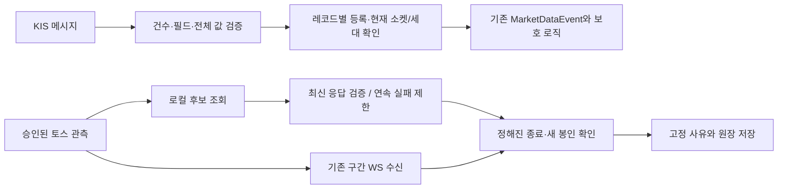

# 10월6일 관측 설치·예약 — 46차 Plan → Do → See

> **47차 현재 상태:** 사용자 현재 승인으로10월2일22:17:04 KST 엔진 `df1a5af` 일반 모드 배포·재시작 완료. 신규 PID172854·자동 재시작0·매수 중지·기존 설정 유지, 실행 원장/DB 첫 기동 점검 통과. 22:28:56 KST 예약 실행기 교체·독립 리뷰 조건 검증·10월6일 timer 재개까지 완료했다. 아래46차는 이전 설치 당시 이력이다.

상태: **2026-10-02 16:48 KST 비활성 설치·예약·사후 검증 완료. 실제10월6일 기동·수집·수익 비교는 아직 수행하지 않았다.** [45차 적용안](entry-capture-installation-2026-10-06.md)에 대한 사용자의 “ㄱㄱ 해도 돼” 승인을 따른다. 목적은 **어떤 종목을 고르고 어느 가격·시점에 진입해야 거래·운영비 이후 순이익이 좋아지는지** 실제 근거를 확보하는 것이다. 관측 성공은 수익성 확인이 아니다.

## Plan — 승인 범위와 고정 시각

운영 읽기 점검, 새 입력·불변 토스 배포물 설치, 날짜별 예약을 수행한다. 봇에 적용할 대상은 PR #137 병합 `df1a5afb5f3150052df16e7823a7129cf91d2198`, tree `03cd63ada0030047e371270951ba9d30dbaf43a9`다. 운영 기준 `5468208`에서 이 대상에는 관측 외에 취소 후 체결·실행 원장·장부 저장 변경도 포함된다. 기존 override와 KR 매수 중지는 보존한다. 이번 설치 시점에 봇을 재시작하거나 주문하지 않는다.

| 한국 시각 | 예정 작업 |
|---|---|
| 2026-10-06 08:55 이상, 08:57 미만 | 지문·상태·새 grant 확인 후 검토 코드 적용, 봇 재시작 요청 최대1회, 정확한 study/epoch 준비 확인 후 토스 시작 |
| 09:15 이상, 09:17:30 미만 | 첫 반환 스캔 전체 최대100개 보존, 원래 앞3개만 추가 호가 관측 |
| 09:33 | 관측 종료와 원장 봉인 |
| 09:34 | grant 만료; 연결·발급/송신 종료 확인 필요 |
| 2026-11-01 09:46:10 | 기존10월2일 토스 cohort의 보존 만료 정리 |
| 2026-11-05 09:34:10 | 새10월6일 토스 cohort의 보존 만료 정리 |

활성화 timer는 `Persistent=false`다. 창을 놓치거나 실패하면 날짜·영수증을 재사용하지 않는다. 예약은 실제 시장 세션·데이터 품질·수익을 보증하지 않는다. 휴장/세션 근거와 정규장 상태는 당일 확인해야 한다.

## Do — 점검 및 결합

설치 전 봇 PID34408, active/running, NRestarts0, 운영 HEAD5468208을 확인했다. loopback의 broker/risk 미완료 주문·수량·매도 수는0이다. 이 값은 메모리 상태이며 증권사 실제 주문·늦은 체결·저장 대기열의 완전성을 인증하지 않는다. 설정 지문은 default `81b7cd2545e18e6e40dfb1e7586310a5bd8a1ac4e599f8d05b2696569efa1938`, override `4970f2bf8ebfe6c5ba408336204cde07a8c80669cc9e5ba4edb0761b670b6d68`이다. 실행 중 메모리의 모든 실효 설정을 검증했다는 뜻은 아니다.

기존 토스는10월2일09:24:35의 저장 결과에서 `websocket_incomplete` / `frame_limit`이며, 서비스는 실패 종료 상태였다. 토스 인증값은 읽지 않고 ready 상태·generation4·서비스 identity와 UID997/GID987·전용 상태 경계만 대조했다. 토큰·발급/송신/시작 기록은 보존한다.

이전 운영 코드에는 실행 SQLite 원장이 없으므로 실행 원장 파일0개가 예상 상태다. 캐시 부모는 UID1000,0755, 심볼릭 링크 없음이다. PostgreSQL도 읽기 전용 조회에서 신규 실행 관련 열0개로 기존 코드와 일치했다. 신규 버전 기동 후 원장 생성·오류 여부는 별도 확인해야 한다. 단순 broker connected만으로 새 실행 원장이 정상이라고 판정하지 않는다. 살아 있는 SQLite 파일을 임의 복사·초기화하거나 과거 체결을 replay하지 않는다.

새 입력은 개발 설정 참조를 운영 **디스크** 설정 지문으로 바꾸고, 검토 대상의 src/scripts Python284개 전체를 함께 결합했다. 거래 정책·점수·후보 순서·수량을 바꾸지 않았다. `capital_policy`는 여전히 없고 수량/자본 근거가 없으면 경제성은 unknown이다.

| 결합 항목 | SHA256 |
|---|---|
| 설치 입력 제안 원본 | `f51f6a9106b3d3a629b8c49fde2091c51d28cdca3bb1fd33d63d14d6802b0f13` |
| 대상 소스284개 manifest | `e819a2c3f623b41b08828b16789382bbe53169651a423a485c34e5034b148c67` |
| study 원본 | `a4c46b8c509ebc2d98401db3fcbc54388d1a706a52bb85ea991887f2e1b890f8` |
| 엔진 manifest 원본 | `ac88a8b64e85976a6afcc97625bd8924c17da0a2b7a08d48fa4aad34b52324b5` |
| once 요청 원본 | `c85e536ea94a744abc60abc7fcb245335309db0df2542700dd67d25aa96fe533` |
| 토스 plan 원본 | `16d098d4813ba770b7a50c35f63c26c4c7ae7bf99f8b4a9dc1892da375608798` |
| 토스 plan canonical / cohort | `01634caab3fb1e2e390cc04287f13f974fe96e7e2127c356096a97dac460e062` |
| 토스 불변 artifact | `d446656bee5d34e1a1961a224a0409c3d7110142673d0dbd0e6af3f394cbaef5` |
| 활성화 실행기 | `cc5b190af2ed8410a20728625249c9dc6cf880e6c692d9b5ada29620cc72506e` |

공개45차 JSON은 당시 검토안으로 보존한다. 실행용 원본·비공개 identity/등록부·설치 영수증을 저장소에 복사하지 않는다.

### 보존 예약 연결 수정

기존11월1일 timer가 공용 deployment를 읽는 삭제 서비스를 호출했다. 새 deployment로 교체하면 기존 cohort를 정리하지 못하는 문제다. 날짜별 서비스가 해당 날짜의 deployment/plan/registry/launcher/retention5개 파일을 root 소유 스냅샷에서 필수 읽기 전용 bind로 보게 한다. 서비스 내부 고정 경로와 기존 검증·삭제 코드는 유지한다. 각 불변 release도 보존한다.

스냅샷은 `/etc/qwq-toss-observer/retention/20261002`와 `/etc/qwq-toss-observer/retention/20261006`에 둔다. 날짜별 서비스는 같은 UID/GID·격리·자원 제한을 유지하며 쓰기 허용은 기존 토스 상태 디렉터리뿐이다. 매일 실행되는 공용 보존 timer는 disabled/inactive를 유지한다. 당장 삭제하거나 토큰·안전 기록을 지우지 않는다.

검증은 같은 서비스 사용자·격리·5개 bind를 적용한 임시 서비스 안에서 지문·소유권·release·`load_verified_document`까지만 수행한다. 과거 또는 미래 grant를 현재 시각의 `launcher --check`로 검사하지 않는다. 실제 삭제는 각 만료 시점의 기존 시간·서비스 상태·sender 잠금·inode/영수증 검사를 통과해야 한다.

## See — 검증 원장

- 운영 API/자료에 접근하지 않는 임시 입력 검증: study와 plan의 raw/canonical hash, CapturePlan 적재 통과.
- 설치 파일 교체: 성공, 검증 실패, 교체 직후 디렉터리 fsync 실패의3경로에서 예상 게시/복원 확인.
- 활성화·launcher·retention 관련145검사 통과, 운영 상태/외부 네트워크 접근 시도0건.
- 독립 중요 작업 리뷰: 실제 `claude-opus-5`, 요청 xhigh(실효 effort 메타데이터 없음), 도구 비활성,600초/$6 한도, 전역 모델 정책 전달. 첫 광범위 검토는600초/968이벤트에서 시간 초과하여 승인으로 사용하지 않았다. 같은 모델·effort·권한의6.12초 연결 점검 후 이미 검토된 의존성을 제외한 설치 부분 검토가289.34초에 완료됐다.
- 조건부 차단 B1~B4를 한 차례 보완했다. 실제 서비스의5개 bind 일치/마지막 Service 절 확인, 설치 지문3개 고정, 루트 보호 artifact에서만 import·bytecode 생성 금지, umask022 고정이다. 새16검사의 실패를 먼저 확인하고 수정 후16건 모두 통과했다. 교체 성공·검증 실패·fsync 실패3경로도 재확인했다. 구현자가 독립 승인을 했다고 표현하지 않는다.
- 기존 대상 소스 전체4045 passed / 2 known xfailed / 1 warning,122.93초, 문법·비밀정보 검사 통과. 제품 코드는 이번 설치에서 수정하지 않았으며 별도 설치 스크립트 수정은 위16검사와 실제 설치 검증으로 확인했다.
- 실제 root 소유 원본에서259개 inventory 파일+manifest1개(총260개)를 검산했다. 서비스 UID/GID에서 새 release/identity 적재, 양쪽 날짜 namespace의5개 파일·소유권·지문 검증을 통과했다. **공용 설정을 새 날짜로 교체한 뒤에도 이전 namespace가 이전 cohort를 적재하는 것을 재확인했다.**
- 두 보존 서비스의 실행 시작 시각과 InvocationID는 비어 있으며 실제 삭제는 수행하지 않았다. 일반 매일 보존 timer는 disabled/inactive다.11월1일 timer 재적재 후 보이는 LastTrigger는 보존된10월1일22:15:39 stamp의 시각이며 이번 삭제 실행 증거가 아니다. 다음 실행 시각은11월1일09:46:10이고 신규11월5일 timer는09:34:10, 신규 활성화 timer는10월6일08:55:00으로 각각 확인했다.
- 설치 후 봇 PID34408 / NRestarts0 / HEAD5468208, 동일 설정 지문·매수 중지·기존 실행 인자를 확인했다. 소비된10월2일 drop-in은 정확한 원본을 root 전용 백업에 fsync·검산한 뒤 제거하고 daemon-reload만 했다. DropInPaths는 비어 있다. 토스는 inactive/dead, 새 cohort 디렉터리는 비어 있으며 토스 관측 원장 파일, 새 activation/startup receipt와 엔진 원장도 없다.

### 실제 설치 경로와 감사 근거

- 엔진 입력 `/home/ubuntu/.local/share/qwq-entry-observation/20261006-pilot2`: UID1000/0700, study·manifest·once 각각0600.
- 엔진 상태 `/home/ubuntu/.local/state/qwq-entry-observation/20261006-pilot2`: UID1000/0700. 결과 파일은 미리 만들지 않았다.
- 활성화 JSON `/etc/qwq-entry-capture/20261006-pilot2/activation.json`: root/0600, SHA256 `2cfb13b891c8e18fca8651460cc426e55445a9edde469ae32cb1ee2f6bc9e7d5`. 상태는 `/var/lib/qwq-entry-capture/20261006-pilot2`, 실행기는 `/usr/libexec/qwq-entry-capture/activate-20261006.py`다.7개 input hash와 study 원본 hash의 일치를 재확인했다.
- 토스 새 deployment config hash `45579a3eee843390199584fa57819023b794cd09c715944e172e6a8ad21d0c40`. 루트 스냅샷·새 grant/plan이 동일 artifact/cohort에 연결됐다. 서비스는 시작하지 않았다.
- 이전 공용 파일과 소비된 drop-in 백업은 `/var/backups/qwq-entry-capture-20261006`. 설치 스크립트·비공개 입력·리뷰·검증 결과·`installation.receipt.json`은 `/var/lib/qwq-entry-capture/install-20261006` root/0700 아래에 보존한다. 실행 입력이므로 Git에 넣거나 자동 재실행하지 않는다.
- 설치 스크립트 SHA256: `stage_toss.py` = `291ef790b123a9842fb3f94a58f4859089cdcbb8bb4c5a2803adb5427ca6e70b`, `retention_bundle.py` = `27a8010894292ef630f644faa1b8801e2cc32c26d181187b1cf261ea2ddc8b4c`, `arm.py` = `d872f0171c6170ce8ec056fccf3f48763813e369ac66b55726b17a341d87a619`.
- 최종 읽기 전용 verifier SHA256 `50d45cefa9e0372d2aa69e31a2a814421df6bc0a0b81af9a4a29fd083d02885a`, 검증 결과 SHA256 `1f6bdd7459b751e4ebb3f8177d861afb25398c31646eee3e07d6427677ba6f36`.

초기 원본 복사 준비는 inventory259개와 manifest 포함260개를 혼동한 검사에서 파일 생성 전에 중단했다. 지문 불일치가 아니며 개수 구분을 바로잡은 뒤 동일 artifact를 검산했다. 최종 verifier도 기존 persistent timer의 stamp를 신규 timer처럼 비어 있다고 가정한 검사를 수정했다. 실제 기존 stamp와 두 삭제 서비스의 미실행을 확인했고 stamp/원장을 초기화하지 않았다. systemd 검증의 기존 `claude-session.service` KillMode 경고는 이번 서비스와 무관하며 해당 사용자 세션을 변경하지 않았다.

활성화 서비스의 TimeoutStartSec는 독립 리뷰 조건에 따라120초로 제한했다. 실행기는08:57 절대 경계를 각 명령과 재시작 직전에 검사한다. 예외 경로의 rollback과 프로세스 강제 종료는 구분한다. 강제 종료·전원/I/O 장애에서는 rollback 완료를 보장하지 않으므로 receipt만 있고 status가 없으면 HEAD·drop-in·PID를 읽기 점검하고 임의 재시작/재실행하지 않는다.

## 다음 세션 인계 — 순이익 개선으로 연결할 순서

1. 장전 실행 결과: 정확한 target/study/epoch, 재시작 요청 횟수와 실제 NRestarts, 새 원장 생성·저장 오류, pending·매수 중지를 확인한다. 실패 receipt 삭제, 자동 재시작 반복, 토스 단독 실패로 봇 재시작을 하지 않는다. 기동 후 DB/원장 확인은 읽기 전용 메타데이터·오류 건수로 제한하고 실자료를 출력하지 않는다.
2. 09:33~09:34 종료 후 KIS 봉인/드롭·토스 frame/file cap·cleanup·소켓 종료를 확인한다. 후보 전체를 분모로 원천별 점수·캐시·누락과 첫 진입 탈락/미도달/unknown을 보고한다. 버전·국면·거래장 차이를 유지한다.
3. 유효 수량·자본·호가 쌍이 있으면 같은 종목/수량에서 사전 고정한 가격 조건 하나를 비교한다.900초 bid, 비용과0·10·30bp 슬리피지, 회피 손실과 놓친 이익을 함께 본다. 없으면 수익을0으로 만들지 말고 관측된 병목 하나를 개선 대상으로 고른다.
4. 독립 기간 검증 후 같은 진입으로 청산을 대조하고, 열린 보유·현금·입출금·거래비용·AI/자료/서버비를 포함한 계좌 순이익을 확인한다. 전체 KODEX200과 대칭적인 반도체 제외 보조 비교를 함께 유지한다. 반도체 급등을 이유로 전체 기회비용을 없애거나 과거 미완성 엔진의 성과를 현재 버전의 성과로 간주하지 않는다.

실제 관측·유효 가격 비교·수익 우위·매수 재개는 각각 별도 판정이다. 이 설치로 매수 중지를 해제하지 않는다.

## 47차 Plan — 엔진 선배포와 예약 관측 분리

검토된 엔진 `df1a5afb5f3150052df16e7823a7129cf91d2198`을 현재 호스트에 일반 모드로 먼저 적용한다. 루트 전용 예약 실행기는 별도 지문으로 설치하고,10월6일 고정 프로필에 한해 `old_head == new_head`를 허용한다.10월2일 계약은 계속 거부한다. 엔진 소스284개/study/once/grant/시간/코호트는 변경하지 않는다. 엔진 저장소의 실행기 파일과 systemd가 호출하는 루트 설치 실행기의 버전은 의도적으로 다르므로 두 지문을 따로 기록한다.

이미 배포된 경우 checkout을 생략하되 현재 HEAD·실제 소스 바이트·설정·입력·매수 중지·pending·grant 검증을 유지한다. 재시작 전 실패는 checkout 여부와 관계없이 자신이 만든 drop-in inode만 정리한다. 재시작을 한 번 요청한 뒤에는 rollback·재요청을 하지 않는다.10월6일08:55 관측 연결을 위한 별도 재시작1회는 여전히 필요하다.

실행 순서는 기존 설치 상태 확인 → 미래 활성화 timer 일시 중지 → 기존 로컬 배포 절차로 엔진 적용/전체 검증/재시작 → 신규 PID·원장 메타데이터·DB 열·저장 오류 점검 → 루트 실행기/활성화 JSON 원본 백업·지문 고정 교체 → 전체 계약 확인 → 미래 timer 재개다. 일반 배포 스크립트의 실패 시 코드 rollback·재시작은 원장/추가 DB 스키마를 되돌리지 않는다. 배포 또는 사후 점검 실패 시 미래 timer를 보류하고 저장 근거를 보존하며 자동 재시도·원장 초기화를 하지 않는다.

새 동일 버전 경로는 성공·현재 HEAD/소스 변조·입력/매수 중지/pending·창 만료·부분 파일 쓰기·inode 교체·재시작 요청 실패·재실행 거부를 검증한다. 두 날짜 프로필 관련125검사와 전체4069 passed/2 known xfailed를 확인했다. 이는 준비 시점의 검증 기록이며 실제 적용·독립 리뷰·최종 서비스 상태는 아래47차 Do / See에 기록한다.

## 47차 Do / See — 10월2일 일반 모드 배포

사용자 현재 요청으로22:17:04 KST 검토된 엔진 `df1a5af`를 기존 로컬 배포 절차로 적용했다. 운영 checkout 자체에서 전체4045 passed / 2 known xfailed / 1 warning,127.14초와 문법·비밀정보 검사를 통과했다. 정상 적용 경로로 재시작했으며 rollback은 없었다. 이전 PID34408에서 PID172854, active/running, NRestarts0이다. NRestarts는 systemd 자동 재시작 횟수이며 이번 명시 재시작0회라는 뜻이 아니다.

실행 인자에 관측 옵션이 없고 DropInPaths도 비어 있다. default/사용자 override의 지문과 KR 매수 중지를 그대로 보존했다. broker connected와 broker/risk 미완료 주문·수량·매도 집계4개 모두0이다. 이는 메모리 집계이며 증권사 원격 주문·저장 대기열의 완전성 인증은 아니다. 토스는 inactive/PID0이다.

실행 SQLite 파일은0→1개, UID1000/0644·일반 파일·하드링크1·크기32768바이트로 첫 생성 메타데이터를 확인했다. PostgreSQL 읽기 전용 열 수는0→7이다. 살아 있는 SQLite 내용은 열거나 복사하지 않았다. 현재 서비스 InvocationID의 시작 로그147행에서 장부 DB 연결 성공1개, 실행 원장/장부 저장/ERROR·CRITICAL·traceback 오류0개를 확인했다. 첫 점검은 journal의 MESSAGE144개가 UTF-8 바이트 배열인 것을 문자열처럼 비교하여 성공 로그0으로 거부했다. 문자열3개와 바이트 배열을 엄격히 해독하고 ANSI 표시를 제거하는 점검기를8검사로 검증했다. 정상/실패 문구를 모두 보존하며 잘못된 형식은 계속 거부한다. 운영 엔진 오류 수정이나 성공 조건 완화가 아니다.

예약 실행기 코드 변경은 [PR #139](https://github.com/qwq-partners/qwq-ai-trader/pull/139), 검토 코드 commit `e686949f0a9334e152070f2b31dd3c4f4fc166d4`, 병합 `c60ce3a8bf0416cbc8be3b1b277cdeeb1ba5a032`다. 관련125검사, 전체4069 passed/2 known xfailed, CI도4069 passed/2 known xfailed/33 warnings,94.82초로 통과했다. 운영 엔진은 계속df1이며 루트 실행기만 별도 배포한다.

첫 독립 리뷰는 실제 `claude-opus-5`, 요청xhigh(실효 effort 미확인), 도구 비활성·전역 정책 전달,433.61초에 완료했다. 엔진 배포/실행기 변경은 승인됐으나 운영 설치 도구의 환경 격리·교체 전 선행 점검·실제 출력 경로·systemd 실행 연결4조건은 보완 전 차단됐다. 루트 설치 도구를 실행하기 전에4조건을 보완하고18개 검사를 통과했다. 원본 입력은 `.local/share`, 실제 출력은 `.local/state`로 고정되어 있으며 출력 경로와 디렉터리 존재/소유권을 입력에서 대조한다.

관측 timer는 전환 중 disabled/inactive로 두었고,22:28:37 KST 루트 실행기/활성화 JSON 교체와 정적 적재·원본 백업을 완료했다. 중지 상태의 전체 검증을 통과한 뒤22:28:56 KST enabled/active로 재개했다. 다음 실행은10월6일08:55:00 KST, Persistent=no, LastTrigger 비어 있음이다. 활성화 서비스도 inactive, InvocationID/시작 시각 비어 있음, NRestarts0으로 실제 미실행을 확인했다. 기존/신규 보존 timer와 원본 지문·격리 연결은 유지된다.

최종 독립 리뷰는 실제Opus5/xhigh 요청,487.12초에 설치 도구를 승인하고 timer 재개에는 세 조건을 부여했다. 추가 실행/환경 지시 부재·실행 파일/argv/유일 명령·service 미실행을 확인하고, 실행기 bytes의 literal 지문을 receipt와 함께 대조하도록 보완했다. systemd의 실제 속성명 `EnvironmentFiles`를 사용했으며, 빈 복합 배열 속성은 출력에서 생략되는 것을 확인해 빈 값으로 처리하되 unit 원본 지문도 별도로 고정했다. 입력 환경 격리·선행 점검·경로/소유권·파일 교체·실행 연결31검사와 로그 형식8검사(총39개)를 통과했고, 실제 중지/예약 상태 검증도 모두 통과했다. 이는 리뷰 조건을 보완하고 검증한 기록이며 구현자가 독립 승인을 했다는 뜻이 아니다.

로그 해독 변경만의 독립 리뷰는 별도로 승인됐다(실제Opus5, 요청xhigh,28.67초). 앞선 넓은 로그 점검 검토는180초/283이벤트에서 시간 초과했으므로 승인으로 사용하지 않았다. 동일 모델/effort/권한의5.59초 연결 점검 후 순수 해독 함수와 검사로 범위를 좁혔다. 모델/권한 변경이나 실패 우회는 없었다.

최종22:28:56 검증에서 실행 원장1개·DB 열7개·장부 연결1·현재 InvocationID 로그157행의 저장/실행/오류0을 재확인했다. 동일 PID172854/자동 재시작0, 매수 중지·설정 유지, 봇 관측 인자/drop-in 없음, 토스 inactive·새 cohort 비어 있음, activation/startup receipt/engine 원장 부재를 확인했다. 현재 서비스 건강 상태가 수익성·과거 체결 대사·원장 내용 완전성의 증거는 아니다.

### 루트 설치 지문과 보존 근거

- 운영 엔진은 `df1a5afb5f3150052df16e7823a7129cf91d2198`로 고정한다. 루트 실행기 구현은PR139의 `e686949f0a9334e152070f2b31dd3c4f4fc166d4`에 해당하며 별도 설치됐다.
- 루트 실행기 SHA256 `6d87de20ad5536decf801b22d7049c458b6a8109507a242dc34185d3f3c69ff2`.
- 활성화 JSON SHA256 `98b72aceebb2bc2883dd8ae76bc42a7c8d1d97c41fd0bd559aca573ee9fb92da`. 기존 JSON 의미 중 old_head만df1로 바꿔 old/new를 같게 했다.284개 소스·설정·7입력/study/once/grant/cohort/시각은 보존됐다.
- 루트 updater SHA256 `6c85df9372a7ab8dec65dc4ce2ed2ef86b6cff2454050370b15420c74258ed02`, 최종 verifier SHA256 `eff3d5f626067abb48dad208064546652a651ede3d5af1e7125f19843c5b997c`.
- 활성화 service 원본 SHA256 `6b5f2d6d52c8be1125d6ada6a4b04f24cf5819c29bd7b71a7f7eab88829080e7`. 호출은 고정 루트 실행기와 `--profile 20261006-pilot2`로 연결된다.
- 설치 코드·검사·리뷰·이전 executor/activation 원본·`update.receipt.json`·배포 후 근거는 `/var/lib/qwq-entry-capture/predeploy-20261002` root0700에 보존한다. 첫23개 파일의 stage manifest SHA256 `52916d36be73a1b6807dcc79e2317bf05991f955f48cbe92ea207613c5bbb4b9`. 이후 최종 결과/문서 통합 영수증은 별도 추가하고 기존 파일을 덮어쓰지 않는다.
- 이번 검증기는10월2일의 일반 모드/미수집 상태를 확인하는 고정 검증기다.10월6일 관측 기동 뒤에는 이 상태를 기대하지 않으며 위 인계 순서의 당일 활성화/수집 결과를 판독한다.46차의 이전 PID/HEAD 검증기를 현재 상태 검사로 재실행하지 않는다.

### 이후 설정 변화·실패 처리

- 엔진 코드 배포와10월6일 관측 기동은 다르다.10월6일08:55에는 같은df1 소스 확인 후 별도 재시작1회가 필요하고, 실제 수집은09:15~09:33이다.
- 운영 진화가 override를 바꾸면 현재 고정 지문과 달라져10월6일 관측이 중단될 수 있다. 이 가능성을 수용하며 설정/지문을 자동으로 재고정하지 않는다. 새 설정을 유지하려면 변경 내역 검토 후 별도 실행 입력 갱신이 필요하다.
- `rollback` 문구만 믿지 않고 실제 HEAD·drop-in 부재·PID를 확인한다. 부분 stage/restore 파일이나 이미 소비한 백업/영수증이 있으면 조사하며 임의 삭제·자동 재시도하지 않는다.
- code rollback은 실행 원장/DB 추가 구조를 되돌리지 않는다. 원장을 초기화하거나 과거 체결을 replay하지 않는다.
- 동일 HEAD의 git diff는 변경 검증 근거가 될 수 없으므로 실제284개 소스와 두 설정 지문을 계속 확인한다.

### 다음 PDS 우선순위

1.10월6일 관측 기동/봉인 품질 확인 → 전체 후보의 원천 상태와 첫 진입 탈락 원인 집계. 선정과 진입을 각각 평가한다.
2.실제 수량/자본과 호가가 확보된 후보만 동일 조건에서 가격 가설1개를 비용 후 비교한다. 유효쌍이 없으면 수익률을 만들지 않고 확인된 병목을 개선한다.
3.독립 기간에서 같은 진입의 청산 차이를 검증하고 실제 계좌 순이익에 연결한다. 전체 KODEX200과 대칭 반도체 제외 보조 비교, 버전/국면 차이, 열린 보유분/현금/입출금/거래·운영비를 유지한다.

## 48차 Do / See — 10월3일 엔진 재배포와 관측 입력·토스 grant 재등록

사용자 결정("P1-3·P1-4도 수정, 문서·커밋·푸시·배포까지" → 배포 시점 질문에 "지금 배포 + study 재등록" → 범위 질문에 "study + 토스 grant 전체 재등록")에 따라 수행했다. 정본 리뷰는 [48차 리뷰](../reviews/codex-recent-work-review-2026-10-02.md).

**엔진 배포(01:13~01:15 KST).** `scripts/deploy/local_deploy.sh 2645820`(PR #141 머지 커밋). 운영 체크아웃에서 전체 4086 passed / 2 xfailed / 132.35초·문법·비밀정보 검사 통과 후 재시작, rollback 없음. PID 172854 → **249914**, 01:15:45 KST 기동, NRestarts 0, HEAD `2645820` detached, `config/evolved_overrides.yml` 미커밋 수정 보존. 시작 로그 KIS 연결·TR 세트 legacy·엔진 시작 정상, 새 PID ERROR/Traceback 0, 이전 세션은 `종료 완료`로 정상 종료. 기동 뒤 ops 점검: KIS 오류 0, pending `[]`, 정체/실패 없음, 현금 비중 22.9%·보유 2종목. 새 세션에 원장 보류 로그 없음. 매수 중지·설정 지문 불변.

**재등록 필요성.** 10월 6일 프로필은 old/new HEAD·284개 소스 해시를 df1a5af로 고정했고, 사전등록 `study.json`의 `capture.source_version_ref`가 `commit:df1a5af;capture-source-sha256:e819a2c…`(활성화 실행기 포함 284 파일 `{path: sha256}` compact sorted JSON의 SHA-256)를 담았다. 독립 리뷰가 추가로 잡은 것: 토스 `plan.json`의 `websocket.engine_study_sha256`이 옛 study 해시라 study만 바꾸면 토스 WS 서비스가 첫 엔진 응답에서 `engine_identity_or_time_invalid`로 실패하고, plan 해시는 `deployment.json`·`registry.json` grant·보존 스냅샷·활성화 `input_hashes`에 묶여 있다.

**재등록(01:41:46 KST, 루트, `/var/lib/qwq-entry-capture/rereg-20261003/rereg_20261006.py`).** 바꾼 것과 지문:

| 파일 | 변경 | 새 SHA256 |
|---|---|---|
| `~/.local/share/qwq-entry-observation/20261006-pilot2/study.json` | 두 `source_version_ref` → `commit:2645820760d0…;capture-source-sha256:e2104b9e…`(285 파일) | `f77d450d…` |
| 같은 디렉터리 `manifest.json` | `study_sha256` | `b8e6bf55…` |
| `/etc/qwq-toss-observer/plan.json` | `websocket.engine_study_sha256` | raw `9c156615…` / canonical `1a454e7e…` |
| `/etc/qwq-toss-observer/deployment.json` | plan 두 해시·cohort 경로·`grant_id` → `toss-entry-20261006-pilot2-r2`·`config_hash` `473c667e…` | `03b44a31…` |
| `/etc/qwq-toss-observer/registry.json` | grant 1개 재발급(같은 identity·시각·capabilities, `approval_reference=user-explicit-phase48-reregister-20261003`) | `0e70cfc1…` |
| `/etc/qwq-toss-observer/retention/20261006/{plan,deployment,registry,hashes}.json` | 라이브와 동일 바이트로 갱신(11/05 보존 timer bind) | — |
| `/etc/qwq-entry-capture/20261006-pilot2/activation.json` | old/new HEAD `2645820…`, `source_hashes` 285개, `input_hashes` 5개, `study_sha256` | `04be26ce…` |
| 새 cohort `/var/lib/qwq-toss-observer/cohorts/1a454e7e…` | 997:987/0700 생성 | — |

바꾸지 않은 것: `once.json`, 런처·retention.py·활성화 실행기 바이트, 토스 release artifact, 토큰·발급 기록·시작 영수증, 시각(`not_before` 10/5 23:55Z)·epoch·`request_id`, 보호 설정 지문(default `81b7cd25…`, override `4970f2bf…`), systemd unit. 옛 cohort `01634caa…`(빈 디렉터리)는 남는다. 봇 재시작·토스 시작·KIS/토스 호출 없음.

검증: 기존 파일을 같은 직렬화로 바이트 재생산 확인 뒤 교체(실패 시 역순 복원·cohort 제거·타이머 재개·rollback 영수증). 교체 후 런처 `verify_release`(루트)와 서비스 UID에서 `load_verified_document` + 승인 로더(`load_authority`, grant 창 안 시각 주입) + `_validate_policy`, 활성화 실행기 `load_config` + 08:55 preflight 동등 검사(HEAD·detached·dirty·소스/보호/입력 해시·drop-in·pending·kill·상태 디렉터리) 통과. 타이머는 enable 유지 상태로 stop/start만 했고 다음 실행 `Tue 2026-10-06 08:55:00 KST` 확인. 독립 리뷰 2회(요청 Opus/high): 1차가 토스 plan 결합 P0를 잡아 범위를 확장했고, 2차가 승인 로더의 시각 창 검사(현재 시각 `approval_expired`)·작업본 import·타이머 disable 문제를 잡아 반영했다. 영수증·원본/신규 바이트·스크립트는 `/var/lib/qwq-entry-capture/rereg-20261003/`(root 0700).

한계: 재등록은 10월 6일 08:55 실행기의 사전 검사와 토스 결합을 복원한 것이며 실제 기동·수집·수익 비교는 여전히 예정이다. 그 전 운영 override 지문이 바뀌면 관측은 중단된다. 공개 45차 제안 JSON의 base 지문은 당시 검토안으로 보존한다.

## 49차 — P1 수정과 관측 후 배포 예약 갱신

사용자는 독립 리뷰의 P1 네 건을 격리 브랜치에서 수정·검증하고, 통과한 커밋으로 기존 10월6일 16:00 배포 예약의 대상만 갱신하는 순서를 승인했다. 즉시 운영 배포·재시작·매수 재개는 포함하지 않는다.

Plan: 운영 `2645820`과 08:55 관측 체인의 HEAD·소스·study·manifest·토스 grant·보호 설정을 보존한다. `~/.local/share/qwq-deploy/deploy_after_capture_20261006.sh`의 `TARGET`만 검증된 후속 SHA로 교체하며, cron 시각·`EXPECT_HEAD=2645820`·한 번 실행 영수증·기존 가드는 유지한다.

Do / See: 제품 수정과 독립 리뷰 근거는 [49차 리뷰](../reviews/codex-claude-followup-review-2026-10-03.md)를 따른다. 설치된 배포 스크립트는 실행하지 않고 격리된 DRY 사본에서 정상/날짜/시각/HEAD/미체결/봇/관측 active·activating/토스/이미 시도한 영수증의 10개 가드를 확인했다. 실제 예약 대상 교체는 제품 검증·리뷰·CI 통과 뒤 수행하고 아래에 확정 SHA와 보존 검증을 기록한다.

**2026-10-03 20:15 KST 예약 갱신 완료.** 제품 [PR #145](https://github.com/qwq-partners/qwq-ai-trader/pull/145)의 머지 커밋 `7049bbaef752bdf8cb3c623de6cebc034dfe7ba8`로 `TARGET` 한 줄만 교체했다. 최초 대상 `2f5cbae`는 더 이상 예약 대상이 아니다. cron 주석에 남은 옛 대상명은 최초 등록 이력이며 실행 대상은 스크립트의 TARGET을 따른다.

| 확인 | 실제 결과 |
|---|---|
| 새 고정 대상 | `7049bbaef752bdf8cb3c623de6cebc034dfe7ba8`; 테스트된 head `a127796`와 tree 동일 |
| 제품 검증 | UTC 전체4199 passed/기존xfail2, KST 관련161 passed; 독립 리뷰 지적 판정 완료 |
| 필수 CI | [PR #145 verify](https://github.com/qwq-partners/qwq-ai-trader/actions/runs/37118905526): SUCCESS, 4199 passed/2 xfailed, 격리 위반0 |
| 예약 시각/가드 | `0 16 6 10 *` KST·기존 crontab 바이트 불변. `EXPECT_HEAD=2645820`·1회 시도·기존 가드 유지 |
| 변경 전 백업 | `/home/ubuntu/.local/share/qwq-deploy/deploy_after_capture_20261006.before-p1-20261003.sh` (0700) |
| 변경 영수증 | `/home/ubuntu/.local/state/qwq-deploy/retarget-20261003.json` (0600) |
| 스크립트 SHA256 | 변경 전 `0494bf46177053ac57204ade7646b0a3dc9581f06a2045b038e2ad867315324b` → 변경 후 `8b8a17f74c0b9b2b4ead25f3988465cdee6c1877b8cac7d007b6496481e9e734` |
| 교체 후 검증 | bash 문법 통과, TARGET 외 바이트·소유자·0700·cron 불변. 격리 DRY 사본의10개 가드 통과 |
| 운영/관측 보존 | HEAD2645820 detached/PID249914(10-03 01:15:44 기동) 유지. 소스285·입력7·보호 설정2 해시 일치; 활성화 설정 hash04be26ce… 불변, 매수 중지 유지 |
| 미실행 확인 | 설치된 예약 스크립트 실행·즉시 배포·재시작·주문·관측 재등록 없음. 시도 영수증·활성 drop-in 없음 |

다음 Plan → Do → See:

1. **10월6일08:55~09:34 관측:** 현재2645820과 고정 입력으로 시작·봉인·소켓 종료, 실제 후보/호가 품질을 확인한다. 미래 실행 성공을 이번 정합 검사로 대신하지 않는다.
2. **16:00 예약 배포:** `7049bba` 적용/가드 중단/실패를 Telegram·deploy 로그·실제 HEAD/PID/health로 판정한다. 실패코드2는 롤백도 실패한 경우다. 후속 문서 커밋은 배포 대상에 자동 포함되지 않는다.
3. **관측 자료 대사:** 종목 선정·진입 조건·체결/청산·실제 비용을 나눠 유효한 비교쌍만 평가한다. 전체 KODEX200과 반도체 제외 보조 기준, 현금·업종 효과를 구분하고 비용 후 개선 가설1개를 검증한다.
4. **별도 운영 정리:** 소비된 once 요청과 대조 후 남은 활성화 drop-in 정리 여부를 결정한다. 이번 승인으로 삭제하지 않는다.

운영 HEAD가 관측 전에 변경되면 기존 관측과 배포의 선행 HEAD 검사가 중단된다. 자동 재고정·자료 부족을 성공 처리·매수 중지 해제는 하지 않는다.

## 50차 — 10월6일 실행 결과와 배포 복구

목적은 실제 비용 이후 순수익을 개선할 종목 선정·진입 근거를 확보하는 것이다. 수집 성공과 거래 성과, 현재 엔진과 과거 버전의 결과를 구분한다. 사용자는 실행 결과 보고 뒤 “ㄱㄱ”로 아래 수정·검증·재배포 순서를 승인했다.

### Plan

1. 검증 실행기가 대상 Git 저장소의 작업 경로를 소유하도록 고친다. 저장소 밖 호출·상대 경로·실패 전파를 임시 저장소로 검증하고 전체 검사·독립 리뷰·필수 CI를 통과한다.
2. 기존 일회 예약/시도 영수증을 보존하고 수정된 고정 SHA로 별도 배포한다. pending0·관측 종료·기존 override·매수 중지·원본을 확인하고, 기존 `local_deploy.sh`의 복구 경로를 유지한다.
3. 엔진/토스 자료를 각 원래 시각과 완전성 상태로 분석한다. 확인된 수신 결함을 회귀 검증하고, 점수 기준은 임의로 낮추지 않는다. 새 관측 실행 입력·grant·날짜를 자동 재사용하지 않는다.

### Do — 확인된 실행 결과

- 08:55 활성화는 완료됐으나 관측 완료 인증이 아니다. 엔진은09:33:00 KST에21,754건(호가20,230·구독 진단1,509·후보 스캔1·선정 근거7·진입 단계7)을 봉인했다. dropped0이지만 `unsupported_frame_shape`로 complete=false다.
- 프레임 진단1,480건은 모두 plain/H0STCNT0/count2~20/non_candidate_tr다. 후보 호가 손실과 동일시하지 않되 기존 connection gap·불완전 판정을 사후 삭제하지 않는다.
- 토스는3종목 ACK 후09:16:58~09:25:48에호가11,901건을 기록했고09:25:50 exit1로 끝났다. 종료 사유는 `capture_failed`, receiver는 정리 중 `cancelled`, cleanup_failed=false다. 기존 광범위 예외 처리 때문에 당시 상세 예외 원인은 확정할 수 없다. 원래 결과 시각을09:33으로 늦추거나 최종 엔진 원장으로 바꿔 완전성을 주장하지 않는다.
- 두 원장의 전체 해시 연결은 읽기 검산으로 일치했다. 최종 상태를 읽었다는 뜻이며 시세 무손실·원천 진위·실행 가능 가격을 증명하지 않는다.
- 16:00:01 예약이 가드를 통과해7049bba를 시도했으나 pytest 수집 단계에서 홈 디렉터리 metadata 접근이 격리 가드에 차단됐다. local_deploy와 verify의 작업 경로 미고정 및 저장소 내부 CWD만 쓰던 기존 테스트가 원인이다. 거래 테스트 assertion은 실행되지 않았다. 16:00:39 자동 롤백 결과rc1/HEAD2645820/PID475530. 기존 시도 영수증은 존재하고 일회 cron 항목은 제거됐다.
- 18:03 읽기 점검에서 service active/NRestarts0, HTTP200, broker connected, stale loops 없음, 로컬 pending0, KR 매수 중지 유지. 이는 증권사 원격 미체결 전체 대사와 구분한다.

### See — 후보 선정과 진입에서 확보한 근거

고정 study와 원장 SHA를 대조한 기존 진입 보고 CLI는 후보7개 전부의 단계 기록을 읽었다. 모두 enabled/session/engine/broker/entry_time/regime/cash를 통과한 뒤 score에서 탈락했다. 점수는61·44.856·43.32·30.273·4.06·0·0, 기준은75다. 이후 ATR/추격/거래량/전략/호가 조건은 미도달이며 신호/주문 생성 기록이 없음을 그 조건의 실패로 해석하지 않는다. 이 한 스캔에서 진입이 없었던 직접 원인은 하락장·현금 부족이 아니라 점수 조건이다.

원천은 갭/거래량 급증의 새 비어 있지 않은 결과, 등락 순위 캐시, 빈 기관/외국인 캐시, 빈 신고가 결과, 시도 근거가 불명인 테마뉴스가 섞여 있다. 네이버/LLM 원천은 해당 스캔에서 호출되지 않았다. “여러 소스를 사용한다”와 “해당 후보를 여러 독립·신선한 근거가 뒷받침한다”는 다르다. 최고 후보의 원천 가중합75+중복10−후속보정24=최종61을 확인했다. 임계값 완화의 수익성은 미검증이며, 다음은 가중치·보정·미호출/빈 원천의 의미와 선택적 진입 비용을 고정 기준으로 비교하는 것이다.

검증·리뷰·배포 결과는 실제 실행 뒤 이 절에 이어 기록한다. 비공개 상세 근거는 `~/.local/state/qwq-deploy/recovery-20261006/`에 두고 계좌 값·원시 원장을 Git에 넣지 않는다.

### 검증·독립 리뷰 — 배포 경로 수정

- 구현 커밋8617cb7을 통합d1b390f로 반영했다. 임시 저장소 밖 CWD·상대 ROOT/PYTHON의 실제 pytest 실행에서 수정 전 실패를 확인했고 수정 후 집중6검사가 통과했다.
- 코디네이터의 `QWQ_VERIFY_PYTHON=…/venv/bin/python bash scripts/dev/verify.sh`는4200 passed/기존xfail2(143.09초), 문법·비밀정보 검사·격리 위반0으로exit0. 기존 pykrx deprecation warning1은 남는다.
- 구현자는 요청Terra/high, 독립 최종 리뷰는 요청Astra/high. 실행별 실제 모델 식별 metadata는 노출되지 않았으므로 요청값으로 기록한다. 독립 집중6검사·셸 문법·diff 검사를 재실행했고 신규P0/P1/P2 없이 한정 승인했다. 원인 분석은 별도Sol/high 요청으로 교차 확인했다.
- 이전 worker의 전체 검사 시도는 최종출력을 회수하지 못해 통과 근거로 쓰지 않았다. 위 코디네이터의 완결된 검증만 채택했다.

## 51차 — 수신 결함 수정과 종목 선정·진입의 다음 검증

### Plan

순수익 평가 이전에 관측 기능 때문에 정상 체결가를 버리는 결함과 관측 실패 사유가 사라지는 결함을 고친다. 가격·점수·매수 조건을 유리하게 재정의하거나 과거 불완전 원장을 성공으로 바꾸지 않는다. 새 관측의 날짜·grant·불변 토스 배포물은 기존 소비된10월6일 입력과 별개다.

### Do — KIS 체결가 메시지

PRICE TR의 다중 메시지는 먼저 건수(2~999), 건별 필드 수(구46/신47), 종목·시간·사용 수치 전체를 확인한 뒤 원래 순서로 전달한다. 관측 owner가 있는 경로는 각 레코드마다 등록 여부·연결 세대를 확인한다. 일반 운용도 실제 수신 소켓을 고정해 전달하고, 모든 PRICE 경로에서 콜백의 await 뒤 현재 소켓·연결 여부·종료 상태를 다시 확인한다. 앞 종목이 미등록이어도 뒤의 등록 종목을 누락하지 않는다. 잘못된 뒤 레코드가 있으면 앞 레코드도 부분 전달하지 않는다. 기존 단건20~47필드 호환은 유지하며 단건이라고 표기한 다중 payload는 거부한다.

기존 owner 없는 BOOK 경로도 count2 헤더/단건 payload에서 첫 호가를 전달하던 기대를 없앤다. 다중 BOOK 지원을 추정해 첫 호가로 축약하지 않는다. 단건의 불명 시각을 source_as_of로 승격하지 않는 기존 동작은 유지한다. 암호화·건수/길이 오류와 잘못된 다중 수치는 계속 거부한다.

공식 근거: [현재 KRX/NXT 체결가47필드](https://github.com/koreainvestment/open-trading-api/blob/3e9c321408424c17e1a16bee6d7f4fc6af871470/examples_user/domestic_stock/domestic_stock_functions_ws.py), [legacy46필드 건수별 처리](https://github.com/koreainvestment/open-trading-api/blob/main/legacy/websocket/python/ops_ws_sample.py). 현재 파일의 읽기 SHA256은 `b282661c47287d5374a7b67256a91503e1b16b2dfeb40490a581a65e80918453`다. 기존1,480건에는 원문을 저장하지 않았으므로 그 자료가 어느 폭이었는지는 소급 확정하지 않는다.

### Do — 토스 후보 조회와 실패 기록

수신 중 일시적인 로컬 후보 조회 실패는 연속1회만 허용하고, 다음 검증된 최신 응답에서만 실패 연속 횟수를 초기화한다. 연속2회면 중단한다. 형식·identity·시각·기존 기록 변경은 일시 실패로 취급하지 않는다. 후보 클라이언트에서도 잘못된 응답을 통신 실패와 구분해야 한다. 종료 뒤의 기존5초 이내 봉인 회수 한도는 연장하지 않으며, 마지막에 성공했던 오래된 응답으로 완료를 만들지 않는다. 예외 원문·토큰 대신 고정된 실패 단계·종류·횟수만 남긴다.

오늘 실제 토스 종료 예외는 기록 유실로 여전히 미확정이다. 위 변경은 재현된 실패 처리 경로를 고치고 다음 실행의 원인 판별을 가능하게 한다. 불변 서비스 배포물은 저장소 업데이트만으로 교체되지 않는다. 새 토스 release 설치·승인 입력·실제 수집은 별도 실행 절차다.

### See — 코드와 처리 흐름

다음 수익 개선 검증의 우선순위:

1. **선정 점수의 의미 확인:** 현재7개 후보에서는 기준75를 통과한 종목이 없었다. 소스별 신선도/빈 결과/미호출과 가중합·후속보정·중복 보너스를 분리한다. 같은 가격 순위·갭 입력을 독립 근거 여러 개로 세는 효과도 따로 본다.
2. **후속 보정의 원인 확인:** 최고 후보는75+10−24=61이다. 현재 원장에는−24의 합계만 있으므로 이를 특정 감점 규칙 탓으로 추정하지 않는다. 원래 후보 분모를 고정한 채 실제 보정 근거와 이후 비용 후 결과를 비교한다.
3. **진입 한 가지 가설:** 데이터가 확보되면 기존 기준과 대안 하나를 같은 시점·종목·수량·현금 조건으로 비교한다. 점수 기준 인하로 거래 건수를 늘리는 것과 순수익 개선을 구분하고, 놓친 이익·회피 손실·거래 비용을 함께 기록한다. 일봉 결과만으로 실시간 선정/진입 우위를 기각하지 않되 실제 체결 근거 없는 호가 결과를 실현 수익으로 부르지 않는다.
4. **벤치마크/버전:** 계좌 총수익·현금/업종 효과·같은 진입의 청산 대조를 유지한다. 전체 KODEX200과 반도체 제외 보조 기준을 함께 보고, 이번 수정 이전/이후 엔진 구간을 구분한다. 유효 비교쌍이 없는 오늘은 비용 후 우위를 숫자0으로 채우지 않는다.

### 배포 복구 추가 기록 — 실행 환경

PR #147은 필수CI(run37443793645) 성공 후 `1d4289f0a07f20174cb921ba24308d9d03f9e066`으로 병합했다. 테스트된2534457과 tree동일·pending0·원장/설정/매수중지 지문 보존·관측 비활성을 확인한 뒤 `/home/ubuntu` CWD에서 기존 local_deploy로 실행했다. 로그를 비공개로 생성하려고 설정한umask077이 두 부정 권한 시험의 생성 결과를0755→0700,0644→0600으로 바꾸었다. 실제 운영 검사4198 passed/2 xfailed/2 failed 후 rc1로2645820을복구했다.18:43 PID495203/자동재시작0·HTTP200·broker연결·stale없음·로컬pending0·매수중지를확인했다.

실패는보호로직이안전한권한을올바르게허용한결과다. root가같은umask에서2실패를재현한뒤 임시fixture에최종권한을명시해2통과를확인했다. 운영권한/파일보호가드를바꾸거나테스트를건너뛰지않는다. 후속통합검증도umask077로실행한다. 원래예약의시도영수증과실패로그는보존하며추가실행로그를덮어쓰지않는다.

### See — 통합 검증과 독립 리뷰

- 수정 전 재현: 외부 CWD의 pytest 수집, umask077의 잘못 생성된 권한 fixture2개, PRICE 다중 메시지 누락/거짓 단건, 토스 단발 조회 실패, 총5초 유예 초과 봉인, 일반 운용의 콜백 대기 중 연결 종료/교체 후 시세 전달을 각각 확인했다.
- KIS는 요청Astra/high, 토스는 요청Terra/high로 분리된 같은 기준 작업트리에서 구현했고 통합은 코디네이터가 맡았다. 최종 독립 리뷰는 별도 요청Astra/xhigh다. 실제 모델 식별/실효 effort metadata는 노출되지 않아 요청값으로만 기록한다.
- 독립 리뷰에서 토스 유예 초과P2를 재현했고 남은 시간 timeout·await 이후 승인/시한 재확인으로 수정했다. root 추가 검토의 일반 운용 PRICE 연결경계P1도 독립 재현한 뒤 실제 수신 소켓 전달과 레코드/콜백별 검사로 보완했다. 초기 승인으로 후속 결함을 덮지 않았다.
- 전체 검증은 단계별로4283 passed/2 xfailed(139.83초), 유예 보완4b15fc3은4285 passed/2 xfailed(129.47초), 모두umask077·문법/비밀정보통과·격리0이었다. 최종PRICE경계c941faf는 관련9파일367 passed(6.74초),umask077·격리0이다. 뒤의 필수CI와 실제 배포 검증은 최종 통합 SHA 기준으로 별도 확정한다. 기존pykrx deprecation warning1은 남는다.
- worker가 최종출력/exit를 회수하지 못한 전체검사는 통과 근거로 쓰지 않았다. 위 결과는 코디네이터가 완결된 로그와 exit0을 확보한 검사다.

최종 독립 소스 리뷰는c941faf에신규P0/P1/P2없이승인했다. 일반 운용의연결종료/교체 재현에서첫레코드1건만전달되고후속콜백/레코드는차단됐다. 독립KIS165검사·Toss61검사·umask077부정권한2검사통과/격리0,기존P1/P2해소를확인했다. 실행원장/계좌/실시세완전성과전체운영건강인증으로확대하지않는다.
