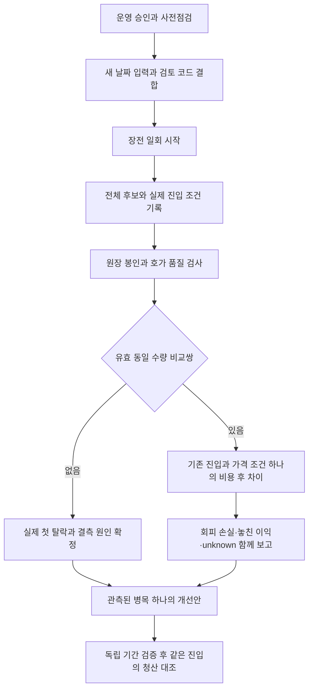

# 10월6일 v4 관측 준비 — 45차 Plan → Do → See

상태: **로컬 검토안, 운영 미설치·미예약·미수집**. 목적은 실제 후보의 선정 근거와 진입 탈락 이유를 확보하고, 같은 종목·수량에서 거래비용 이후 유리한 진입 조건을 찾는 것이다. [44차 실제 비용 기준](../research/current-engine-observed-cost-next-step-2026-10-02.md)은 유지한다. 계좌 자료를 다시 요청하거나 새 합성 결과를 수익 증거로 쓰지 않는다.

## Plan — 무엇을 관측하고 왜 하는가

10월2일에는 후보가 있었지만 signal/order_ready가 없어 유효한 가격 비교쌍이 없었다. 새 v4 관측은 후보 전체의 원천별 점수·캐시/실패·중복 입력, 실제 진입 조건의 첫 탈락·미도달·불명, KIS 프레임 오류 범위를 함께 기록한다. 어느 종목이 선택됐는지와 왜 진입하지 않았는지를 먼저 분리한다. 점수·매수 조건·종목 순서를 관측용으로 바꾸지 않는다.

| 한국 시각 | 고정 조건 |
|---|---|
| 2026-10-06 08:55 이전 | 명시 승인 후 운영 사전점검·새 입력·불변 토스 배포물·날짜별 실행기 준비 완료 |
| 08:55 이상, 08:57 미만 | 새 grant 검사와 일회 봇 재시작·정확한 study/epoch 준비 확인 후 토스 시작 |
| 09:15 이상, 09:17:30 미만 | 첫 반환 스캔 하나, 전체 최대100개 보존·원래 순위 앞3개 호가 관측 |
| 09:33 | 관측 종료·엔진 원장 봉인·토스 최종 파일 저장 |
| 09:34 | grant 만료. 소켓과 발급/송신 종료 별도 확인 |
| 2026-11-05 09:34 이후 | 승인된 보존 만료 정리. 인증·발급·시작 안전 기록은 보존 |

[KRX의 2026년10월 휴장 안내](https://trn.krx.co.kr/corebbs5/BHPTRN0301/view?bbsSeq=150)는10월5일 휴장을 안내한다. 이에 따른 다음 평일10월6일을 제안한 것이며, 해당 일자의 실제 정상 세션을 인증한 것은 아니다. 돌발 휴장·세션/종목 상태는 당일 확인한다. 창이 지나거나 준비가 부족하면 취소하고 다음 날짜로 자동 이동하지 않는다.

첫 진입 호가 이후900초·평가 호가 허용 지연5초가 기준이다.09:33 종료까지 최대 허용 지연을 확보하려면 첫 진입 호가가09:17:55 이하여야 한다. study에는 의도적으로 `capital_policy`가 없다. `capital_evidence_ref`는 정책 검증을 대신하지 않으며, 실제 order_ready 수량/자본 근거와 별도 검토된 평가 입력이 연결되기 전에는 현금·종목 한도 충족을 unknown으로 둔다. 스캔 입장 마감은 진입 판단 마감이 아니므로 늦은 신호, 수량/자본 없음, 호가 결측은 계속 unknown이다. 비교쌍0일 수 있으며 이18분 관측은 품질 점검이다. 기존 독립 평가 기간의 끝을 뒤로 밀거나 이 관측을 수익성 확인 표본으로 자동 승격하지 않는다.

## Do — 코드와 구체적 입력

[고정 입력 제안](../research/current-engine-capture-proposal-2026-10-06.json)은 신규 study·manifest·once·토스 plan·경로·예산을 담는다. 실제 운영 설정/identity/승인/deployment 결합이 남은 검토 입력이다. 이전10월2일의 grant·승인 참조·영수증·원장·cohort·타이머를 새 권한으로 재사용하지 않는다.

실행기는 임의 날짜나 경로를 받지 않고, 기존 무인자10월2일 계약과 정확히 `--profile 20261006-pilot2`만 허용한다. 새 프로필의 루트 설정은 `/etc/qwq-entry-capture/20261006-pilot2/activation.json`, 상태는 `/var/lib/qwq-entry-capture/20261006-pilot2`다. 엔진 입력은 `/home/ubuntu/.local/share/qwq-entry-observation/20261006-pilot2`에 따로 둔다. epoch는 `kr-entry-20261006-firstscan-v4`다. 새 날짜의 입력도 UID1000 소유권 검사를 받으며 임의 인자·교차 날짜·시간·경로 대체를 거부한다.

통합 검토에서 후보 전달 함수의 기존50,000행 상한을 발견했다. 이를80,000행으로 맞추고50,001/80,000행의 뒤늦은 신호·수량 전달과80,001행 거부를 검증한다. 출력은 기존 후보 최대100개·앞3개의 scan/signal/order_ready 최대7행만 유지한다. 이 변경을 반영한 capture source/study/manifest/once/Toss plan·cohort·artifact 지문을 새로 결합하며, 최초 기반 소스/배포물 지문은 최종본으로 사용하지 않는다.

KIS journal은 후보 관측18분만이 아니라 설치08:55부터 종료09:33까지 들어오는 기존 호가를 포함한다. 버퍼80,000행, 큐4,096행, batch256, 파일64MiB, 단일 행64KiB를 사용한다. 후보/선정/진입 trace 최대201행 burst를 포함한다. [오프라인 전체 구간 용량 근거](../research/current-engine-kis-v4-capacity-2026-10-06.json)를 따른다.41채널·최대 후보3·내부 여유4는 기존 조정기 계약이고 외부 예약0은 사용자 진술이다. 실제 장중 여유를 측정했다는 뜻이 아니다.

토스는50,000프레임·32MiB로18분만 관측한다. [43차 검산](../research/current-engine-next-evidence-2026-10-02.md)의2배 평균 유량49,617프레임에 대한 여유는383프레임(0.766%)이다. 실제 폭주를 감당한다는 보장은 없으며 상한에 닿으면 불완전 종료한다. 저장 손실을 숨기거나 시간을 늘리지 않는다. KIS와 토스의 거래장/LOSSY 차이를 유지하고 토스 통합 호가를 KRX 실행가격으로 재표기하지 않는다.

### 적용 범위와 사전점검

운영 기준으로 알려진 소스는 `5468208e2bf481eabae5c54da490c7da972756e1`이고 이번 준비 기반은 `6a22b82d46bb21414c21a5b4eb7c90e22d25a920`다. **운영에 최신 통합본을 적용하면 관측 기능 외에 잔고·취소 후 체결·실행 원장·장부 commit 처리 변경도 함께 들어간다.** 기반까지 src/scripts41파일 변경이며 전체 배포 범위를 관측 전용이라고 부르지 않는다. 관련 [32~42차 통합 검토](../research/current-engine-integrated-pds-2026-10-02.md)와 새 프로필 독립 리뷰를 연결한다. 전략 설정의 추적 파일 차이는 없지만 사용자의 수정된 운영 override는 그대로 보존해야 한다.

명시 운영 승인 후에만 아래 실제 값을 점검·결합한다. 이 문서의 오프라인 검증으로 대체하지 않는다.

1. 운영 HEAD·실행 명령의 허용 필드·서비스 사용자·상태·재시작 횟수, 기본/override 설정 지문과 KR 매수 중지. 전체 환경·비밀·로그는 출력하지 않는다. 봇 pending, 체결/장부 처리 중 상태, 영구 실행 원장의 이전 미완료/손상/clean shutdown 조건을 확인한다. 기존 미완료를 초기화하거나 과거 체결을 새 잔고에 replay하지 않는다.
2. 토스 서비스 비활성, 기존 UID997/GID987·host/client identity·단일 발급/송신 소유권·기존 안전 기록, 메모리·디스크·WS 등록 여유. 불일치 시 새 권한/요율/identity를 추정하지 않는다.
3. CI와 독립 리뷰를 통과한 최종40자리 release SHA·tree·capture source 지문·실제 보존할 설정 지문을 고정한다. 제안의 개발 설정 참조를 실효 운영 설정 검증이라고 표시하지 않는다. 실제 hash로 study/source/manifest/plan/grant/deployment/input 집합을 함께 다시 결합해 오프라인 검증한다.
4. 새 명시 승인 참조·약관/보존/발급 소유권 근거와 시간 제한 grant를 결합한다. 토큰 내용을 출력하지 않고, 발급 소비/쿨다운·sender/start 기록은 보존한다. 공개 비용 모형은 실제 계좌 요율 인증이 아니며44차 실제 비용을 미래 단일 요율로 승격하지 않는다.

### 승인 후 설치·실행 순서

1. 읽기 전용 사전점검이 통과한 뒤 새로운 엔진 입력 디렉터리를 UID1000/0700, 입력0600으로 만든다. 새 원장·startup receipt는 미리 만들지 않는다. 과거 자료는 보존한다. 토스 불변 artifact를 새 root 소유 release에 준비하고, 비활성 서비스의 plan/registry/deployment/launcher 이전본과 hash를 보관한 뒤 일치하는 새 세트로 교체한다. 여러 파일 교체를 단일 원자 작업이라고 표현하지 않는다.
2. **옛10월2일 drop-in 처리:** 실행기는 기존 drop-in이 하나라도 있으면 거부한다. 해당 파일이 남아 있다면 기존 실행 영수증·내용/hash·이미 소비된 once 요청과 대조해 정확히 그 파일임을 확인하고 root 전용 보관본을 fsync하고 hash를 검산한다. 승인된 준비 단계에서 그 파일만 live 경로에서 제거하고 daemon-reload한다. daemon-reload 성공·DropInPaths 비어 있음·실행 중 PID/NRestarts/실제 시작 인자가 변하지 않았음을 기록한다. 이때 봇을 재시작하지 않는다. 다른 drop-in, 달라진 내용, 소비 여부 불명은 중단 사유다. 지우고 재시도하는 자동 우회는 없다.
3. `/etc/qwq-entry-capture`와 `/var/lib/qwq-entry-capture`의 root:root 소유·비쓰기 권한, 각각의 새 프로필 하위 디렉터리 root:root/0700을 확인한다. 새 activation.receipt/status 부재를 검증하고 루트 소유0600 activation JSON과 staged drop-in을 준비한다. 최종 `old_head/new_head`, 보호 설정2개, 정확한 source/input hash, study hash와 epoch를 검증한다. 특히 `study_sha256 == input_hashes[<once_dir>/study.json] == SHA256(study.json 원본 bytes)`를 시간 창 전에 검사한다. CapturePlan도 이 원본 bytes 지문을 저장하며 projection에 그대로 전달한다. 이 교차 검사는 기존 프로필에도 적용된다. 날짜별 service는 검토된 root-owned 실행기를 `/usr/bin/python3 -I -B`로 실행하며 정확한 새 프로필만 전달한다. 이름은 `qwq-entry-capture-20261006.service/.timer`, `OnCalendar=2026-10-06 08:55:00 Asia/Seoul`, `Persistent=false`, `AccuracySec=1s`, `RandomizedDelaySec=0`으로 고정한다. 기존 서비스 권한/격리 범위를 넓히지 않는다. 타이머 문법·정확한 다음 실행 시각·신규 receipt 부재를 검증한 후에만 활성화한다.
4.08:55에 일회 실행기는 시도 receipt를 먼저 배타적으로 쓰고 잠금을 획득한다. 운영 HEAD/설정/매수 중지·pending·입력·grant/launcher 점검 → 검토 SHA checkout → 지문 재확인 → 새 drop-in 생성 → daemon-reload → 봇 재시작 요청1회 → 정확한 study/epoch loopback 준비 확인 → 토스 시작 순서다.08:57에 도달하면 중단한다. 실패한 receipt는 삭제해 재사용하지 않는다.
5. 재시작 요청 전 실패는 실행기가 만든 drop-in과 checkout만 원상 복구하며, 준비 단계에서 보관한 옛 drop-in은 자동 복원하지 않는다. 이 경우 서비스 설정은 관측 인자 없는 일반 시작 상태다. 재시작 요청 뒤 실패는 두 번째 재시작/자동 rollback restart를 하지 않는다. 토스 start 요청 뒤 실패도 동일 grant/cohort로 재시도하지 않는다. 토스 단독 실패도 봇 재시작 사유가 아니다. systemd 자체 재기동 정책과 실행기 요청1회는 구분해 실제 NRestarts를 확인한다.
6. 종료 뒤 원본을 보존하고 봉인/닫힘·드롭·종료 사유·epoch/hash·전체 후보 분모를 확인한다. 토스 grant 만료와 연결 종료를 확인한다. 보존 만료 timer는 `qwq-entry-capture-retention-20261105.timer`, 해당 cohort의11월5일09:34:10KST 이후이며 기존 검증된 retention 경로·Persistent=true를 사용한다. 토큰/발급/송신/시작 안전 기록은 정리 대상이 아니다.

이 순서는 새로운 운영 실행 승인을 받기 위한 구체적인 적용안이다. 현재 루트 파일·타이머·운영 서비스·자격증명·주문 상태를 변경하지 않았다. 실제 점검이 위 가정과 다르면 해당 실행을 중단하고 불일치를 보고한다.

## See — 완료 기준과 다음 행동

| 우선순위 | 수집 후 해야 할 일 | 완료 기준 |
|---|---|---|
| 1 | 후보 선정과 진입 탈락 원인 보고 | 후보 전체 분모, 원천/점수·캐시·첫 탈락·미도달·불명, 버전/실효 설정 연결 |
| 2 | 한 가지 가격 조건 대조 | 실제 수량·자본·ask/bid·시각을 통과한 쌍에만 비용/슬리피지0·10·30bp 적용. 놓친 이익과 회피 손실 모두 보고 |
| 3 | 같은 진입의 청산 대조 | 기존 초기 손절 도구부터, 실제 전체 가격 경로 확보 후 시행. 진입/청산 동시 최적화 금지 |
| 4 | 계좌 차원의 순이익 확인 | 전체 현금·열린 보유·비용·입출금·AI/자료/서버비 포함. 전체 KODEX200과 대칭적인 반도체 제외 보조 비교, 버전/국면별 구분 |

1회 품질 통과, 실행기 성공, 실제 수익 우위는 각각 별도다. 후보가 없거나 모든 조건에서 탈락하면 그 원인을 기록하며 수익을0으로 만들지 않는다. 현재 매수 중지를 해제할 근거는 이 준비안에 없다.

## 로컬 검증 원장

격리 작업공간에서 테스트 우선 방식으로 새 프로필의 거부/수락 경계를 구현했다. 기존33검사에 새 날짜·교차 경로/epoch/시간·CLI·입력 소유권·상태 분리 검사를 추가했다. 독립 리뷰 후 두 날짜 모두에서 전체 상태 기계를 실행하고 study 파일 hash 교차 검사를 보완해101건을 통과했다. 프로필 추가 전 실패를 확인한 뒤 수정했으며 기존 rollback/재시작 순서 검사를 유지했다.

토스 배포물은 명시된 기존 wheelhouse와 해시 고정 의존성만 사용해 오프라인 생성했다. release ID `kr-entry-20261006-v4`, manifest SHA256 `d446656bee5d34e1a1961a224a0409c3d7110142673d0dbd0e6af3f394cbaef5`,260파일이다. inventory 재계산 일치와 서비스/deployment·aiohttp3.13.5 import를 확인했다. 임시 산출물은 `/tmp/qwq-v4-review-20261002/toss-v4-20261006-r2`이며 실제 root 소유권/설치/grant 검증은 아니다. 재생성 시 artifact hash가 달라지면 새 결합 검토가 필요하다.

용량 시험은 paced whole-flow와 별도201행 payload burst다. 전체 파일39,903,463B에 validator 최대 burst13,586,432B를 중복 가산한 보수 합계53,489,895B가64MiB 이내다. 후보 BOOK3개·100후보×16원천·100후보×31단계의 별도 burst와close5초를 확인했다. 최대 payload 전체 창·순간 폭주·실제 RSS 한계는 검증하지 않았다. 전체 로컬 검사는4045 passed / 2 known xfailed / 1 warning,121.60초로 통과했다. Python 문법·비밀정보 패턴 검사도 통과했고 운영 상태/외부 네트워크 접근 시도는0건이다. 관련 시작/전달/활성화 검사는 실제 publish 경로 추가 후203건을 통과했다. 실제8만 버퍼에서79,999/80,000번째 신호·수량이 전달되고80,001번째 publish는 누락1로 표시되는 것도 확인했다. 최종 전체 검사와 조건부 독립 리뷰의 확인 근거는 아래 검토 원장에 기록했다. 운영 기동/실자료 확보/수익성 검증은 별도다.

추가 확인: 전체63,691행도 제안과 같은close5초로 봉인·writer fsync/drop0를 확인했다. strict reader 자체의 fsync 증명은 별도라 `durability_confirmed=false`를 그대로 보존한다. 전체 원장이 봉인돼도 의도한 gap3,606개 때문에 stream/source 완전성은false다.

후보 전달은 실제 publish로 만든50k/80k 원장과 후보100개·출력7행에서 각각100회 측정했다.80k의 projection+JSON p95는10.38ms, 최대11.29ms였다. 제안의 실제 `poll_seconds=1` 기준이고0.1초 조회로 확대하지 않는다. 로컬 비용 관측이며 실서비스 부하·HTTP/스케줄링의 최악 지연 상한은 아니다. 운영 전/후 기존 이벤트 루프 지연·CPU/메모리 여유와 비교해 부담이 확인되면 토스 관측을 종료하며 봇을 반복 재시작하지 않는다.

[독립 코드·프로세스 검토와 검증 원장](../reviews/entry-capture-v4-2026-10-02.md). 모니터링 항목은 [최신44·45차 체크리스트](monitoring-checkpoints.md)를 따른다.
