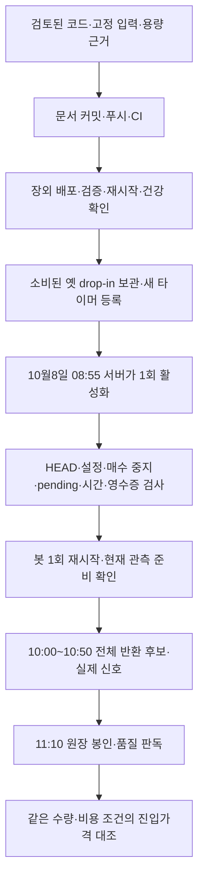

# 57차 — 신호 시간대 용량 검증과 10월8일 운영 적용

목적은 현재 엔진의 **종목 선정과 진입가격을 비용 후 개선할 근거**를 확보하는 것이다. 사용자가 56차 남은 순서의 1·2번, 단계별 PLAN–DO–SEE, 문서 갱신·커밋·푸시 후 운영 배포를 승인했다. 관측 성공과 순수익 입증은 구분한다. 매수 중지·사용자 설정은 유지한다.

## 1. Plan — 시간대와 용량

- 10월8일 08:55~08:57 KST에 한 번 활성화한다. 스캔 접수는 **10:00 이상 10:50 미만**, 호가 관측 종료는 **11:10**이다. 장중 재시작을 피하면서 마지막 접수 뒤 900초 horizon과 5초 지연 한도에 여유를 둔다. 실제 늦은 신호나 미수신은 결측으로 남긴다.
- [KRX 10월 휴장 공지](https://trn.krx.co.kr/corebbs5/BHPTRN0301/view?bbsSeq=150)의 휴장일은 5·9일이다. 이는 날짜 확인이며 개별 호가의 연속매매 세션 증거를 대신하지 않는다.
- 새 계약 `runner-signal-window-v1`: 최대12스캔, 스캔당 선정·gate100후보, 선정 근거16항목, 실제 신호별 추가 KIS lease5개. 등록41·외부 예약0(사용자 진술)·운영 여유10·lease4800초. 반복 종목의 신호도 후보별 lease를 사용한다. 운영 채널이 우선이며 추가 호가 미할당은 명시적으로 남는다.
- buffer300,000행, queue8,192행, batch256행, 원장384MiB, 행64KiB 상한을 후보로 검증한다. 메타데이터 최소 예약은12×201행이다. 최대 크기의 메타데이터 예약과 측정된 호가 크기를 함께 수용하도록 256MiB 초안에서 확대했다. 임의의 모든 행이 최대 크기인 조합까지 보장하지 않으며, 실제 상한 초과는 불완전 봉인한다.
- 10월7일 원장의 H0STASP0 호가20,338건/5채널, 최대 rolling60초1,035건을 측정했다. 8채널과2배 유량으로 확대하면 `1,035/60 × 8/5 × 2 × 4,200 = 231,840`건이다. 시험은116,000/232,000호가와 buffer 초과를 사용한다. 과거 최대값은 미래 상한이 아니다.
- 새 window 모드의 호가는10:00부터 저장한다. 이전 ACK·연결 공백은 보존하고 기존 첫 스캔 계약은 변경하지 않는다. 시작 전 호가를 저장 상한에 포함시키지 않는다.
- 자본 정책은 원래 수량과 pending 등록 전 내부 스냅샷을 사용한다. 설정·코드 참조를 고정하고 위험0.7%, 종목18% 한도를 연결한다. 증권사 매수가능액 인증은 아니다. 수수료/세금은 기존 사전 선언 참조 모형과0/10/30bps 민감도를 사용하며 미래 실계좌 비용 확정으로 주장하지 않는다.

## 1. Do / See — 근거와 제한

합성 부하 시험은 실제 buffer·원장 writer·봉인·strict reader를 사용한다. 수집과 오프라인 읽기를 별도 제한 프로세스에서 실행해 각각의 최고 메모리를 기록한다. writer를 배치별로 쉬게 하는 시험이므로 실시간 callback 지연 성능의 입증은 아니다. 검증 결과는 다음과 같다.

| 사례 | 호가 요청 | 보존 행 / 누락 | 원장 크기 | 수집 최고 / 별도 읽기 최고 | 판정 |
|---|---:|---:|---:|---:|---|
| [기본](../research/signal-window-capacity-20261008/base.json) | 116,000 | 118,412 / 0 | 77,531,348 B | 143.9 / 301.4 MiB | 완전 봉인·재독출 |
| [2배 stress](../research/signal-window-capacity-20261008/stress.json) | 232,000 | 234,412 / 0 | 148,523,348 B | 246.4 / 553.0 MiB | 완전 봉인·재독출 |
| [상한 초과](../research/signal-window-capacity-20261008/overflow.json) | 300,001 | 300,000 / 2,413 | 188,663,208 B | 304.3 / 695.5 MiB | 의도한 불완전 봉인 |

모든 사례는 선정/gate 메타데이터2,412행을 포함한다. 선정 행 자체는 unavailable 합성이며 실제16항목 최대 payload 재생은 아니다. 별도의 최대 메타데이터 예약163,014,656 B + 합성 호가 크기 예산도384MiB 안에 든다. 각 자식 프로세스의 주소 공간은1.25GiB로 제한했고 수집 buffer와 strict reader 전체 복사본을 동시에 유지하지 않았다. 23:02 호스트 사용 가능 메모리 약1.6GiB·디스크 약47.6GiB, 봇 사용량 약568MiB/최고663MiB와 대조했다. 미래 유량/다른 프로세스 증가까지 보장하지 않으며 관측 종료 뒤 메모리 여유를 확인한 다음 오프라인 분석한다.

독립 Astra/xhigh 리뷰는 P0/P1 없이 readiness의 원장 writer 실패 누락(P2)을 지적했다. 실제 writer 오류 회귀로 재현·수정하고, 리뷰어가 수정/설치/용량 관련58개 검사를 별도 실행해 지적 해소와 소스 승인 의견을 냈다. 최종 로컬 `scripts/dev/verify.sh` rc0: **4659 passed / 2 skipped / 2 known xfailed**, 137.61초. 건너뜀2개는 엔진 전용 프로필에 해당 없는 토스 시작/런처 사례이며 기존 pykrx 경고1개가 남는다. 문법·비밀정보 검사 통과, 운영 상태·외부 네트워크 접근 시도0. 필수 CI·정확한 staging 입력 검증 뒤 배포한다.

## 2. Plan — 배포와 예약

1. 관측 전 호가 저장 제한, 현재 프로세스의 관측 준비 조회, 고정 engine-only 활성화·설치기를 검증하고 독립 리뷰를 받는다.
2. 문서·코드를 커밋/푸시하고 필수 CI를 확인한 정확한 커밋을 장외에 `local_deploy.sh`로 배포한다. 직전 pending0·KR kill·보호 설정 지문을 확인한다. 기존 배포 절차의 자동 복구를 유지한다.
3. 배포 뒤 봇 HEAD·PID·건강·복구 상태·설정 지문을 확인한다. 소비된10월7일 요청/시작 영수증/완료 상태/drop-in을 지문으로 대조·보관한 뒤 그 drop-in만 제거한다. 기존 원장·토스 release/권한·보존 타이머는 그대로 보존한다.
4. 새 날짜 study/manifest/once·root 실행기/설정·08:55 일회 타이머를 설치한다. 타이머는 마지막에 켜며 실패한 설치는 소비된 시도로 남기고 자동 재시도하지 않는다.
5. 실제 다음 실행시각·새 원장/영수증 미생성·보호 상태를 확인하고 실행 결과를 문서·커밋·푸시에 남긴다.

설치기의 `--check`는 고정 입력·지문·운영 경계를 검증한다. 코디네이터가 사용자 소유 비공개 staging에서 CapturePlan 전체 의미 검증을 먼저 수행하며, 설치기는 입력을 배타 생성한 뒤 다시 ubuntu로 전체 검증하고 나서 옛 drop-in 제거/타이머 활성화를 진행한다.

새 readiness 경로는 루프백·고정 Host·전용 헤더·비프록시 요청만 허용한다. 현재 봇 메모리의 study SHA/epoch/capture ID/window/미종료 상태를 확인한다. 옛 파일만 남았거나 한 번 소비된 요청으로 재기동한 봇을 준비 완료로 간주하지 않는다. 원장 writer의 실패나 비정상 종료도 준비 실패로 처리한다. 토스 첫 스캔 projection을 확대하지 않는다.

재시작 전 실패만 새 drop-in의 제한적 복구를 허용한다. 재시작 요청 뒤 실패는 영수증을 유지하고 추가 재시작·자동 재시도 없이 점검 대상으로 남긴다. 매수 재개나 실거래 주문은 이번 승인 범위가 아니다.

## 2. Do / See — 실제 적용 결과

**1·2번 완료 — 2026-10-07 23:47:48 KST 설치 완료.**

- [PR #157](https://github.com/qwq-partners/qwq-ai-trader/pull/157)을 문서/코드 커밋·푸시하고 필수 CI **4659 passed / 2 skipped / 2 xfailed**(101.86초) 후 머지했다. CI에는 의존성 경고33개가 있었고 검사 실패는 없었다. 리뷰한 소스와 머지본의 내용 일치를 확인했다.
- 정확한 `1d457044e3febdc73bb9580ce4c658b448ecde24`를 승인된 장외 절차로 배포했다. 실제 운영 verify도 **4659 passed / 2 skipped / 2 xfailed**, 134.64초·문법/비밀정보 통과·격리 위반0이다. 배포 rc0·롤백 없음. 기동은23:45:56, PID601969/NRestarts0이다.
- 배포 후 HTTP 정상·broker 연결·pending 네 항목0·로컬 미체결0·stale 없음·execution recovery ready/장부 대기0/귀속 미확정0/prior_unclean false를 확인했다. 사용 설정 두 지문과 KR 매수 중지를 보존했다.
- 전체289개 src/scripts Python 지문을 고정했다. 사용자 소유 staging의 CapturePlan 전체 검증과 독립 입력 리뷰를 통과했다. 설치기는 실제 배포본으로 다시 검증했고 사전 검사 ready, 실제 apply rc0/complete이다.
- 23:47:48 일회 타이머를 활성화했다. 실제 `NextElapseUSecRealtime=Thu 2026-10-08 08:55:00 KST`, 활성화 서비스는 inactive, 새 원장/시작 영수증/활성화 영수증은 미생성이다. 예약은 서버 systemd가 실행하며 대화 세션이 계속 열려 있을 필요가 없다.
- 소비된10월7일 once/영수증/완료 상태/drop-in은 `/var/backups/qwq-entry-capture-20261008`에 지문과 함께 보관했다. 일치한 drop-in만 제거했고 현재 DropInPaths는 비어 있다. 설치 중 봇 재시작·토스 시작은 없었으며 PID601969를 유지했다.
- 기존 엔진/토스 원장, 토스 deployment/plan/registry, 기존11월1·5·6일 보존 타이머8개 파일의 전후 SHA256 일치를 확인했다. 토스 서비스는 inactive다. 새 관측이 없는 현재 readiness는 의도한503이다.
- 설치 정적 검사 중 기존 `claude-session.service`의 KillMode=none 폐기 예정 경고가 함께 출력됐으나 rc0이며 해당 서비스는 변경하지 않았다.

| 고정 항목 | 값 |
|---|---|
| 운영 HEAD | `1d457044e3febdc73bb9580ce4c658b448ecde24` |
| study SHA256 | `d2fcbbf28aa9957c0402497b982fc8d83c935f7a9853ffbd410e6969af801bb1` |
| source inventory SHA256 | `524f2d88e8d1aee2b44d69d920d6e767cb49a62b0624668b78504edb472d1777` |
| 설치 manifest SHA256 | `4283ccd84763e581e582e1d8c108c7bdff379c120b3c4f5cde903a3e3e07c23f` |
| 정책 고정 시각 | 2026-10-07 23:42:21 KST |
| 새 입력 | `~/.local/share/qwq-entry-observation/20261008-signal-window-v1/` |
| 새 원장/시작 영수증 | `~/.local/state/qwq-entry-observation/20261008-signal-window-v1/` |
| 활성화 영수증/상태 | `/var/lib/qwq-entry-capture/20261008-signal-window-v1/` |
| 배포 로그 | `~/.local/state/qwq-deploy/signal-deploy-20261008.log` |

**다음 관측 전 운영 HEAD·설정을 바꾸면 활성화 지문 검사에서 중단된다. 문서 후속 커밋은 운영 배포 대상이 아니며 운영 HEAD는 위 커밋으로 유지한다.** 오늘 완료한 것은 용량 검증·배포·예약이다. 내일 실제 관측과 비용 후 경제성 판정은 아직 실행되지 않았다.

## 관측 뒤 다음 PLAN–DO–SEE

1. 08:55 활성화 상태와 현재 관측기를 확인한다. 11:10 이후 study/봉인/누락/스캔 수·후보 분모·gate/신호·호가 지연·horizon 결측률부터 판독한다.
2. 평가 가능한 동일 수량 사례에서 현재 진입 대 가격 조건 하나의 회피 손실·포기 이익·비용 민감도를 비교한다. 신호0/리스크 차단/미수신을 수익0이나 전략 실패로 바꾸지 않는다.
3. 이후 동일 진입의 청산 대조와 계좌 전체 현금·업종·종목 선택·청산·비용 기여를 분리한다. KODEX200 전체 기준은 유지하고 반도체 제외는 양쪽에 같은 규칙을 적용한 보조 진단으로 둔다. 버전별·시장 국면별 성과를 분리한다.

라우팅: 용량 도구 Terra/high, 활성화·설치 구현 Astra/high, 배포 경로 감사 Sol/high, 독립 최종 리뷰 Astra/xhigh 완료. 실제 모델·유효 effort 메타데이터는 노출되지 않아 미검증이며 fallback은 없었다. 독립 리뷰이며 다른 제공자 간 교차 검증이라고 주장하지 않는다.
