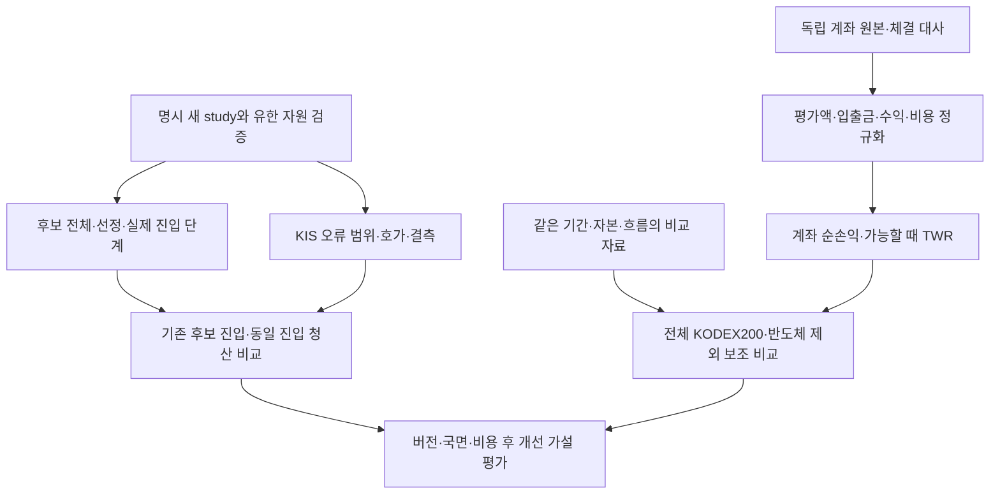

# 관측 용량·오류 범위·계좌 순수익 — 40·41·42차 PDS

목적은 좋은 종목과 유리한 진입 시점을 찾아 거래비용·운영비 뒤 계좌 이익을 남기는 것이다. 사용자의 “순서대로 전부” 지시에 따라 39차 main `1f3b10e59c56706b3c2f5270121fe0b4b7455c98`에서 세 작업을 순차 진행한다. 기준39차는 [PR #133](https://github.com/qwq-partners/qwq-ai-trader/pull/133)이며, 이번에는 운영5468208/기존 override·매수 중지·설치 입력을 변경하지 않는다.

## 40차 Plan — 필요한 길이와 현재 유한 상한

[설계](../superpowers/specs/2026-10-02-capture-capacity-frame-design.md)와 [계획](../superpowers/plans/2026-10-02-capture-capacity-frame.md)을 따른다. 이전 pilot 평균10,000/435.343147초를 선형 가정하면 전체1800초41,347프레임,2배 가정82,694프레임이다. 현재 cap50,000으로 어떤 구간을 확보하고 어디서 실패하는지 실제 수신기·저장기로 검증한다. 과거 집계만으로 미래 유량이나 실제 틱 완전성을 보장하지 않는다.

## 40차 Do — 기존 수신/저장 경로의 합성 검증

새 오프라인 qualifier는 외부 소켓 대신 한 프레임씩 생성하는 소켓과 주입 시계를 사용한다. 실제 `receive_orderbooks`→`TossOrderbookCapture`→`CaptureArtifact`→엄격 재읽기 경로를 통과한다. 종목3개/10단계 호가, 균등 시간/첫1초 집중·원래 편중 가정/한 종목 집중, 정확한 cap 경계를 고정했다. 실제 원문이나 증권사 키를 사용하지 않는다.

프레임·파일 hard cap은 기존50,000·64MiB를 그대로 쓰며, Python 추적 peak256MiB와 case wall/CPU120초를 사전에 측정 예산으로 정했다. 시간에는 합성 생성·tracemalloc·export·직렬화·저장·재읽기가 포함된다. 이는 운영 프로세스 RSS, 실시간 지연, 강제 자원 격리 또는 네트워크 완전성 보장이 아니다.

`test_expectation_met`는 예상 종료 원인과 실제 결과의 일치다. `window_coverage_met`는 시간 종료 도달, `all_symbols_horizon_quote`는 각 후보의900초 뒤 유효 호가 존재, `resource_budget_met`는 합성 저장·재읽기와 선언 자원 예산 통과다. 한도가 정확히 찼으면 계속 frame_limit이고 불완전하다. CLI exit0은 예상 종료 사유 일치일 뿐 자원 통과/실수집 완료/수익 통과가 아니다.

```bash
python scripts/qualify_toss_capture_capacity.py --suite smoke
python scripts/qualify_toss_capture_capacity.py --suite full
```

## 40차 See

[전체8개 합성 결과](current-engine-capture-capacity-2026-10-02.json)를 보존했다. 실제 기존 receiver/collector/storage를 통과한 전체 재생은1 passed·533.33초·exit0·격리0이고 예상 종료 사유가 모두 일치했다. 기본 회귀24개 RED→GREEN, 기존 수신/서비스 포함132 passed·4.03초·exit0·격리0. 독립 Astra/xhigh 요청 검토는24 passed·1.39초·exit0, 확인된P0/P1/P2 없음.

| 합성 사례 | 처리 프레임 | 종료 | 모든 후보 horizon 가격 | 자원 예산 |
|---|---:|---|---|---|
| 기존10k 상한 | 10,000 | frame_limit | 없음 | 통과 |
| 900초+1초 여유 | 20,697 | window_ended | 있음 | 통과 |
| 실제ACK→계획종료 길이 | 38,124 | window_ended | 있음 | 통과 |
| 전체1800초 평균 가정 | 41,347 | window_ended | 있음 | 통과 |
| 전체1800초2배 가정 | 50,000 | frame_limit | 있음 | 통과 |
| 한 종목 집중 | 41,347 | window_ended | 다른2종목 없음 | 통과 |
| 첫1초 집중 | 41,347 | window_ended | 없음 | 통과 |
| 정확히50k 상한 | 50,000 | frame_limit | 있음 | 통과 |

전체창 평균 사례의 Python 추적 peak174,477,772bytes·artifact14,791,763bytes, 최대 사례 peak212,548,447bytes·artifact17,889,648bytes였다. 선언 예산을 통과했지만 2배 유량의 전체창은 실패다. 따라서 새 수집 cap을 임의 확정하지 않았다. 후속 실제 수집 제안에는 목적에 맞는 입장/종료 구간과 별도 유량 가정, 후보별 평가 가격 확보를 함께 검증해야 한다. 저장방식/보존정보를 바꾸면 새 계약으로 검토하며 현재 LOSSY·과거 불완전 상태는 유지한다.

## 41차 Plan — 불량 프레임이 무엇에 속하는지

40차 결과 확인 뒤 원문 없이 TR·count·암호화·관측범위를 기록한다. 현행 완전성 실패를 제거하지 않고 원인 진단 근거를 보완한다. 명시 v4/원장v2 계약·기존 v1/v2/v3 비활성 경계는 설계를 따른다. 실제1,803건 오류의 상세를 사후 추정하지 않는다.

## 41차 Do / See

명시v4를 기존 first-scan 런타임에 연결하고 원장v2 헤더에 선택 설정을 보존했다. 기존5종 오류 분기에서만 `frame_gap`을 호출하며 후보 귀속은 유효한 현재 lease 수요다. ACK/무손실 증거로 바꾸지 않는다. 다중·암호화·count 불명 프레임은 첫 종목에 귀속하지 않는다. 진단 실패에도 기존 gap 한 번을 남기고 추가 불완전을 기록한다.

원문 없는 enum 조합·원래 sequence·관측≤봉인≤보고·v4 연구/설정 동일성을 검사한다. 구형 원장이나 상세 없는 오류는 unavailable이며 기존 전체 gap/유실은 유지된다. 받은가격 입력과 진입 trace 보고의 v4 호환도 검증한다.

```bash
python scripts/report_kis_frame_diagnostics.py --journal /explicit/capture.jsonl --study /explicit/study.json --as-of 2026-10-02T01:00:00Z --max-journal-bytes 67108864
```

이는 예시 경로/시각이며 실제 새 수집 입력이 아니다. worker 신규48개 RED→GREEN, 기존 포함 전체3889 passed /2xfailed·130.42초·격리0. root는diff를 확인해 통합했으며 독립 최종 검토/전체 검증은 아래 통합 See에 기록한다.

## 42차 Plan — 계좌 원화 손익과 정확한 TWR 구분

독립 기존도구 감사에서 실제 계좌 총수익 계산 경로가 없음을 확인했다. `quantstats_report`의 내부 daily_pnl_pct 복리나 체결 가격 일치만으로 계좌 순수익을 인증할 수 없다. 41차 후 [42차 설계](../superpowers/specs/2026-10-02-account-net-return-design.md)·[구현 계획](../superpowers/plans/2026-10-02-account-net-return.md)·[입력 절차](../operations/account-net-return-input.md)에 따라 순손익/TWR 계산기를 보완한다.

계좌 원본 경로는 기존 요청에 아직 답이 없으며 파일이 없다고 단정하지 않는다. 새 실행 원장보다 오래된29건의 identity·체결 수량/가격/비용은 독립 명세가 필요하다. 새 도구가 이를 자동 복원하거나 내부148자산 기록을 완전 계좌 자료로 바꾸지 않는다. 현재 pilot은 신호/주문 생성0·비교쌍0이며 경제값은 계속 미확정이다.

## 42차 Do / See

새 순수 계산기와 명시 파일 CLI는 평가/보고 시간과 금액·완전성·중복/순서를 검증한 뒤 원화 손익과 TWR을 나눈다. 계좌 안에 반영한 비용은 중복 차감하지 않고 밖에서 지불한 운영비만 순손익에서 뺀다. 외부 운영비가 있으면 모든 비용 후 TWR은 null이다. 별도 비교 포트폴리오는 같은 기간/초기자본/흐름을 요구하되 ID와 각 입출금 전후 NAV는 달라도 된다.

합성54개 RED→GREEN 뒤 실제 CLI 프로세스·파일변경 거부·UTC 시각 범위 초과3사례를 추가했다. 시각 범위 초과가 오류로 유출되는 것을 RED로 재현하고 입력 거부로 수정했다. root의 세 작업 관련 통합337 passed·5.27초·exit0·격리0. 계좌 원본은 읽지 않았으며 실제 계좌 순손익은 미계산이다.

## 통합 See — 리뷰와 검증

독립 Astra/xhigh 요청 리뷰에서 새v4 study를 구형 원장에 붙이는 가격 소비 경로의 누락(P2)을 재현했다. 공통 가격 입력기에서 연구/관측/원장 중 진단 표식이 있으면 v4 binding과 frame report를 함께 검증하도록 수정했다. 역방향인 구형 study+v2 원장, v2 헤더만 남긴 경우도 거부한다. 세 반례 RED→수정 뒤 기존 가격·평가 조립·동일진입 청산·계좌 관련193 passed·4.37초·격리0. 원래 정상 직접입력 시험은 명시 v4/v2 선언으로 맞췄다.

요청 모델은41차 구현 Astra/high, 독립 최종 리뷰 Astra/xhigh다. 실제 모델/effective effort는 런타임 메타데이터에 노출되지 않아 unverified이며 독립 동일 제공자 검토를 교차 제공자 검토로 부르지 않는다. 자원 측정 JSON은 qualifier 소스 SHA와 일치한다. 문서 상대 링크197개와 MEMORY42줄을 확인했다. 독립 수정후 표적검증190 passed·4.24초·격리0으로 P2 수정 확인, 미해결 P0/P1/P2 없음. 최종 검토 source/scripts/tests diff SHA-256은 `1b4d69838f4041fe3e7945d2d22385ee5b6513ff8d40b64cef45bd633f5af75c`다. 수정 전 전체3970 passed/2xfailed·135.76초·기존 경고1·격리0·비밀정보 검사 통과를 보존하되 최종 수정의 전체 증거로 대체하지 않는다. 최종 전체 verify는 **3973 passed /2xfailed·118.85초·기존 pykrx 경고1·격리0**, 문법/비밀정보 검사 통과(exit0)다. 코드·프로세스 통합 검토와 로컬 실행 가능 작업을 완료했다. 정확한 PR head·CI·merge 영수증은 해당 PR 본문에 기록한다.

## 통합 흐름



실시간·다중 원천은 검증할 강점으로 유지한다. 어떤 코드가 작동한다는 사실과 그 코드가 수익을 개선했다는 증거를 구분하며 현재 버전을 과거 결함 구간에 소급하지 않는다. 이번 로컬 구현에서 운영 배포·재시작·API·추가 수집/예약은 실행하지 않는다.


## 이후 실제 자료 작업의 우선순위

1. **계좌 손익 기준 확정:** 제공된 비공개 원본 경로에서 시작/끝 순자산·입출금·배당/분배금·수수료/세금·계좌 밖 운영비를 대사한다. 과거29건은 원주문/체결 identity부터 확인하며 미확인분을 추정 체결로 보충하지 않는다. 계산 도구의 합성 통과는 이 작업 완료가 아니다.
2. **현재 버전의 유효 관측:** 새 study/epoch와 시간·후보·자원 예산을 고정하고 선정→실제 진입 단계→호가 유실/평가 가능성을 확인한다. 기존 pilot 날짜·승인·불완전 가격을 재사용하지 않는다. 현재 개발 코드는 운영5468208에 포함되지 않는다.
3. **개선 가설 한 개의 사전 고정:** 먼저 실제 기록에서 가장 큰 병목을 확인한 뒤 한 정책만 선택한다. 기존 ‘지수 비중 기준 제한적 기울기’ 가설은 당시 구성/수익/비용 자료가 확보되어야 평가할 수 있다. 선정 점수·진입 시간·청산을 동시에 바꾸지 않는다. 이미 본 pilot에 맞춰 임계값을 낮추지 않고 별도 미관측 확인 구간으로 평가한다.
4. **순수익 기준 의사결정:** 현금·업종·종목·진입·같은 진입의 청산·비용을 나누고 계좌 전체 결과로 연결한다. 전체 KODEX200은 기회비용 기준으로 유지하고 반도체 제외는 보조 비교로 함께 낸다. 각 엔진 버전과 상승/하락 국면을 분리한다. 거래비용과 운영비 이후 이익 및 사전 위험 조건을 충족할 때만 변경의 유효성을 판단한다.

추가 전략을 계속 만드는 대신 위 입력이 확보되면 기존 도구를 한 번씩 연결해 실제 결과를 낸다. 원본 제공이나 새 수집 실행 범위가 없는 동안에는 실제 손익/승격을 완료로 표시하지 않는다.
