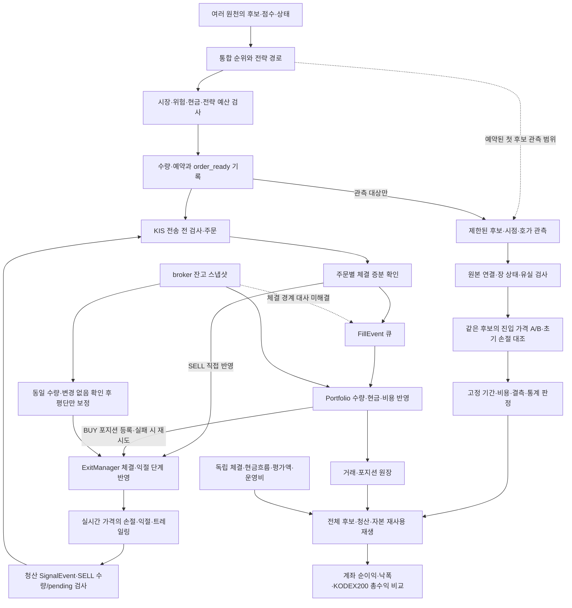

# 순수익 개선 우선순위와 코드·프로세스 통합 검토 — 32차

목적은 **좋은 종목을 유리한 시점에 진입해 거래비용·운영비 차감 후 계좌 이익을 남기는 것**이다. 다중 원천과 실시간 판단은 검증할 강점이다. 일봉 대조만으로 그 가치를 부정하지 않으며, 반대로 실시간·다중 원천이라는 이유만으로 비용 후 우위를 가정하지 않는다.

이번 범위는 개발 checkout에서 재현 가능한 결함 수정, 이미 고정한 가격 진단 통계의 구현, 전체 흐름과 남은 선행조건의 통합 검토다. 실제 관측과 독립 계좌 자료가 필요한 작업까지 완료됐다는 뜻은 아니다. 기준 base는 `89eaec20422c3f4579413d5b4cfd15542369db65`다.

## Plan — 순서와 완료 기준

| 우선순위 | 해결할 문제 | 이번 처리 | 완료 기준/남은 조건 |
|---|---|---|---|
| P0-1 | 잔고 평단과 청산 판단 평단의 불일치 | 동일 수량·알려진 로컬 pending 없음·조회 중 engine fill 시작 없음의 범위에서 평단 보정 | 손절 누락/오발동 회귀, 청산 단계·초기 위험 불변, 조회 중 체결 방어 |
| P0-2 | 체결 조회 일부를 전체로 간주하는 시작 시 복구 | 완결 응답만 거래 기록 복구에 사용 | 부분/실패/불명 응답으로 캐시·DB를 수정하지 않음 |
| P1-1 | 성과 원장의 NaN/Infinity로 계산 중단·오염 | 유한 숫자만 계산에 사용 | 누락을 0으로 만들지 않고 benchmark와 요약까지 처리 |
| P1-2 | 사전 고정 기간·통계 규칙이 문서에만 있음 | 원본 일별 자료에서 기간 판정까지 오프라인 연결 | 결측일·원래 순위·버전·비용·표본·신뢰구간·상위3건 제외 검사 |
| P0 후속 | 잔고 수량과 늦게 도착한 체결의 선후 관계 | 원인·구현 계약 확정, 미해결로 표시 | authoritative 잔고 시점/체결 경계와 중복 방지 테스트 필요 |
| P1 후속 | 실제 첫 관측/장 상태 근거 | 기존 예약 유지, 종료 후 검토 순서 확정 | 원본/봉인/종료·유실·후보 연결·거래소별 세션 근거 |
| P2 후속 | 전체 후보 처분·다른 진입 경로의 관측 공백 | 경로별 공백과 후속 계약 명시 | 후보 탈락·현금·슬롯·예산·주문 결과를 같은 ID로 연결 |
| P2 후속 | 청산·자본 재사용·계좌 성과 | 사건 순서와 계좌 평가 선행조건 명시 | 독립 체결29건, 현금흐름·비용·평가액·벤치마크 자료 |
| P3 후속 | 반도체 제외 연간 비교·새 제한적 기울기 가설 | 기존 미확보 상태 유지 | 공식 당시 구성 자료 및 미관측 기간 확보, 별도 사전등록 |

P0 후속 수량 문제는 실제 주문에 영향을 주므로 수익 최적화나 배포 전에 우선 해결해야 한다. 이번에 안전하게 고친 평단 경로가 수량 문제까지 해결했다는 의미는 아니다. 운영 매수 중지 해제나 오늘 예약에 새 변경을 넣는 작업은 이 개발 범위에 없다.

## Do — 평단 수정과 수량 대사의 경계

`KRScheduler._sync_portfolio`는 기존 종목의 수량·평단을 Portfolio에 갱신하지만 ExitManager의 평단은 남겨 두었다. 합성 사례에서10주@10,000원의 평단이12,000원으로 보정되고 현재가가11,000원이면, 기존 청산 상태는5% 손절을 놓쳤다. 반대 보정은 불필요한 손절을 유발할 수 있다.

새 평단 보정은 조회 시작 전과 적용 직전에 다음을 확인한다.

- 캡처한 Portfolio/ExitState 객체가 유지되고, 각 객체의 수량·평단이 적용 직전까지 변하지 않았다. broker·Portfolio·ExitState 수량은 양수로 일치한다.
- broker와 engine의 매수/매도 pending 및 ExitManager의 부분체결 대기가 알려진 빈 상태다. 확인할 수 없는 adapter는 보정하지 않는다.
- 조회 동안 `UnifiedEngine.update_position`이 한 번도 시작되지 않았다. 로컬 세대 번호로 수량이 늘었다 다시 줄어 원래 값이 된 경우도 감지한다. 다른 종목 체결도 해당 주기의 보정을 보류한다.
- 유한한 양수 평단만 ExitManager.entry_price에 반영한다. 검사와 적용 사이에는 비동기 대기가 없다.

수량, 최초 수량, 단계, 초기 위험금액, 손절 파라미터, 본전 이동, 고점, 트레일링, 진입시각, 실현손익을 다시 쓰지 않는다. stage 파일에 평단을 새로 저장하지 않으며 재기동은 기존 포지션 기반 복원 경로를 유지한다. 보정을 보류해도 기존 청산 경로를 막거나 새 pending을 만들지 않는다.

**남은 위험:** 기존 Portfolio 수량 동기화가 체결보다 먼저 반영되면, 이후 같은 SELL 체결을 다시 차감할 수 있다. ExitManager에 `register_position`을 무조건 재호출하면 이 문제를 확대하고 최초 수량·익절 단계까지 바꿀 수 있어 채택하지 않았다. 로컬 세대 번호는 조회 중 변경 감지용이며 거래소 체결 watermark가 아니다. 전체 수량 대사가 해결됐다고 표시하지 않는다.

이 검사는 로컬 메모리 pending을 사용하므로 **거래소 미체결·수동 주문이 없다는 증거는 아니다**. 재기동 이전 주문이나 외부 매매의 동일 수량 왕복도 로컬 세대 번호만으로 검출하지 못한다.

시작 시 복구에서 `checked complete`는 한 번의 KIS 당일 체결 조회가 페이지 순회·정규화 기준을 충족했다는 뜻이다. 저널과 계좌의 수량·가격·비용 대사 완료, 실제 체결시각 확보, 재기동 미체결 복원을 뜻하지 않는다. 미완결이면 복구를 건너뛰고 기동은 계속된다. 이때의 상태 가시화와 재시도는 수량 대사 후속 계약에 포함한다.

후속 수량 대사의 최소 계약은 다음과 같다.

1. broker 주문 ID/누적 체결/개별 증분 ID와 잔고 스냅샷에 포함된 체결 경계를 연결한다. `미체결 없음`이나 주문시각은 실제 체결 확정 시각을 대신하지 않는다.
2. 잔고 기반 수량 교체와 뒤늦은 FillEvent 반영 중 동일 증분을 한 번만 적용한다. 수동 거래와 봇 거래가 구분되지 않으면 임의 체결/PnL을 만들지 않는다.
3. BUY/SELL 부분체결·취소·거절·조회 실패·재기동·잔고 응답 중 fill·큐 대기를 재현한다. 현금, 수량, pending 예약, ExitManager 수량 및 최초 위험 기준을 함께 검사한다.
4. 손절 전체를 막는 전역 가드로 문제를 감추지 않는다. 미해결 주문에 대한 과매도 방어와 보유 위험 청산의 정책을 명시한다.

## 선정에서 계좌 평가까지의 흐름



화살표는 호출/자료 의존 관계이며 하나의 원자적 처리나 모든 단계 구현 완료를 뜻하지 않는다. FillEvent의 `emit`은 큐에 넣는 동작이므로 뒤의 Portfolio 반영까지 완료됐다고 볼 수 없다. `F→X`와 `Q→P`의 시차가 수량 대사 후속 작업의 핵심이다. 연구 결과에서 운영 주문으로 자동 승격하는 화살표는 없다.

SELL의 ExitManager 반영은 큐의 Portfolio 처리보다 먼저 일어날 수 있다. BUY 등록은 포지션 생성을 최대1초 기다리고 실패하면 재시도 대기열로 넘긴다. 이 대기는 원자적 체결 완료 보장이 아니다.

| 흐름 | 코드 확인 지점 | 통합 검토 판단 |
|---|---|---|
| 후보 | `signals/screener/kr_screener.py`, `schedulers/kr_scheduler.py` | 원천 상태/캐시 계산은 이전 수정 유지. 다중 원천 개수를 독립 정보 수로 보지 않음 |
| 진입 | `core/engine.py` Signal→Risk→Order | `order_ready`는 주문 완료가 아니며 자본 재사용 평가의 전체 모집단도 아님 |
| 주문/체결 | `execution/broker/kis_kr.py`, `schedulers/kr_scheduler.py` | KIS 주문 번호와 로컬 ID, 누적 조회와 증분·큐 처리의 차이를 유지 |
| 청산 | `strategies/exit_manager.py` | 실제 엔진은 PRICE 기반 단계·트레일링.31차 bid 초기 손절 대조는 그 전체 재생이 아님 |
| 동기화 | `schedulers/kr_scheduler.py`, `core/engine.py` | 이번 idle 동일수량 평단 수정과 미해결 수량 대사를 구분 |
| 기록 복구 | `data/storage/trade_storage.py` | 완결 확인이 없는 조회로 기록 복구 금지 |
| 가격 평가 | `analytics/entry_evaluation_bundle.py`, `analytics/entry_exit_comparison.py` | 원본과 전체 후보 보존, 실제 세션 근거 필요, unknown은0이 아님 |
| 성과 원장 | `analytics/excess_return.py` | 일봉 종가 규약의 포지션 초과손익. 당일 체결시점 일치/계좌 총수익이 아님 |

## 고정 기간 가격 평가 도구

[28차의 사전 고정 기준](current-engine-session-evaluation-2026-10-01.md#결과를-보기-전에-고정하는-연구-기준)을 기간 평가기에 연결한다. 원래 상위3개/일, 완전 비교30쌍·10가격일,0/10/30bp,5거래일 순환 블록10,000회, 고정 PCG64 난수, 상위 양의3개 후보 제거 뒤27쌍·10가격일 조건을 바꾸지 않는다. 제공한 공식 예정일 전체를 분모로 삼고, 미관측일이나 미해결 후보가 있으면 경제적 판정을 중단한다.

입력은 `protocol`, `days`, `as_of` 세 필드의 명시 JSON 파일이다. 프로토콜의 `version=entry-window-protocol-v1`, `phase=diagnostic|confirmation`, `dataset_kind`, `fixed_at`, `evaluation_epoch`, `calendar`를 지정한다. calendar는 사전 고정한 `source_ref`, `source_sha256`, `scheduled_dates`를 요구한다. 날짜를 평일 목록으로 자동 생성하지 않으며 달력 원천을 인증하지 않는다. 예정 거래일 누락이 없는지는 원천 검토가 필요하다.

각 days 항목은 `date`, 수집 당시 원문을 보존한 `study_utf8`, 원장 reader가 해석한 `observations`, 선택적 `session_review`다. 일별 요약 숫자를 받지 않고 원문 지문을 확인하여 기존 가격 비교기를 다시 실행한다. 같은 capture ID/원장/연구파일을 다른 날로 재사용하거나 pilot을 후속 날짜로 재표기하지 못하게 검사한다. 일자만 달라지는 수집 인스턴스와 시각·코드·설정·선정·가격 정책 변경을 구분한다.

```bash
python scripts/evaluate_entry_window.py \
  --input <검토한-기간입력.json> \
  --max-input-bytes <명시한-전체입력-바이트상한>
```

CLI는 지정한 정규 파일 하나만 읽고 stdout으로 결과를 낸다. 심볼릭 링크·중복 JSON 키·비유한 상수는 거부한다. 총 입력 상한은 명시한 양수이면서256MiB 이하여야 한다. 이는 일별64MiB 원장 모두를 최대 크기로 담은 한 달 입력을 지원한다는 뜻이 아니다. JSON 해석 시 추가 메모리가 필요하므로 실행 전 실제 파일 크기와 가용 자원을 확인한다. 파일 탐색·추가 수집·원본 변경 기능은 없다.

종료일15:30 KST 전에는 품질만 표시하고 경제적 결과를 노출하지 않는다. 종료 이후에도 결과는 제공 자료에 대한 조건부 가격 진단이다. 원본 전체 후보 수/부분집합·비교 쌍·unknown과 날짜별 분모를 함께 보고한다. 실제 공통 미진입 처분을 인증하는 기록 계약이 없으므로 기록 부재를 양쪽 현금0으로 만들지 않는다. `production_eligible=false`, `profitability_pass=false`, `account_return=null`을 유지한다. 외부 세션/달력의 진실성, 실행 코드의 실제 적용, 실제 계좌 순수익을 이 도구가 인증하지 않는다.

빈 scan의0도 정상 획득 근거가 있어야 한다. 기존 구조화 원천 기록이 `observed`이고 폴백이 없으며, 한 원천 이상이 완료되고 시도한 원천 모두 `completed_empty|completed_nonempty`일 때만 허용한다. 원천 기록이 없는 과거 v1, 실패·부분·불명·캐시가 섞인 빈 scan은 `empty_scan_unverified`다. 후속 정상성/신선도 계약 없이0으로 바꾸지 않는다. 원장·장 상태 검토 시각이 기간 보고서의 `as_of`보다 뒤인 자료로 과거 시점의 경제적 결론을 만들지 않는다.

## 수익 개선을 위해 다음에 바꿀 수 있는 것

종목 선정과 진입은 별도 지표로 보되 같은 후보·시각에서 연결한다. 현재 먼저 검증할 가설은 기존의 비용 후 진입 가격 조건 하나다.31차 같은 진입의 초기 손절 대조로 손실 방어와 반등 기회손실을 함께 확인한다. 손절폭만 넓히는 제안은 채택하지 않는다. 손절·보유시간을 바꾸는 후속 가설에는 동일 위험 기준 수량 조정과 현금 점유 시간을 함께 넣어야 한다.

선정 경로에는 세 가지 공백이 있다. 첫째, 주기적 live_screening의 전역 전략 태그가 후보별 전략 적합성을 대신하는 구간이 있다. 둘째, emit 직후 횟수·cooldown이 소비되므로 뒤의 거절이 실제 진입 횟수와 다르다. 셋째, batch/intraday/sector 경로와 모든 조기 탈락의 관측은 현재 제한된 관측 범위 밖이다. 이는 자동으로 매수 한도를 늘리거나 태그를 바꿀 근거가 아니다. 후보 ID별 **제안→위험 통과/거절 사유→예약→전송/거절→부분/완전 체결→취소**를 보존하고, 시도 제한과 체결 제한을 다른 지표로 평가하는 후속 설계를 먼저 진행한다.

선정 평가에는 신호 점수/조정 후 점수/전략 태그/정책 버전·실효 설정 지문과 당시 전체 후보가 필요하다. 문자열 버전명 자체는 실제 실행 코드의 인증이 아니다. 실행에 성공한 후보만 남기면 자본·슬롯 때문에 놓친 좋은 종목이 사라진다. 수익 기여가 없는 중복 원천을 줄이는 최적화는 비용·지연 절감 후보지만 동일 원천 제거 가설로 따로 고정한 뒤 검증한다.

## 후속 자료 작업의 순서

1. 예정된10월2일 pilot의 종료 후, 기존 실행 기록에 따라 원본·종료·봉인·유실·후보 연결을 확인한다.08:55 기동/09:45 종료는 이 문서 작성 시 미래이며 성공을 주장하지 않는다. 실패 시 자동 재실행/기간 연장하지 않는다.
2. 원본 KRX 호가별 장 상태 근거를 확보하고 기존 준비 도구로 계산 가능 범위와 unknown을 먼저 낸다. Toss 통합 KRX+NXT 값을 KIS 실제 체결이나 KRX 전용 값으로 바꾸어 부르지 않는다.
3. 후속 기간은 공식 KRX 예정일 전체·동일 평가 세대·정책을 첫 관측 전에 고정한다.10월2일은 품질 pilot이며10월6일~11월3일 진단,11월4일~12월1일 확인과 섞지 않는다. 기간 고정은 추가 수집 실행 승인이 아니다.
4. 독립 체결29건과 현금흐름·분배금·비용·평가액을 대사한다. 체결 조회의 행 수나 매수 종목 집합 일치만으로 수량·가격·비용 대사를 완료하지 않는다. 기존 SELL exporter의 동시각 정렬/원천 event ID 보존도 이 입력 계약에서 보완해야 한다.
5. 전체 후보 시간순 A/B 계좌 재생의 현금흐름 처리, 분배금 처리, 평가시각, 수익 추정량과 CI를 자료 확인 전에 고정한다. 실제 계좌 절대 허용 최대낙폭·운영 투입 한도는 아직 사용자 확정 전이다.
6. 같은 기간·자본·현금흐름의 전체 KODEX200 총수익을 주 비교군으로, 당시 반도체 제외 비교를 원인 진단으로 함께 보고한다. 반도체 급등이 대표성을 약화할 가능성과 지수를 보유했을 기회비용은 서로 다른 질문이다. 연간 제외자료의 부족을 이미 확보한11구간으로 대체하지 않는다.

과거 결함/수정 전후와 현재 평가 세대를 분리하고, 상승·하락 국면도 당시 이용 가능했던 기준으로 나눈다. 과거 하락장 손실을 오늘 수정된 엔진의 검증 결과로 재사용하거나, 반대로 하락장을 이유로 실제 손실을 성과에서 삭제하지 않는다. 버전별 같은 기간 대조와 원인 분해로 무엇이 개선됐는지 판단한다.

계좌 검증을 통과하기 전에는 순수익 최적화가 완료됐다고 결론 내리지 않는다. 이번 개발은 오류를 줄이고 정해 둔 가설을 같은 규칙으로 평가할 수 있게 하는 작업이다.

## See — 검증 원장

- 평단: 수정 전6실패/16통과로 재현, 실제 BUY/SELL 왕복 변경 및 상태 불일치 검사 추가 후 관련84개 통과·격리 위반0. 독립 Astra/xhigh 요청 리뷰에서 새 P1/P2 없음. 기존 수량 대사는 미해결.
- 비유한 성과값: 작성자 신규14실패를 수정하고 관련183개 통과. 조정자가 diff를 확인하고 통합 후 원장/스케줄러101개 재검증 통과·격리 위반0.
- 시작 시 복구: 작성자 신규11실패 재현 후 관련88개 통과. 조정자가17행 변경과 실제 임시 저널·캐시·DB 큐 회귀를 독립 검토하고 통합 후28개 재검증 통과·격리 위반0. 조회 완결을 저널 대사 완료로 부르지 않는다.
- 위 세 수정의 전체 로컬 검증:3,261 passed / 2 xfailed·기존 pykrx 경고1개,95.70초. Python 문법·비밀정보 검사 통과, 운영 상태·외부 네트워크 접근 시도0. 기간 통계까지 통합한 최종 검증은 아래에 별도로 기록한다.
- 프로세스 통합 검토: 별도 Sol/high 요청 검토자가 관련117개를 실행했다. 로컬 pending의 증명 범위, 복구 skip 후 기동 지속, SELL/BUY 및 청산 신호 경로의 문서 지적을 위에 반영했다.
- 기간 통계: 독립 Sol/high 요청 검토가 작성자 커밋 `36373a3`을 승인했다. 원장 연결·날짜 재표기·정책 시간대·중간 손익 노출·미확인 빈 scan 지적을 수정하고 관련91개를 독립 재검증했다. 조정자가 보고시각 인과성, 비용별 unknown 합집합,33쌍/11일의 긍정/비긍정 기준과 별도 순환 블록 루프 검산을 추가해 기간 평가26개 통과·격리 위반0을 확인했다. 생산 승격은 모든 결과에서 false다.
- 최종 로컬 전체 검증: **3,287 passed / 2 xfailed**, 기존 pykrx 경고1개,91.59초·exit0. Python 문법·비밀정보 검사 통과, 운영 상태·외부 네트워크 접근 시도0. 추가 테스트 전용 diff도 Sol/high 요청 검토자가 별도로 승인하고26개를 재실행했다. 위 수량 대사 등 기존 미해결 위험을 제외한 이번 변경의 미해결 P1/P2 지적은 없다.
- 모델 기록: 분석/일반 검토 Sol/high, 기간 구현 Terra/high, 평단 구현 조정자·독립 검토 Astra/xhigh, 완결 체결 복구 Astra/xhigh 요청. 비유한값 구현은 처음 Terra 배정이 세션 제한에 막혀 기존 분석자 Sol/high를 재사용했다. 실제 모델/실효 effort 메타데이터는 미노출로 미검증이며 교차 공급자 검토라고 부르지 않는다.
- 운영 checkout `7ddfb52`와 사용자 override는 보존 대상이다. 활성화 대상 `5468208e2bf481eabae5c54da490c7da972756e1`, 공개 설치 제안 SHA `bf329d43417d4435407dfdf52adf8ee5a9c677ca691f149e5d7b2370729d4a48`를 바꾸지 않는다. 새 코드 통합은 운영 배포/재시작/매수 재개가 아니다.
