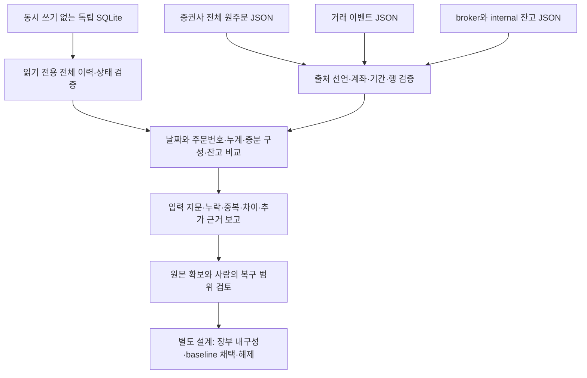
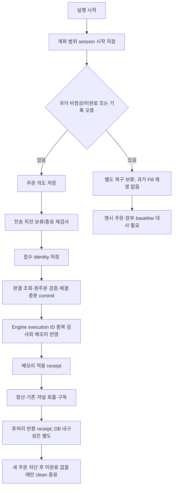
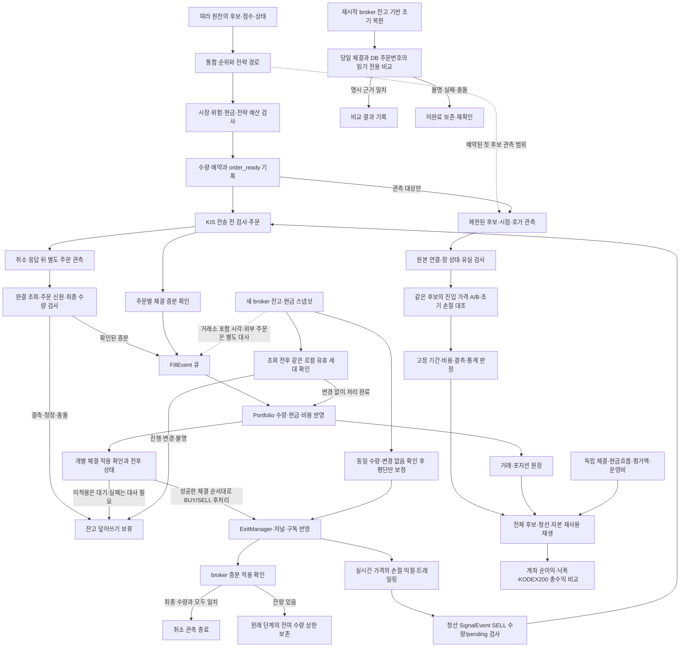

# 순수익 개선 우선순위와 코드·프로세스 통합 검토 — 32·33·34·35·36차

목적은 **좋은 종목을 유리한 시점에 진입해 거래비용·운영비 차감 후 계좌 이익을 남기는 것**이다. 다중 원천과 실시간 판단은 검증할 강점이다. 일봉 대조만으로 그 가치를 부정하지 않으며, 반대로 실시간·다중 원천이라는 이유만으로 비용 후 우위를 가정하지 않는다.

## 36차 Plan — 복구 증거의 읽기 전용 대사

기준 main `3be93a95a1b76dbd4f8de521c45df8bc0315e54b`(PR #129 병합). [계획/입력 계약](../superpowers/plans/2026-10-02-recovery-evidence.md)과 [사용 절차](../operations/execution-recovery-evidence.md)를 기준으로 **누락/중복을 수익이나 손실로 오인하지 않도록 실제 자료를 대사할 경로**를 구현했다. 과거 정상 장부의 주문번호 NULL, 체결 helper의 0체결/최종 상태 누락, broker 잔고의 체결 포함 시각 부재가 확인되어 추정 복구 대신 원본 차이와 필요한 자료를 보고한다.

### 36차 Do — 코드·프로세스 흐름

- `read_execution_ledger(path, expected_scope)`는 기존 mutable open/snapshot을 호출하지 않는다. 읽기 전용 transaction에서 원래 이벤트를 재생 검증하고 projection/계좌 범위/지문을 확인한다. 원본 데이터·세션·디렉터리 항목을 보존하며 WAL/동반 파일/손상/크기 초과/동시 변경을 거부한다. 온라인 DB snapshot 기능이 아니다.
- 순수 비교기는 날짜+ODNO와 종목·방향·원수량을 검증한다. 0체결 취소, 같은 ODNO 다른 날짜, 정정 계보, 원장 밖 주문, 범위 밖 미완료, NULL/중복 event ID를 구분한다. 거래 장부는 합계뿐 아니라 `(증분 수량, 현재 Fill의 2자리 반올림 가격)` 구성과 누락/추가 개수를 비교한다.
- 잔고는 종목별 양쪽 수량 차이, 현금값/종류, 취득 시각을 보고한다. 0원과 결측을 구분하고 종류가 다르면 현금을 비교하지 않는다. 한 시점의 잔고로 과거 체결 포함 여부나 현금 이동을 생성하지 않는다.
- CLI는 네 경로와 scope를 모두 명시해야 한다. JSON 중복 key/비표준 수치/형식 오류를 거부하고 입력 파일 및 내용 지문, 원천별 총/무효/중복 행 수와 후속 조치를 출력한다. `consistent|incomplete|mismatch`는 제공 자료 내 비교 상태이며 자동 복구 승인과 분리된다.
- 모든 보고서에서 `runtime_release_allowed=false`, `replay_allowed=false`, `state_mutated=false`, `baseline_inclusion=unverified`를 유지한다. 입력의 출처/완결성은 선언이며 파일 SHA가 실제 계좌의 진실을 인증하지 않는다. 무효 행도 전체 상태에 남겨 정상 일부만으로 통과시키지 않는다.



### 36차 See — 검증과 인계

- RED: 새 API 부재와 CLI 부재의 수집 실패, symlink/`..` 경계 실패, 누락 증분/잔고 차이 표시 누락을 확인한 뒤 GREEN으로 수정했다.
- 새 원장 reader25개, 비교기32개, 실제 임시 SQLite→JSON→CLI8개와 기존 원장42개 **107 passed**, 격리0. 원장 bytes/session/event/파일 목록 불변, URI 특수문자, WAL 전환 중 공유메모리 생성0, 동일 크기 파일 변경, 같은 합계의 다른 증분, 현금0/결측/basis/시차를 검증했다.
- 독립 중요 변경 리뷰 **APPROVE**, 검토 범위 내 미해결 P0/P1/P2 없음. 확정 소스에서 관련107개와 추가 합성5경계를 묶은 시험1개를 독립 실행해 exit0·격리0을 확인했다(중복 포함; 전체 결과와 합산하지 않음). 승인 제품3파일 결합 SHA-256은 `7b8370810d51bd31aa468940895ab81ff352ada5a188ca66902f5c2f52d5e74b`다. 산출 순서는 `execution_ledger.py`, `recovery_evidence.py`, CLI의 `sha256sum` 출력에 다시 SHA-256을 적용했다.
- 최종 로컬 전체 검증 **3,596 passed / 2 xfailed**, 기존 pykrx 경고1개,104.16초·exit0. Python 문법·비밀정보 검사 통과, 운영 상태·외부 네트워크 접근 시도0. 문서 상대 링크150개 누락0, diff 공백 검사 통과. PR CI와 병합은 동일 head의 GitHub 결과를 별도 확인한다. 실제 계좌 원본을 읽거나 복구하지 않았으며 운영 순수익 검증이 아니다.
- 라우팅: 구조 검토와 원장 reader writer는 Astra/high, 구현 비참여 최종 reviewer는 Astra/xhigh 요청. reader writer는 동일 base의 분리 worktree에서 소유2파일만 작성했고 조정자가 비교기/CLI/문서를 통합했다. 실제 모델/실효 effort는 미노출로 미검증이며 교차 공급자 리뷰라고 부르지 않는다.

| 우선순위 | 다음 작업 | 완료 기준 |
|---|---|---|
| P0, 개발 | 앞으로의 거래 이벤트에 주문/실행 identity와 DB commit 근거 보존 | 일반 진입/청산·부분 체결·재시도에도 NULL/중복/유실 없이 저장; 반환 영수증과 commit 구분 |
| P0, 실제 자료 확보 후 | 과거 주문·장부·잔고 실제 대사와 복구 범위 결정 | 독립 원본으로 누락/중복/수동 거래/정정 설명, 시작 잔고·계좌 이동·포함 기준; 불명 상태 유지 |
| 기존 예약 이후 | 예약5468208의 수집 품질 검토 | 실제 첫 후보/봉인/종료/유실/장 상태 근거. 이후 코드의 필드가 있다고 가정하지 않음 |
| 품질·장부 근거 확보 후 | 선정·진입·동일 진입 청산의 비용 후 비교 | 버전/시장국면·결측 분모·놓친 이익을 분리, 거래/운영비 차감 계좌 순수익으로 확인 |
| 성과 비교 | 전체 KODEX200 총수익과 반도체 제외 보조 비교 | 같은 기간/현금흐름·분배금 기준. 전체 지수는 기회비용, 제외 비교는 집중도 원인 분해 |

운영 계좌/API/자격증명/상태 파일·SSH·서비스·주문·배포·재시작을 사용하지 않았다. 운영 override·매수 중지·예약5468208과 설치 입력을 보존한다. 이번 완료 범위는 로컬 대사 도구와 절차이며 실제 보류 해제·baseline 채택·순수익 검증은 남아 있다. 아래35차는 당시 이력이다.

## 35차 Plan — 영구 실행 원장과 재시작 경계

기준 main `6126c9160b67fd9987aee307c89fbb671d5594f7`에서 34차의 메모리 체결 관측을 재시작 증거와 연결한다. [구현 계획](../superpowers/plans/2026-10-02-durable-execution.md)에 파일 소유권·실패 경계·검증 기준을 고정했다. 목표는 순수익 계산과 실제 잔고를 왜곡하는 누락/중복을 줄이는 것이며, 이 수정 자체를 전략 우위로 평가하지 않는다.

### 35차 Do — 적용 경계

`ExecutionLedger`는 환경·계좌·상품코드의 scope 해시로 파일을 분리하고, 인증 자료나 원본 API 응답을 저장하지 않는다. SQLite FULL transaction에 불변 이벤트와 현재 상태를 함께 commit한다. 최초 생성 디렉터리 fsync, 시작 시 전체 이벤트 재검증, 이후 상태 해시/끝 순번 검증, 취소된 thread 작업의 종료 대기를 적용했다. 지난 행은 매번 UPDATE하지 않지만 현재 상태 조회·해시 비용은 누적 상태 크기에 비례한다. 자동 prune은 하지 않는다.

주문은 session+local ID로 의도를 POST 전에 기록하고, 알려진 접수 뒤 날짜·ODNO·기관·종목·방향·원수량과 전략/청산 의도를 보존한다. 체결은 큐 인계 전에 누적 경계별 고정 execution ID로 기록한다. 정상 조회도 완결 페이지와 중복/원주문 identity를 검사한다. 조회의 await가 추가된 경로를 직렬화하고 Engine에서도 같은 execution의 다른 이벤트 재전달을 중복 적용하지 않는다.

Scheduler의 `portfolio_applied`는 실제 메모리 잔고 변경을 확인한 뒤 기록한다. `handoff_returned`는 청산·기존 저널 호출·구독 후처리 함수가 반환한 뒤 기록한다. 기존 저널의 JSON 예외 처리와 DB 비동기 큐까지 성공했다는 뜻은 아니다. 따라서 기존 원장 대사 결과와 영구 execution receipt는 별도 근거다.

재시작은 과거 주문을 현재 `_pending_orders`/`_fill_observations`에 복원하거나 Fill로 재생하지 않는다. 이미 broker 잔고로 채운 Portfolio에 과거 체결을 다시 더할 수 있기 때문이다. 이전 비정상 session·미완료·손상은 별도 보류이며 정상 잔고 조회, 빈 주문 목록, 날짜 변경으로 해제하지 않는다. **현재는 과거 원주문을 자동 조회하여 baseline을 채택하는 절차와 수동 해제 도구까지 구현한 상태가 아니다.** 자료 없는 최초 설치 역시 예전 주문을 증명하지 않는다.

- session 시작을 저장한 현재 프로세스에서 기록이 고장 나면 신규 BUY와 분할 SELL은 보류하되 보호 전량 SELL을 허용한다. 그 현재 주문의 날짜/ODNO/종목/방향/원수량·미정정 근거와 누계가 맞는 체결은 메모리에 반영한다. 이 체결의 execution ID는 비어 있으며 영구 저장 완료라고 표시하지 않는다. session fault는 유지되어 정상 종료 표식을 쓸 수 없다.
- session 시작 기록조차 실패하면 기록 없는 주문이 다음 시작에서 사라질 수 있어 전량 포함 새 주문을 보류한다. 종료를 시작하면 첫 await 전에 새 주문을 막고 최종 POST에서도 재검사한다. 종료 중 전송은 보호 SELL 예외가 아니다.
- 정정 계보는 미지원이다. 성공/불명 정정은 unresolved이며, 과거 체결·기존 청산 단계/JSON/DB·broker baseline을 추정해 자동 수선하지 않는다. 보호 SELL 유지도 현재 인식 보유분의 기존 경로를 뜻하며 과거 살아 있는 주문의 추가 체결까지 완전 복구했다는 주장이 아니다.



### 35차 See — 검증 및 남은 일

- 신규 임시 SQLite42개·실제 adapter/engine/scheduler 통합27개가 통과했다. 최초 API 부재9실패, 별도 이벤트의 동일 execution 중복, 종료 중 전송, 최초 시작 기록 실패, 저장 장애의 보호 체결, 동일 누계 가격 충돌, 뒤 행 실패 후 완료 주문 잔류를 RED→GREEN으로 확인했다. 기존 동시조회 시험은 새 직렬화 경계로, 조회 mock은 완결 여부 인자로 갱신했다.
- 독립 중요 변경 리뷰에서 종료 기록 뒤 미기록 SELL, 최초 RUN_OPEN 실패 뒤 미기록 SELL의 P1 두 건과 앞선 완료 주문이 뒤 행 실패 때문에 pending에 남는 P2 한 건을 재현했다. 모두 수정·회귀 검증 후 **미해결 P0/P1/P2 없음**으로 승인했다(이번 구현 범위 기준). 관측 commit 후 snapshot 오류도 독립 주입해 다음 주기에서 메모리에 한 번 반영되고 재시작 보류가 남는 것을 확인했다.
- 독립 검증은 관련253개, 활동 경계23개, 최종 통합27개를 별도로 실행했다(중복 포함; 합산하지 않음). 모두 exit0·격리 위반0. 승인된 제품7파일 aggregate SHA-256은 `c70072ad6694c4d77144678b57d5cb271d855584165b35e402e339d131f8e05a`다.
- 최종 로컬 전체 검증: **3,531 passed / 2 xfailed**, 기존 pykrx 경고1개,95.51초·exit0. Python 문법·비밀정보 검사 통과, 운영 상태·외부 네트워크 접근 시도0. PR CI와 최종 병합은 동일 head의 GitHub 검사 결과를 별도 확인한다.
- 라우팅: 구조 검토/원장 writer Astra/high 요청, 최종 독립 reviewer Astra/xhigh 요청, 조정자는 broker·엔진·스케줄러·문서를 통합했다. worker는 분리된 같은 기준 worktree에서 두 소유 파일만 작성했다. 실제 모델/실효 effort 메타데이터는 미노출로 미검증이며 교차 공급자 리뷰라고 부르지 않는다.

운영 서비스/계좌 API/자격증명/운영 상태 파일을 사용하지 않았으며 예약5468208·설치 입력·운영 override·매수 중지를 보존한다. 공개 설치 제안 지문 `bf329d43417d4435407dfdf52adf8ee5a9c677ca691f149e5d7b2370729d4a48`도 동일하다. 위 승인은 과거 복구·운영 적용·계좌 순수익 검증 완료가 아니다.

| 순서 | 남은 작업 | 완료 기준 |
|---|---|---|
| P0, 운영 적용 전 | 과거 주문·체결/청산·DB 장부와 새 broker baseline의 명시 대사·해제 절차 | 원주문 identity와 체결 포함 경계 근거, 누락/중복/수동 거래·정정 처리; 불명은 자동 완료 금지 |
| 기존 예약 이후 | 10월2일 첫 후보 원본·봉인·종료·유실·장 상태 점검 | 예약5468208이 실제 생성한 자료 기준. 이35차 소스가 수집됐다고 가정하지 않음 |
| 품질 통과 후 | 같은 후보·수량의 비용 후 진입 가격, 같은 진입의 청산 비교 | 사전 고정 기간/후속 가격, 회피 손실과 놓친 이익, 결측과 후보 분모 보존 |
| 수익 판단 | 독립29체결·현금흐름·분배금·거래/운영비·평가액 대사 | 전체 KODEX200 총수익을 기회비용으로, 당시 반도체 제외 비교를 원인 진단으로 병기; 버전·상승/하락 국면 분리 |

## 34차 Plan — 취소 뒤 체결 누락과 재시작 복구 상태

Base `9be42d52db3bd0f1c8612c52eb4d4daf896035d6`. 목표는 취소 직전 실제 체결을 놓쳐 보유량·예약·청산 수량이 틀어지는 경로와, 불완전한 장부 복구를 완료로 보고하는 경로를 수정하는 것이다. 수익 전략·운영 설정·예약 입력은 변경하지 않는다.

- [x] **P0 주문 관측:** 실행 중 주문과 취소 뒤 체결 관측을 분리한다. `KISBroker.has_pending_fill_observations()`와 `get_fill_observation_order_ids()`로 스케줄러가 열린 주문이 없어도 관측·진입 lot 보존을 계속한다. `has_unresolved_cancel(symbol)`은 분할 재주문을 보류한다. 확인된 증분은 기존 FillEvent와 적용 영수증을 거치며 `acknowledge_fill(order_id, quantity)`는 후처리까지 성공한 뒤 호출한다.
- [x] **P0 완료 근거:** 해당 계좌 연결에서 알려진 미정정 주문의 일자·ODNO·종목·방향·원수량을 대조한다. 취소 응답 후 시작한 완결 전체주문 조회에서 명시적인 취소 Y, 잔여0, 거부0, 체결+취소확인=원수량, 중복 충돌 없음이 확인되어야 관측을 닫는다. 빈 결과·시간 경과·날짜 변경은 완료 근거가 아니다. 이 수량 분할식은 보수적인 구현 규약이며 공식 보장식으로 표현하지 않는다.
- [x] **P0 주문 귀속:** 늦은 옛 체결은 실제 잔고에 반영하되 새 주문의 pending·예약·신호 캐시·청산 대기 단계를 소비하지 않는다. 부분 SELL 재주문은 옛 주문의 최종 체결 적용 후 남은 의도 수량으로 제한한다. 기존 전량 보호 청산 경로를 유지한다.
- [x] **P0 복구 결과:** `TradeStorage.sync_from_kis()`는 `KISSyncResult(status, reason, recovered_count)`를 반환한다. `complete`는 조회와 DB가 모두 빈 결과 또는 명시 ODNO 기반 장부 비교 완료만 참이다. 자동 복구는 지원하지 않으며 recovered_count는0이다. 불완결·미지원·같은 종목 다중 주문의 귀속 모호성·실패를 구분하고 시작/장마감/대시보드 호출부가 이를 소비한다. 실패 날짜를 완료로 기록하지 않는다. 이미 broker 잔고로 복원된 Portfolio에 과거 체결을 다시 적용하지 않는다.
- [x] **로컬 See:** 실제 adapter/engine 합성 재현, 관련·전체 테스트와 독립 중요 변경 리뷰를 수행했다. 비밀정보·PR CI·최종 통합 diff는 병합 전 필수 게이트로 확인한다. 운영 API·자격증명·상태 파일·SSH·주문·배포·재시작은 사용하지 않는다.

코드 소유권: broker 작업자는 `kis_kr.py`와 전용 broker 테스트, 장부 작업자는 `trade_storage.py`와 전용 복구 결과 테스트, 통합자는 engine/event/scheduler/exit_manager/run_trader 및 통합 테스트·문서를 담당한다. 작업자는 같은 base의 별도 worktree를 사용한다. 중요 구현은 요청 Astra/high, 독립 최종 리뷰는 별도 Astra/xhigh이며 실제 모델/effort가 도구 메타데이터에 노출되지 않으면 미검증으로 기록한다.

공식 근거: [KIS 전체/체결 주문 조회 입력](https://github.com/koreainvestment/open-trading-api/blob/main/examples_llm/domestic_stock/inquire_daily_ccld/inquire_daily_ccld.py), [취소확인·잔여·거부 수량 필드](https://github.com/koreainvestment/open-trading-api/blob/main/examples_llm/domestic_stock/inquire_daily_ccld/chk_inquire_daily_ccld.py). 이 필드는 특정 주문의 broker 보고 종료 상태를 검증하는 데 사용하며, 잔고에 해당 체결이 포함된 시각이나 재시작 시 정확히 한 번 적용을 증명하지 않는다. 정정 계보·재시작 주문 ID/적용 watermark의 내구성·외부 거래 귀속은 별도 계약이 필요한 남은 범위다.

이번 범위는 개발 checkout에서 재현 가능한 결함 수정, 이미 고정한 가격 진단 통계의 구현, 전체 흐름과 남은 선행조건의 통합 검토다. 실제 관측과 독립 계좌 자료가 필요한 작업까지 완료됐다는 뜻은 아니다. 32차 기준 base는 `89eaec20422c3f4579413d5b4cfd15542369db65`,33차는32차 병합본 `259aeeb43e0c32e787f13f6ce3b34da75e9e3d16`이다.

### 34차 Do — 적용 경계와 실제 효과

취소 요청의 성공은 새 체결 관측의 시작이다. 실행 주문에서 제거해 재취소를 멈추되, 원래 접수일/ODNO/수량과 관측 누계를 보존한다. 정상 취소는 최종 수량과 개별 적용/후처리 확인 뒤 닫고, 동일 체결을 다시 내보내지 않는다. 관측 주문이 남으면 열린 주문이0이어도15초 유휴 주기에서 조회하며 한 번에 과거 날짜 하나만 순회한다. 확인할 수 없는 정정·결측·충돌은 보존한다. 정상 종료 기록만256개로 제한하며 미해결 건은 임의 삭제하지 않는다.

체결은 원래 주문의 현금/보유량을 반영한다. 다른 주문의 예약과 신호 점수를 쓰지 않으며, 타임아웃 정리 뒤에도 원래 청산 상태 객체와 단계 세대를 연결해 올바른 단계에만 수량을 반영한다. 부분 익절 목표10주 중3주 체결 후에는7주, 그중2주 추가 체결 후에는5주를 상한으로 재발행한다. 이 잔량 상한은 기존 청산 상태 파일에 보존한다. 동일 이름의 새 단계에는 옛 체결을 합치지 않는다. 전량 보호 청산은 이 부분 익절 상한의 적용 대상이 아니다.

실행 대기 중 상태가 바뀌는 경계도 다룬다. 원래 BUY/분할 SELL 의도를 주문에 남기고 hashkey·rate limit·토큰 재시도 뒤 마지막 POST 직전에 취소 미확인을 다시 검사한다. 이 검사는 API 주문 본문에 새 필드를 보내지 않는다.

장부 함수는 현재 저장 구조의 한계를 드러낸다. 평소 거래 이벤트에 broker ODNO가 없는 경우를 종목/전략 추정으로 메우지 않는다. `unsupported/incomplete/ambiguous/error`는 미완료이며, 조회와 DB가 모두 빈 경우만 `verified_empty`, 명시 ODNO/종목/방향/수량/가격이 일치하면 `reconciled`다. 동기화는 읽기 전용이고 복구 건수는 항상0이다. 시작 시 확인은 장마감 검사를 소비하지 않으며 장마감 실패는 재시도 대상으로 남는다. 대시보드도 같은 결과 경로를 쓴다. 이 결과는 Portfolio 건강성·JSON 저장 완료·거래소 잔고 포함 시각의 증명이 아니다.

### 34차 See — 독립 검토와 다음 순서

- 로컬 최종 전체 테스트: **3,462 passed, 2 xfailed**, 기존 pykrx 경고1건. 문법·비밀정보 검사 통과, 운영 상태/외부 네트워크 접근 시도0건. 정본 명령은 `QWQ_VERIFY_PYTHON=.../venv/bin/python bash scripts/dev/verify.sh`이며 이 스크립트는 `tests/`만 실행한다.
- 독립 Astra/xhigh 리뷰 **APPROVE**, 별도 관련 시험424개 통과. 리뷰에서 지적한 정리 후 단계 귀속,3→7→5 잔여, 빈 조회와 DB 불일치, 실제 adapter의 중복 ODNO 충돌, 마지막 POST 대기 경계를 수정하고 다시 검증했다. 실제 모델/유효 effort 메타데이터는 미노출로 미검증이며 교차 공급자 리뷰로 표현하지 않는다. 검토 제품 소스9개 결합 지문은 `e78104da92da4ea159b590ab5596fe5ee46a20e0fda579bfd050be213f7b357d`로 최종 통합본과 일치한다.
- 작업자 두 명이 범위를 생략한 pytest를 잘못 실행해 `scripts/test_new_tr.py`의 누락 fixture 오류2개를 만났다. 해당 본문은 실행 전 실패했고 격리 접근 시도0건이었다. 성공 근거로 쓰지 않으며 한 실행은 중단, 다른 실행은 이미 종료됐다. 이후 위 정본의 전체 검증으로 대체했다.
- 운영 checkout은 `7ddfb52`와 기존 override 변경을 보존했다. 공개 예약 입력 지문은 `bf329d43417d4435407dfdf52adf8ee5a9c677ca691f149e5d7b2370729d4a48`로 동일하다. 설치 경로/실서비스를 읽거나 변경하지 않았고 예약에 새 코드가 포함됐다고 주장하지 않는다.

| 순서 | 다음 Plan | Do | See/완료 기준 |
|---|---|---|---|
| P0 | 재시작 이후의 체결 귀속·적용 기준 | 주문 접수 결과/계좌·일자·ODNO·정정 계보/증분/Portfolio 적용/후처리 완료를 영구 기록하고 기준 잔고의 포함 경계를 명시 | 각 기록 전후 강제 종료 재현에서 체결 유실·중복0. 포함 경계 미확정이면 자동 replay 금지 |
| P1 | 예정된 실제 관측 품질 | 종료 후 원본·봉인·장 상태·유실·후보 연결을 확인 | 부실 자료를 수익 검증으로 승격하지 않음. 운영 접근은 별도 승인 범위 필요 |
| P1 | 어떤 종목·언제 진입·어떻게 청산이 유리한가 | 같은 시각에 고정한 후보/버전으로 진입 가격과 같은 진입의 청산 대조, 비용·결측·시장 국면 분리 | 이미 본 구간 밖에서 비용 후 기대값·낙폭·현금 사용 효과 평가 |
| P2 | 실제 계좌 순수익과 기회비용 | 독립29체결, 입출금·수수료·세금·평가액·운영비를 대사하고 현금/업종/선정/청산/비용 기여를 분리 | 계좌 총수익과 KODEX200 총수익 비교. 당시 구성 기반 반도체 제외 비교를 보조로 병행 |

이번 수정의 경제적 목적은 누락 체결과 초과 재주문으로 생기는 불필요한 거래·비용·위험을 줄이는 것이다. 합성 회귀가 실제 수익 개선의 크기나 시장 우위를 증명하지는 않는다. 아래32·33차 내용은 당시 판단 이력이다.

## Plan — 순서와 완료 기준

| 우선순위 | 해결할 문제 | 이번 처리 | 완료 기준/남은 조건 |
|---|---|---|---|
| P0-1 | 잔고 평단과 청산 판단 평단의 불일치 | 동일 수량·알려진 로컬 pending 없음·조회 중 engine fill 시작 없음의 범위에서 평단 보정 | 손절 누락/오발동 회귀, 청산 단계·초기 위험 불변, 조회 중 체결 방어 |
| P0-2 | 체결 조회 일부를 전체로 간주하는 시작 시 복구 | 완결 응답만 거래 기록 복구에 사용 | 부분/실패/불명 응답으로 캐시·DB를 수정하지 않음 |
| P1-1 | 성과 원장의 NaN/Infinity로 계산 중단·오염 | 유한 숫자만 계산에 사용 | 누락을 0으로 만들지 않고 benchmark와 요약까지 처리 |
| P1-2 | 사전 고정 기간·통계 규칙이 문서에만 있음 | 원본 일별 자료에서 기간 판정까지 오프라인 연결 | 결측일·원래 순위·버전·비용·표본·신뢰구간·상위3건 제외 검사 |
| P0 후속 | 잔고 수량과 늦게 도착한 체결의 선후 관계 | 33차: 로컬 주문/체결 세대와 적용 확인으로 동시 덮어쓰기 방지 | 미관측 취소 체결·재시작·수동 거래·거래소 as-of 대사는 별도 미해결 |
| P1 후속 | 실제 첫 관측/장 상태 근거 | 기존 예약 유지, 종료 후 검토 순서 확정 | 원본/봉인/종료·유실·후보 연결·거래소별 세션 근거 |
| P2 후속 | 전체 후보 처분·다른 진입 경로의 관측 공백 | 경로별 공백과 후속 계약 명시 | 후보 탈락·현금·슬롯·예산·주문 결과를 같은 ID로 연결 |
| P2 후속 | 청산·자본 재사용·계좌 성과 | 사건 순서와 계좌 평가 선행조건 명시 | 독립 체결29건, 현금흐름·비용·평가액·벤치마크 자료 |
| P3 후속 | 반도체 제외 연간 비교·새 제한적 기울기 가설 | 기존 미확보 상태 유지 | 공식 당시 구성 자료 및 미관측 기간 확보, 별도 사전등록 |

P0 수량 문제 중 봇이 추적하는 거래의 로컬 중복 반영을33차에서 우선 수정했다. 거래소 시점·취소 직전 미관측 체결·외부 거래까지 포함한 전체 대사 완료는 아니다. 운영 매수 중지 해제나 오늘 예약에 새 변경을 넣는 작업은 이 개발 범위에 없다.

## Do — 평단 수정과 수량 대사의 경계

`KRScheduler._sync_portfolio`는 기존 종목의 수량·평단을 Portfolio에 갱신하지만 ExitManager의 평단은 남겨 두었다. 합성 사례에서10주@10,000원의 평단이12,000원으로 보정되고 현재가가11,000원이면, 기존 청산 상태는5% 손절을 놓쳤다. 반대 보정은 불필요한 손절을 유발할 수 있다.

새 평단 보정은 조회 시작 전과 적용 직전에 다음을 확인한다.

- 캡처한 Portfolio/ExitState 객체가 유지되고, 각 객체의 수량·평단이 적용 직전까지 변하지 않았다. broker·Portfolio·ExitState 수량은 양수로 일치한다.
- broker와 engine의 매수/매도 pending 및 ExitManager의 부분체결 대기가 알려진 빈 상태다. 확인할 수 없는 adapter는 보정하지 않는다.
- 조회 동안 `UnifiedEngine.update_position`이 한 번도 시작되지 않았다. 로컬 세대 번호로 수량이 늘었다 다시 줄어 원래 값이 된 경우도 감지한다. 다른 종목 체결도 해당 주기의 보정을 보류한다.
- 유한한 양수 평단만 ExitManager.entry_price에 반영한다. 검사와 적용 사이에는 비동기 대기가 없다.

수량, 최초 수량, 단계, 초기 위험금액, 손절 파라미터, 본전 이동, 고점, 트레일링, 진입시각, 실현손익을 다시 쓰지 않는다. stage 파일에 평단을 새로 저장하지 않으며 재기동은 기존 포지션 기반 복원 경로를 유지한다. 보정을 보류해도 기존 청산 경로를 막거나 새 pending을 만들지 않는다.

**32차에서 확인한 위험(33차 로컬 수정 대상):** 기존 Portfolio 수량 동기화가 체결보다 먼저 반영되면, 이후 같은 SELL 체결을 다시 차감할 수 있다. ExitManager에 `register_position`을 무조건 재호출하면 이 문제를 확대하고 최초 수량·익절 단계까지 바꿀 수 있어 채택하지 않았다. 로컬 세대 번호는 조회 중 변경 감지용이며 거래소 체결 watermark가 아니다. 전체 수량 대사가 해결됐다고 표시하지 않는다.

이 검사는 로컬 메모리 pending을 사용하므로 **거래소 미체결·수동 주문이 없다는 증거는 아니다**. 재기동 이전 주문이나 외부 매매의 동일 수량 왕복도 로컬 세대 번호만으로 검출하지 못한다.

시작 시 복구에서 `checked complete`는 한 번의 KIS 당일 체결 조회가 페이지 순회·정규화 기준을 충족했다는 뜻이다. 저널과 계좌의 수량·가격·비용 대사 완료, 실제 체결시각 확보, 재기동 미체결 복원을 뜻하지 않는다. 미완결이면 복구를 건너뛰고 기동은 계속된다. 이때의 상태 가시화와 재시도는 수량 대사 후속 계약에 포함한다.

후속 수량 대사의 최소 계약은 다음과 같다.

1. broker 주문 ID/누적 체결/개별 증분 ID와 잔고 스냅샷에 포함된 체결 경계를 연결한다. `미체결 없음`이나 주문시각은 실제 체결 확정 시각을 대신하지 않는다.
2. 잔고 기반 수량 교체와 뒤늦은 FillEvent 반영 중 동일 증분을 한 번만 적용한다. 수동 거래와 봇 거래가 구분되지 않으면 임의 체결/PnL을 만들지 않는다.
3. BUY/SELL 부분체결·취소·거절·조회 실패·재기동·잔고 응답 중 fill·큐 대기를 재현한다. 현금, 수량, pending 예약, ExitManager 수량 및 최초 위험 기준을 함께 검사한다.
4. 손절 전체를 막는 전역 가드로 문제를 감추지 않는다. 미해결 주문에 대한 과매도 방어와 보유 위험 청산의 정책을 명시한다.

## 선정에서 계좌 평가까지의 흐름



화살표는 호출/자료 의존 관계이며 하나의 원자적 처리나 모든 단계 구현 완료를 뜻하지 않는다. FillEvent의 `emit`은 큐에 넣는 동작이므로 뒤의 Portfolio 반영까지 완료됐다고 볼 수 없다. 33차는 `Q→P→적용 확인→X`로 후처리를 연결하고 조회 중 세대가 바뀌면 잔고를 적용하지 않는다. 연구 결과에서 운영 주문으로 자동 승격하는 화살표는 없다.

BUY/SELL 후처리는 해당 FillEvent의 성공 확인 후에만 실행한다. 최대1초 뒤에도 미적용이면 인계 기록을 다음 체결 확인 주기까지 보존한다. 이후 같은 후처리 함수가 청산 상태·저널·구독을 처리한다. BUY는 현재 최종 잔고가 아닌 개별 체결 직후 스냅샷으로 등록해 뒤의 SELL을 두 번 차감하지 않는다. 실패/취소된 후처리를 자동 재실행하지 않으며, 이 인계 기록은 프로세스 메모리여서 재시작 복구 증거가 아니다.

| 흐름 | 코드 확인 지점 | 통합 검토 판단 |
|---|---|---|
| 후보 | `signals/screener/kr_screener.py`, `schedulers/kr_scheduler.py` | 원천 상태/캐시 계산은 이전 수정 유지. 다중 원천 개수를 독립 정보 수로 보지 않음 |
| 진입 | `core/engine.py` Signal→Risk→Order | `order_ready`는 주문 완료가 아니며 자본 재사용 평가의 전체 모집단도 아님 |
| 주문/체결 | `execution/broker/kis_kr.py`, `schedulers/kr_scheduler.py` | KIS 주문 번호와 로컬 ID, 누적 조회와 증분·큐 처리의 차이를 유지 |
| 청산 | `strategies/exit_manager.py` | 실제 엔진은 PRICE 기반 단계·트레일링.31차 bid 초기 손절 대조는 그 전체 재생이 아님 |
| 동기화 | `schedulers/kr_scheduler.py`, `core/engine.py` | 33차 로컬 유휴 경계·체결 적용 확인. 미관측 거래/거래소 시점 대사는 미해결 |
| 기록 복구 | `data/storage/trade_storage.py` | 완결 확인이 없는 조회로 기록 복구 금지 |
| 가격 평가 | `analytics/entry_evaluation_bundle.py`, `analytics/entry_exit_comparison.py` | 원본과 전체 후보 보존, 실제 세션 근거 필요, unknown은0이 아님 |
| 성과 원장 | `analytics/excess_return.py` | 일봉 종가 규약의 포지션 초과손익. 당일 체결시점 일치/계좌 총수익이 아님 |

## 고정 기간 가격 평가 도구

[28차의 사전 고정 기준](current-engine-session-evaluation-2026-10-01.md#결과를-보기-전에-고정하는-연구-기준)을 기간 평가기에 연결한다. 원래 상위3개/일, 완전 비교30쌍·10가격일,0/10/30bp,5거래일 순환 블록10,000회, 고정 PCG64 난수, 상위 양의3개 후보 제거 뒤27쌍·10가격일 조건을 바꾸지 않는다. 제공한 공식 예정일 전체를 분모로 삼고, 미관측일이나 미해결 후보가 있으면 경제적 판정을 중단한다.

입력은 `protocol`, `days`, `as_of` 세 필드의 명시 JSON 파일이다. 프로토콜의 `version=entry-window-protocol-v1`, `phase=diagnostic|confirmation`, `dataset_kind`, `fixed_at`, `evaluation_epoch`, `calendar`를 지정한다. calendar는 사전 고정한 `source_ref`, `source_sha256`, `scheduled_dates`를 요구한다. 날짜를 평일 목록으로 자동 생성하지 않으며 달력 원천을 인증하지 않는다. 예정 거래일 누락이 없는지는 원천 검토가 필요하다.

각 days 항목은 `date`, 수집 당시 원문을 보존한 `study_utf8`, 원장 reader가 해석한 `observations`, 선택적 `session_review`다. 일별 요약 숫자를 받지 않고 원문 지문을 확인하여 기존 가격 비교기를 다시 실행한다. 같은 capture ID/원장/연구파일을 다른 날로 재사용하거나 pilot을 후속 날짜로 재표기하지 못하게 검사한다. 일자만 달라지는 수집 인스턴스와 시각·코드·설정·선정·가격 정책 변경을 구분한다.

```bash
python scripts/evaluate_entry_window.py \
  --input <검토한-기간입력.json> \
  --max-input-bytes <명시한-전체입력-바이트상한>
```

CLI는 지정한 정규 파일 하나만 읽고 stdout으로 결과를 낸다. 심볼릭 링크·중복 JSON 키·비유한 상수는 거부한다. 총 입력 상한은 명시한 양수이면서256MiB 이하여야 한다. 이는 일별64MiB 원장 모두를 최대 크기로 담은 한 달 입력을 지원한다는 뜻이 아니다. JSON 해석 시 추가 메모리가 필요하므로 실행 전 실제 파일 크기와 가용 자원을 확인한다. 파일 탐색·추가 수집·원본 변경 기능은 없다.

종료일15:30 KST 전에는 품질만 표시하고 경제적 결과를 노출하지 않는다. 종료 이후에도 결과는 제공 자료에 대한 조건부 가격 진단이다. 원본 전체 후보 수/부분집합·비교 쌍·unknown과 날짜별 분모를 함께 보고한다. 실제 공통 미진입 처분을 인증하는 기록 계약이 없으므로 기록 부재를 양쪽 현금0으로 만들지 않는다. `production_eligible=false`, `profitability_pass=false`, `account_return=null`을 유지한다. 외부 세션/달력의 진실성, 실행 코드의 실제 적용, 실제 계좌 순수익을 이 도구가 인증하지 않는다.

빈 scan의0도 정상 획득 근거가 있어야 한다. 기존 구조화 원천 기록이 `observed`이고 폴백이 없으며, 한 원천 이상이 완료되고 시도한 원천 모두 `completed_empty|completed_nonempty`일 때만 허용한다. 원천 기록이 없는 과거 v1, 실패·부분·불명·캐시가 섞인 빈 scan은 `empty_scan_unverified`다. 후속 정상성/신선도 계약 없이0으로 바꾸지 않는다. 원장·장 상태 검토 시각이 기간 보고서의 `as_of`보다 뒤인 자료로 과거 시점의 경제적 결론을 만들지 않는다.

## 수익 개선을 위해 다음에 바꿀 수 있는 것

종목 선정과 진입은 별도 지표로 보되 같은 후보·시각에서 연결한다. 현재 먼저 검증할 가설은 기존의 비용 후 진입 가격 조건 하나다.31차 같은 진입의 초기 손절 대조로 손실 방어와 반등 기회손실을 함께 확인한다. 손절폭만 넓히는 제안은 채택하지 않는다. 손절·보유시간을 바꾸는 후속 가설에는 동일 위험 기준 수량 조정과 현금 점유 시간을 함께 넣어야 한다.

선정 경로에는 세 가지 공백이 있다. 첫째, 주기적 live_screening의 전역 전략 태그가 후보별 전략 적합성을 대신하는 구간이 있다. 둘째, emit 직후 횟수·cooldown이 소비되므로 뒤의 거절이 실제 진입 횟수와 다르다. 셋째, batch/intraday/sector 경로와 모든 조기 탈락의 관측은 현재 제한된 관측 범위 밖이다. 이는 자동으로 매수 한도를 늘리거나 태그를 바꿀 근거가 아니다. 후보 ID별 **제안→위험 통과/거절 사유→예약→전송/거절→부분/완전 체결→취소**를 보존하고, 시도 제한과 체결 제한을 다른 지표로 평가하는 후속 설계를 먼저 진행한다.

선정 평가에는 신호 점수/조정 후 점수/전략 태그/정책 버전·실효 설정 지문과 당시 전체 후보가 필요하다. 문자열 버전명 자체는 실제 실행 코드의 인증이 아니다. 실행에 성공한 후보만 남기면 자본·슬롯 때문에 놓친 좋은 종목이 사라진다. 수익 기여가 없는 중복 원천을 줄이는 최적화는 비용·지연 절감 후보지만 동일 원천 제거 가설로 따로 고정한 뒤 검증한다.

## 후속 자료 작업의 순서

1. 예정된10월2일 pilot의 종료 후, 기존 실행 기록에 따라 원본·종료·봉인·유실·후보 연결을 확인한다.08:55 기동/09:45 종료는 이 문서 작성 시 미래이며 성공을 주장하지 않는다. 실패 시 자동 재실행/기간 연장하지 않는다.
2. 원본 KRX 호가별 장 상태 근거를 확보하고 기존 준비 도구로 계산 가능 범위와 unknown을 먼저 낸다. Toss 통합 KRX+NXT 값을 KIS 실제 체결이나 KRX 전용 값으로 바꾸어 부르지 않는다.
3. 후속 기간은 공식 KRX 예정일 전체·동일 평가 세대·정책을 첫 관측 전에 고정한다.10월2일은 품질 pilot이며10월6일~11월3일 진단,11월4일~12월1일 확인과 섞지 않는다. 기간 고정은 추가 수집 실행 승인이 아니다.
4. 독립 체결29건과 현금흐름·분배금·비용·평가액을 대사한다. 체결 조회의 행 수나 매수 종목 집합 일치만으로 수량·가격·비용 대사를 완료하지 않는다. 기존 SELL exporter의 동시각 정렬/원천 event ID 보존도 이 입력 계약에서 보완해야 한다.
5. 전체 후보 시간순 A/B 계좌 재생의 현금흐름 처리, 분배금 처리, 평가시각, 수익 추정량과 CI를 자료 확인 전에 고정한다. 실제 계좌 절대 허용 최대낙폭·운영 투입 한도는 아직 사용자 확정 전이다.
6. 같은 기간·자본·현금흐름의 전체 KODEX200 총수익을 주 비교군으로, 당시 반도체 제외 비교를 원인 진단으로 함께 보고한다. 반도체 급등이 대표성을 약화할 가능성과 지수를 보유했을 기회비용은 서로 다른 질문이다. 연간 제외자료의 부족을 이미 확보한11구간으로 대체하지 않는다.

과거 결함/수정 전후와 현재 평가 세대를 분리하고, 상승·하락 국면도 당시 이용 가능했던 기준으로 나눈다. 과거 하락장 손실을 오늘 수정된 엔진의 검증 결과로 재사용하거나, 반대로 하락장을 이유로 실제 손실을 성과에서 삭제하지 않는다. 버전별 같은 기간 대조와 원인 분해로 무엇이 개선됐는지 판단한다.

계좌 검증을 통과하기 전에는 순수익 최적화가 완료됐다고 결론 내리지 않는다. 이번 개발은 오류를 줄이고 정해 둔 가설을 같은 규칙으로 평가할 수 있게 하는 작업이다.

## 33차 Plan — 잔고와 지연 체결의 중복 반영

기준 `259aeeb`에서 실제 Engine/RiskManager/ExitManager와 합성 브로커로 SELL10→7→4, BUY0→5→10 및 조회 대기 중 체결 뒤 과거 잔고로 되돌아가는 세 순서를 재현했다. 목표는 봇이 추적하는 주문·체결의 수량/현금 반영을 보존하는 것이다.

- 브로커는 주문 제출/취소/변경/체결 조회의 진행 여부와 단조 증가 세대를 제공한다. 엔진은 큐 진입 전부터 실제 포트폴리오 적용 완료까지 체결별 확인을 유지한다. 실패/무시된 체결을 완료로 표시하지 않는다.
- 스케줄러는 브로커 체결 소비부터 큐 인계와 청산 후처리까지 진행 상태를 유지한다. 잔고 조회 전과 모든 조회·메타 복원·lock 대기 후에 같은 유휴 세대인지 검사한다. 최종 상태 변경 구간에는 await를 두지 않는다. 불명/진행 중이면 기존 상태를 보존하고 다음 정기 주기를 기다리며 주문/손절 경로를 잠그지 않는다.
- BUY 청산 등록은 기존 포지션 존재 대신 해당 체결의 적용 완료를 기다린다. 현금0은 유효한 값으로 반영하고 누락/비유한/음수와 구분한다.
- 취소 직전 미관측 부분체결, 수동 주문, 재시작 이전 주문 복원, 증권사 잔고의 체결 포함 시각 및 현금/보유량의 거래소 원자성은 이 로컬 경계가 증명하지 않는다. 기존 보유량 불일치로 가상 체결/PnL이나 청산 단계를 만들지 않는다.
- 소유: 조정자 Engine/event/scheduler·통합, Astra/high 요청 브로커 전용 별도 worktree, Sol/high 요청 합성 재현. 독립 최종 리뷰어는 구현자와 분리한다. 검증은 pending/queued/inflight/ABA/메타 await/실패/유효0·invalid cash와 정상 완료 뒤 재동기화, 관련 및 전체 격리 테스트와 비밀정보 검사다. 운영 배포/주문/계좌 조회는 범위 밖이다.


### 33차 Do — 구현과 운영 경계

`KISBroker.reconciliation_token()`은 제출/취소/정정/체결 조회 전후의 세대를 제공한다. 진행 중 호출·로컬 미체결 주문이 있으면 유휴를 반환하지 않는다. `UnifiedEngine.track_fill()`은 큐에 넣기 전부터 적용 확인까지 추적하고, 큐에서 꺼낸 뒤에도 미적용 경계를 유지한다. 실제 `update_position` 성공만 확인하며 없는/초과 SELL 또는 예외를 완료로 간주하지 않는다. 초과 SELL은 수량 일부만 줄이고 전체 현금을 올리던 기존 처리를 중단한다.

`_sync_portfolio`는 유휴 토큰을 조회 전후 비교한다. 메타 복원과 lock 획득도 최종 검사 이전에 끝내고 실제 상태 변경에는 await를 두지 않는다. 이 경계는 손절/주문을 잠그지 않는다. 단순 스케줄러 exit pending 표시는 과거 유령 복구를 영구 차단할 수 있어 전체 가드에 넣지 않았고, 실제 broker/core risk/체결 인계 상태를 확인한다. 체결 없는 유휴 폴링은 인계 세대를 바꾸지 않는다.

BUY/SELL 공통 후처리를 `_complete_fill_handoff`로 옮겼다. 지연 체결도 동일한 청산·저널·구독 경로를 거친다. 연속 BUY/SELL은 체결 전후 수량 스냅샷을 사용하며 같은 보유 객체의 저널 ID를 연결한다. 미적용 체결의 진입 위험 누적도 후처리 전까지 보존한다. 최초 BUY의 기존 손절 설정 선택은 유지했고, 등록 예외 재시도는 기존 전략→_sync 경로다. 기간 경과로 실패한 체결을 성공 처리하지 않는다. 실패 적용/후처리는 잔고 동기화 실패로 기록해 기존 매수 건강성 검사에 전달하며, 실제 실패 원인을 확인하지 않고 receipt를 지우거나 재생하지 않는다.

현금은 유효한0과 누락/비유한/음수를 구분한다. KIS 매수가능조회 성공 응답에 값이 없으면 빈 잔고 결과로 거부한다. 조회 실패 시 기존 예수금 폴백은 `available_cash_verified=false`를 붙여 정기 동기화의 현금 덮어쓰기에 사용하지 않는다. 새 잔고 조회 첫 await 전에 이전 보유 스냅샷 캐시를 폐기한다. 현금과 보유량이 거래소에서 같은 시각에 읽혔다는 증명은 아니다.

### 33차 See — 검토와 남은 순서

독립 검토에서 지연 BUY의 기록 누락, 실패 SELL의 선행 청산 변경, 유휴 폴링에 의한 불필요한 보류, stale exit 표시의 복구 차단, 미확인 현금0, 혼합 BUY/SELL 이중 차감, 진입 위험 누적 조기 삭제, 지연 부분매수의 저널 ID 분리를 지적했다. 각각 코드와 합성 회귀에 반영했다. 새 가설이나 매수 확대 없이 수량·현금·청산·기록 경로의 정합성을 먼저 개선했다.

- TDD: 잔고/체결 기본12실패→통과, 브로커 활동14실패→통과, 현금 원천9실패→통과. 최종 새 회귀는 실제 엔진/청산33개와 브로커23개다. 운영 상태·외부 API 대신 합성 입력만 사용했다.
- 독립 최종 검토: 관련396개 통과·격리 위반0, 새 P1/P2 미해결 없음. 승인된 소스 해시와 조정자 통합 파일 일치를 확인했다. 브로커 작성자와 최종 검토자는 별도 에이전트다.
- 최종 로컬 전체 검증: **3,343 passed / 2 xfailed**, 기존 pykrx 경고1개,91.77초·exit0. 문법·비밀정보 검사 통과, 운영 상태·외부 네트워크 접근 시도0.
- 라우팅: 합성 재현/일반 검토 Sol/high, 브로커 구현 Astra/high, 최종 독립 critical 검토 Astra/xhigh 요청. 조정자가 엔진·스케줄러와 현금 원천 후속을 통합했다. 실제 모델/실효 effort 메타데이터는 미노출로 미검증이며 교차 공급자 리뷰라고 부르지 않는다. 브로커 후속 재배정은 스레드 한도로 실패하여 조정자가 맡았고 모델 가용성 실패로 해석하지 않았다.

아래 항목은 여전히 남아 있으며 순수익 검증 완료로 표현하지 않는다.

1. **운영 적용 전 P0:** 취소 직전 관측하지 못한 부분체결, 접수 불명, 시작 시 주문/체결 복원, 실패한 인계의 명시 대사. 현재 취소 시 broker 매핑 삭제와 미완결 복구 skip 이후 기동 지속은 별도 수정 대상이다. 실제 증거 없이 종결 체결이나 잔고 포함 시각을 추정하지 않는다.
2. **기존 예정 관측 이후:** 원본·종료·봉인·유실·호가 장 상태를 먼저 확인한다. 예정5468208에는 이번 수정이 포함되지 않는다. 이 개발은 예약/운영 서비스/매수 중지를 변경하지 않았다.
3. **수익 판단:** 같은 후보·수량의 비용 후 진입 가격 및 같은 진입의 청산 효과를 고정 기간에서 비교하고, 독립29체결·현금흐름·분배금·운영비·평가액으로 계좌 재생을 연결한다. 일봉/실시간, 수정 전후 엔진 및 상승/하락 국면을 분리한다.
4. **벤치마크:** 전체 KODEX200 총수익을 기회비용으로 유지하고 반도체 제외 비교를 원인 진단으로 병기한다. 연간 제외 원천 부재를 일부 구간으로 대신하지 않는다.

### 32차 See — 기존 검증 원장

- 평단: 수정 전6실패/16통과로 재현, 실제 BUY/SELL 왕복 변경 및 상태 불일치 검사 추가 후 관련84개 통과·격리 위반0. 독립 Astra/xhigh 요청 리뷰에서 새 P1/P2 없음. 기존 수량 대사는 미해결.
- 비유한 성과값: 작성자 신규14실패를 수정하고 관련183개 통과. 조정자가 diff를 확인하고 통합 후 원장/스케줄러101개 재검증 통과·격리 위반0.
- 시작 시 복구: 작성자 신규11실패 재현 후 관련88개 통과. 조정자가17행 변경과 실제 임시 저널·캐시·DB 큐 회귀를 독립 검토하고 통합 후28개 재검증 통과·격리 위반0. 조회 완결을 저널 대사 완료로 부르지 않는다.
- 위 세 수정의 전체 로컬 검증:3,261 passed / 2 xfailed·기존 pykrx 경고1개,95.70초. Python 문법·비밀정보 검사 통과, 운영 상태·외부 네트워크 접근 시도0. 기간 통계까지 통합한 최종 검증은 아래에 별도로 기록한다.
- 프로세스 통합 검토: 별도 Sol/high 요청 검토자가 관련117개를 실행했다. 로컬 pending의 증명 범위, 복구 skip 후 기동 지속, SELL/BUY 및 청산 신호 경로의 문서 지적을 위에 반영했다.
- 기간 통계: 독립 Sol/high 요청 검토가 작성자 커밋 `36373a3`을 승인했다. 원장 연결·날짜 재표기·정책 시간대·중간 손익 노출·미확인 빈 scan 지적을 수정하고 관련91개를 독립 재검증했다. 조정자가 보고시각 인과성, 비용별 unknown 합집합,33쌍/11일의 긍정/비긍정 기준과 별도 순환 블록 루프 검산을 추가해 기간 평가26개 통과·격리 위반0을 확인했다. 생산 승격은 모든 결과에서 false다.
- 최종 로컬 전체 검증: **3,287 passed / 2 xfailed**, 기존 pykrx 경고1개,91.59초·exit0. Python 문법·비밀정보 검사 통과, 운영 상태·외부 네트워크 접근 시도0. 추가 테스트 전용 diff도 Sol/high 요청 검토자가 별도로 승인하고26개를 재실행했다. 위 수량 대사 등 기존 미해결 위험을 제외한 이번 변경의 미해결 P1/P2 지적은 없다.
- 모델 기록: 분석/일반 검토 Sol/high, 기간 구현 Terra/high, 평단 구현 조정자·독립 검토 Astra/xhigh, 완결 체결 복구 Astra/xhigh 요청. 비유한값 구현은 처음 Terra 배정이 세션 제한에 막혀 기존 분석자 Sol/high를 재사용했다. 실제 모델/실효 effort 메타데이터는 미노출로 미검증이며 교차 공급자 검토라고 부르지 않는다.
- 운영 checkout `7ddfb52`와 사용자 override는 보존 대상이다. 활성화 대상 `5468208e2bf481eabae5c54da490c7da972756e1`, 공개 설치 제안 SHA `bf329d43417d4435407dfdf52adf8ee5a9c677ca691f149e5d7b2370729d4a48`를 바꾸지 않는다. 새 코드 통합은 운영 배포/재시작/매수 재개가 아니다.
