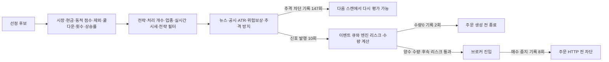

# 첫 스캔과 장중 후보를 구분한 분석 — 53차 Plan → Do → See

목적은 좋은 종목 선정과 적절한 진입을 비용 후 순이익으로 연결하는 것이다. 이번에는 운영 코드를 추가하지 않고 기존 로그·검증된 원장 판독기를 사용했다.10월7일 예약/입력·엔진4384b28·매수 중지·전략 설정은 유지한다.

## Plan — 첫7후보를 하루 전체로 일반화하지 않는다

[52차 진단](current-engine-selection-diagnosis-2026-10-06.md)의 첫09:16:56 스캔은7개 모두점수75미달·상승률5%초과였다. 이는 해당 첫 스캔에 대한 사실이다. 이후에도 좋은 점수의 후보를 못 찾는지 별도 확인하고, 실제 진입 gate와 진입 전 필요조건을 구분한다.

## Do / See — 장중 로그 대조

09:15~15:00 범위에서 로그에 남은 **비어 있지 않은 periodic_regular 스캔66개**를 읽었다. 실제 범위는09:16:56~14:59:34다. `TradingLogger.log_screening()`은 텍스트에 상위10개·정수 반올림 점수만 남기므로 이름/이유 문구에서 정확한 등락률을 복원하지 않는다. 문자 포함 종목코드도 보존해 행을 누락하지 않았다.

| 확인 항목 | 결과와 해석 |
|---|---|
| 헤더의 반환 후보 합계 | 2,114회 등장. 고유 종목 수/독립 표본 수가 아님 |
| 텍스트에 남은 상위 후보 | 653회 등장.66개 중 전체 후보가 남은 스캔은2개 |
| 반올림 점수76 이상 후보가 있는 스캔 | 65/66. 첫 스캔만 없음 |
| 첫 후속 고득점 | 09:22:08, 반올림96점. 약5분 뒤에는 이미 상황이 달랐음 |
| 별도 자동진입 로그의 `75+후보` | 같은66개 스캔 모두 시각 차이0~2초로 대조.65개에서1개 이상, 합계284회 등장 |

반올림75는 실제75미만일 수 있어76 이상을 별도로 집계했다. 자동진입 로그는 스케줄러가 전체 반환 후보에 `score >= 75`를 직접 계산한 값이다. 두 기록을 대조했으나 **이75 기준은 실제 동적 점수 문턱이 아니다.** 실제 문턱은 지수/overnight 조건에 따라85 이상일 수 있다. 높은 점수는 나머지 진입 조건 통과·체결·수익을 뜻하지 않는다.

이날 장중 코드는2645820이고 현재4384b28과 관련 선정/점수/상승률 조건은 같다. 복구·체결 등 전체 엔진 버전의 동등성이나 현재 버전의 성과로 확대하지 않는다. 전체 거래일/시장 국면·실시간과 일봉·전체 KODEX200과 대칭 반도체 제외 비교는 기존 분리 원칙을 유지한다.

**우선순위 보정:** 첫 스캔의 빈 수급 순위/중복 감점은 계속 조사하되, 하루 전체의 핵심 문제가 ‘75점 후보를 전혀 못 찾음’이라고 결론 내리지 않는다. 다음은 높은 점수의 후보가 나온 이후 제외·쿨다운·상승률·전략·실시간 호가·거래량 등 어느 단계에서 막혔는지 확인하는 것이다. 과열 제한을 먼저 완화하지 않는다.

이 분석에서 매수 중지로 주문하지 않은 사실을 선정 실패로 집계하지 않는다. 기존 gate 보고의 범위는 live_screening 신호 생성 전 단계까지이며, 신호 생성과 실제 전달/주문/체결은 별도다.

## Do / See — 내일 판독 절차를 기존 자료로 검증

기존 `read_observation_journal()`에 원래 study SHA와64MiB 상한을 주고, `validate_study_binding()`→`build_frame_report()`→`build_gate_report()`→`build_selection_report()`를 재사용했다. 원본 scan·gate·selection을 `candidate_id`로 결합하고 분모 일치를 확인했다.

10월6일 재현 결과는 후보7/선정 근거7/실제 score 차단7, 이후 `scan_change=not_reached`7이다. 실제 기록된 점수 문턱을 사용한 점수 필요조건0/상승률≤5% 조건0/교집합0이었다. 이 교집합은 조건부 진단이며 이후 gate 통과나 주문 가능성을 의미하지 않는다. 원장의 `unsupported_frame_shape`·불완전·drops0을 그대로 보존했고 수익 계산은 하지 않았다.

10월7일09:34 이후의 최소 CLI(검토된 checkout에서 실행, 출력은 비공개 위치)는 다음과 같다. 실제 파일이 생성되고 봉인됐는지 먼저 확인한다.

```bash
PYTHONDONTWRITEBYTECODE=1 /home/ubuntu/projects/qwq-ai-trader/venv/bin/python scripts/report_entry_gate_trace.py \
  --journal /home/ubuntu/.local/state/qwq-entry-observation/20261007-pilot3/engine.jsonl \
  --study /home/ubuntu/.local/share/qwq-entry-observation/20261007-pilot3/study.json \
  --as-of 2026-10-07T09:34:00+09:00 --max-journal-bytes 67108864
```

- 실제 최초 차단은 `first_blocking_stage`와 `prior_evidence_complete`로 읽는다. `first_observed_blocking_stage`는 선행 근거가 unknown인 경우까지 포함하므로 별도로 표시한다.
- 점수 문턱은 `stages.score.threshold`, 평가 여부는 각 `stages.*.status`를 사용한다. 이후 미도달 조건을 실제 실패로 덮어쓰지 않는다.
- 선정 보고서는 위 검증 loader의 결과에 `build_selection_report(obs)`를 직접 호출한다. **이번 quality pilot에는 `capital_policy`가 없으므로 `prepare_entry_evaluation.py`는 입력 계약상 rc2로 거부하는 것이 정상**이다. 빠진 자본 정책을 사후 삽입해 통과시키지 않는다.
- 내일 원장의 분모는09:15~09:17:30 사이 첫 반환 스캔 하나다.10시7%·11시10% 상한을 그 후보에 적용해도 각 시각의 실제 후보 평가가 되지 않는다. 별도 REST 재조회 gate의12/15/10% 상한과도 구분한다.
- 수집 품질·선정 근거·실제 탈락 위치를 확인할 수 있지만, 수량/현금 규약·실제 비용·완전한 진입/후속 호가·세션 근거를 갖춘 경제성 연구와는 별개다. 첫 관측만으로 하루 전체 고득점 후보의 비용 후 성과를 판정하지 않는다.

## See — 20:30 원장 확인

20:30:29 갱신 로그와 파일을 대조했다. 계산일10월6일, 실행코드4384b28, 벤치마크 `KIS:FHKST03010100:069500:adj1`, 마지막 날짜10월6일, 원천 결측사유null, 오늘 거래일 대사complete/사유없음/저장true다. 원장264행·포함252·미청산 대기1·drift0이며 이번 초과수익 단계의 경고/실패 로그는 없다. 갱신 후 보호 설정 지문도 유지됐다.

다만 포함 포지션 중 거래일 대사 공백을 가진 행이251개(`day_status_missing`)다. 오늘 대사 완료와 과거 전체 대사 완료는 다르다. 원장 생성·KODEX200 원천 확인은 계좌 전체 TWR/현재 엔진 수익 우위 검증이 아니며, 별도 BacktestGate의 KOSPI 원천을 확인한 것도 아니다.

## 다음 우선순위

1. 예약된10월7일 활성화와 수정 수신 경로의 완결성을 확인한다. 현재 예약을 다시 설치하거나 변경하지 않는다.
2. 첫 스캔의 엄격한 원장 진단과 장중 로그의 제한된 분모를 분리한다. 고득점 후 미진입 원인과 원천 가용 시각을 먼저 좁힌다.
3. 그 결과에 맞는 대안 하나를 사전 고정한다. 첫 스캔에 맞춘 감점 제거/점수 완화/시간대 이동을 동시에 최적화하지 않는다. 필요조건 통과 수 증가보다 동일 후보 분모의 비용 후 결과로 채택 여부를 결정한다.

비공개 근거는 `~/.local/state/qwq-deploy/preparation-20261007/`의 `day-score-census.json`, `sanitized-score-review.json`, `offline-analysis-rehearsal.json`, `ledger-2030-confirmation.json`이다. 원본 로그·계좌 값·운영 상태 파일은 Git에 넣지 않았다. 제품 코드 변경 없이 원본 지문/기록 수/후보 연결과 기존 판독 함수의 실행 결과를 확인했다. 도구 감사 요청Sol/high, 실제 모델 metadata 미노출.

## 54차 Plan — 고득점 이후 실제 신호·차단을 추적한다

같은 10월6일 09:15 이상 15:00 미만 KST 로그를 대상으로 선정 이후 경로를 확인했다. 이번 분석은 이미 본 하루의 탐색적 진단이다. 완전한 후보별 gate 원장이나 미거래 수익률을 복원했다고 주장하지 않는다. 10월7일 고정 관측 입력은 유지한다.

## 54차 Do / See — 확인된 경로와 반복 횟수

| 기록 | 관측 결과 | 해석 범위 |
|---|---|---|
| 추격 방지 차단 INFO | 147회, 13종목, 50스캔 | 실제 REST 등락률/ATR 비율이 1.2를 넘는 최종 스케줄러 조건에서 차단 |
| 반복 집중 | 두 종목이 각각44회, 합계88회 | 147개 독립 종목/독립 기회가 아님 |
| 스케줄러 신호 발행 | 10회, 7종목, 7스캔 | 이벤트 큐 삽입. 주문 접수/체결 아님 |
| 신호 뒤 매수 중지 차단 | 8회 | 같은 종목·같은 초의 리스크 수신과 첫 broker kill-switch 차단 로그를 대조. 증권사 주문 HTTP 전 차단 |
| 신호 뒤 수량0 | 2회, 같은 종목 | 같은 종목·같은 초의 리스크 수신과 수량0 경고를 대조. 주문 생성 이전 종료 |
| 추격 차단 후 나중 신호 | 3종목 | 기존 재스캔도 조건이 바뀌면 진입 신호를 만들 수 있음 |

첫 추격 차단은09:58:53, 첫 신호는10:04:03이다. 10개 모두 같은 종목·초에 리스크 수신1개와 위 후속 결과1개가 있었다. 이 연결은 텍스트 대조이며 event ID로 입증한 종단 간 원장이 아니다. INFO에 안 남는 탈락 단계도 있으므로 `147/284`를 추격 조건 탈락률로 계산하거나, `284−147−10`을 특정 실패/통과로 채우지 않는다. 다중 소스 점수가 실제 신호까지 이어지는 사례는 확인했지만, 수익 예측력은 별도 검증해야 한다.

코드 흐름은 다음과 같다. 아래 단계의 순서는 확인했지만 모든 후보의 단계별 숫자는 확보하지 못했다.



근거: `kr_scheduler.py` 4164~4844, `entry_gate_trace.py` 8~15, `engine.py` 268·1743~2301·2895~3198, `kis_kr.py` 691 이후. 장중 스케줄러의 해당 진입 경로와 엔진 큐/사이징은2645820→4384b28→61d6346에서 같다. 다만4384b28은 당일 버전에 없던 기동 현금 검증 조건을 추가했으므로 현재 전체 실행 경로와 동등하다고 보지 않는다.

### 수량0과 신호 횟수의 의미

수량0 두 시점의 가용현금은 주당 가격의 약2.20배였다. 보호된 현재 디스크의 갭 배분5%를 적용하면 **전략 전체 예산조차 한 주 가격의0.619배·0.617배**이고, 보유/미체결 사용분을 빼면 더 작아진다. 코드의 전략 잔여 예산과 정수 수량 규칙상 이 조건에서는 한 주도 만들 수 없다. 그러나 당시 유효 전략·배분·보유/미체결 자본 스냅샷을 확보하지 않았고 런타임 배분 변경 경로가 있으므로, 이는 5% 갭 배분을 전제로 한 원인 후보다. 수량0의 유일한 원인을 확정하거나 배분을 늘리는 근거로 사용하지 않는다.

또 `_daily_entry_count`와30분 쿨다운은 체결이 아니라 큐 삽입 직후 증가한다. 이후 수량0이나 매수 중지 차단에도 되돌리지 않으며, 기존 테스트도 이 동작을 보존한다. 따라서 오늘의 일일 ‘진입’ 횟수를 실제 매수 횟수로 해석하면 안 된다. 현재는 재신호 제한으로 읽고, 임의로 차단 뒤 카운터를 초기화하거나 매수 중지를 해제하지 않는다. 킬스위치를 없앤 가상 경로라면 보유·현금·후속 후보 상태도 달라지므로 오늘10신호를 그대로 가상 체결시키는 수익 계산은 성립하지 않는다.

### 순이익 개선을 위한 다음 순서

1. **관측 품질:** 예약된 10월7일 첫 스캔 관측을 완료하고 결측·시각·분모를 확인한다. 09:33에 끝나는 이 관측만으로 오늘처럼10시 이후 발생한 신호의 경제성을 검증할 수는 없다.
2. **실행 가능한 후보와 진입 가격:** 후속 경제성 관측에서는 실제 신호 발생 시간대와 당시 전략 잔여 예산·최소 수량을 함께 고정한다. 동일 후보 전체를 보존하고, 한 주를 살 수 없는 경우와 가격 조건으로 기다리는 경우를 분리한다. 시세·수급 원천이 많다는 장점을 해당 시각에 실제 이용 가능한 정보로 평가한다.
3. **검증할 대안 하나:** 자본 조건을 충족하는 후보 안에서 진입 가격 조건 하나를 기존 기준과 비교한다. 수량·현금·공통 청산·비용을 사전 고정하고 기다리다 놓친 이익과 피한 손실을 모두 포함한다. 오늘 수익 자료가 없는 상태에서 추격 비율·점수·전략 배분을 동시에 최적화하지 않는다.

효율 개선 후보도 확인했다. 현재 뉴스/공시 검증은 ATR·추격 차단보다 앞이다. 확정적으로 탈락할 후보의 값싼 가격 조건을 먼저 확인하는 순서 변경은 검토할 가치가 있다. 다만 뉴스/DART에는 캐시와 비활성 경로가 있으므로147회가147번의 외부 호출·LLM 비용을 뜻하지 않는다. 동일 입력의 통과 후보/신호, 뉴스 위험 검사 유지, 캐시 신선도, 실제 호출 수·지연을 대조하기 전에는 비용 절감량을 주장하거나 실행 순서를 바꾸지 않는다.

이번에는 제품 코드·전략 설정·예약 변경 없이 원본 로그 지문·66개 스캔/2,114회 반환·284회 기준점수 후보와 후속 기록을 교차 대조했다. 스케줄러 gate/큐 삽입·카운터 관련 기존 테스트75개가 통과했고 운영 상태·외부 네트워크 접근 시도는0건이었다. 독립 소스 분석 요청Sol/high, 실제 모델 metadata 미노출. 익명 검산 입력은 Git 밖 `sanitized-entry-funnel-review.json`에 보존했으며 종목/계좌 금액/원문 로그는 포함하지 않는다.
