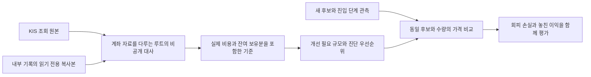

# 실제 비용 기준과 다음 비교 — 44차 Plan → Do → See

목적은 좋은 종목과 유리한 진입 시점을 구분해 거래비용·운영비 이후 이익을 만드는 것이다. 실시간 판단과 여러 선정 원천은 검증할 강점이며, 과거 버전·수동 거래·미청산 보유분을 혼합한 계좌 숫자로 현재 엔진의 우열을 단정하지 않는다.

## Plan — 원본부터 개선 가능 규모까지

사용자는 작년부터의 계좌·잔고를 KIS API에서 직접 조회하도록 지시했다. 원본 위치/엑셀 제공 요청 단계는 종료한다. 기존 인증으로 읽기 전용 조회한 거래·손익·잔고와 내부 기록의 독립 복사본을 대사하고, 최근 진입군의 실제 매입/매도금액·비용·잔여 평가액을 기준으로 고정한다. 실제 체결 증거와 가격 변경의 가상 산술은 구분한다.

## Do — 비공개 기준과 도구 검토

계좌 원본·주문 identity·잔고·상세 금액·개별 결과와 실행 영수증은 Git 밖의 권한 제한 저장소에 둔다. 이 문서는 원본이나 재현 입력을 공개하지 않는 인계 색인이다. 루트만 계좌 자료를 처리하며 독립 작업자는 공개 소스와 실제 값을 포함하지 않은 계산 절차만 검토한다.

원본 조회는 2025년 이후 명시한 기간을 대상으로 했으며, 당일 자료는 수집 시점까지다. 과거 월별 결과가 빈 성공 응답이어도 계좌 시작 평가액/외부 입출금이 없었다는 뜻이 아니다. 확인한 경제적 일치는 옛 거래 전부의 주문 identity 인증이 아니고, 최근 주문의 별도 감사 기록 연결도 과거 표본 전체에 소급하지 않는다.

최근 진입군은 종료 거래와 열린 거래를 함께 보존한다. 동일 수량의 KIS 매입/매도금액, 일자·종목 비용 집계, 남은 수량과 그 시점 평가액을 각각 확인한다. 비용은 주문별 정확한 배분을 주장하지 않고, 다른 거래가 섞이지 않은 일자·종목 집계 전체로 연결한다. 실현손익에 이미 들어간 수수료·세금을 다시 차감하지 않는다.

진입군의 시작/끝 구분에 사용한 시각은 내부에 저장된 체결 관측·기록 시각이다. 거래소의 체결 시각이나 네트워크 지연 측정값으로 해석하지 않는다. 잔여 보유분의 평가는 별도로 고정한 증권사 잔고 수집 시점을 따른다.

고정 기준에서 다음 계산을 분리한다.

- **관측 평가손익:** 매도금액 + 잔여 평가액 − 매입금액 − 실제 발생 비용. 미래 청산비·계좌 밖 운영비는 아직 포함하지 않는다.
- **계획가격 차액:** 실제 매입금액 − 당시 계획가격 × 동일 수량. 계획가격은 신호/사이징 기준이며 체결 가능한 호가 또는 주문 도착 가격이라는 증거가 아니다.
- **개선 필요 규모:** 다른 항목을 고정했을 때 손익분기까지 필요한 매입금액 절감. 실행 가능한 가격 기준, 수익 예측 또는 추천 임계값이 아니다.
- **청산 사유 집계:** 기록된 장 마감 청산·손절·미매도/부분 매도 보유를 구분한다. 충돌하는 사유/유형 기록은 집계를 중단한다. 사유별 손익은 청산 정책이 손실의 원인이었다는 인과 증거가 아니다.
- **종목명에 따른 제외 민감도:** 명시한 코드 제외를 따로 계산한다. 사후 민감도를 전체 반도체 분류나 반도체 제외 지수 수익률로 부르지 않는다.

기존 가격 비교기는 같은 후보·수량에서 A의 진입과 B의 가격 조건 거절/현금을 비교한다. 거절 뒤 A가 벌었으면 B의 놓친 이익, 잃었으면 회피한 손실로 모두 남는다. 잔량·자본·시각 검사와 비용 모형은 이미 있지만 주문 대기열/부분 체결/거부를 재생하는 실행 시뮬레이터는 아니다. 실제 관측 비용을 단일 미래 요율로 자동 승격하지 않는다.

## See — 우선순위와 완료 조건

| 순서 | 작업 | 현재 상태와 다음 완료 조건 |
|---|---|---|
| 1 | 실제 비용·열린 보유분 포함 기준 고정 | 최근 진입군의 비공개 대사·산술 진단 완료. 전체 계좌 TWR과 구분 |
| 2 | 선정에서 진입까지 실제 탈락 이유 확보 | 새 v4 관측 자료 필요. 첫 탈락·미도달·불명, 후보 전체/원래 순위, 버전/실효 설정을 보존. 점수 기준을 낮춰 신호를 만들지 않음 |
| 3 | 가격 조건 한 가지의 비용 후 차이 계산 | 동일 후보·수량·평가 방식과 사전 고정 기준. 유효 비교쌍·회피 손실·놓친 이익·결측 비율을 함께 제시 |
| 4 | 같은 진입의 청산 대조 | 앞선 진입 변경과 동시에 최적화하지 않음. 실제 가격 경로를 확보해 기존 초기 손절 대조 도구부터 사용 |
| 별도 | 계좌 전체 이익·벤치마크 | 시작/끝 평가액·외부 흐름·운영비와 시점 정합성 필요. 전체 KODEX200 및 사전 고정 분류의 반도체 제외 보조 비교를 유지 |

10월2일 pilot은 후보9·signal/order_ready0이므로 수량/자본/진입 기준 호가가 있는 실제 비교쌍이 없다. 이를 현금0수익으로 만들거나, 최근 체결군을 다른 시각/버전의 원장에 끼워 넣거나, 합성 시험을 재실행해 성과 근거로 올리지 않는다. 새 계산기를 추가할 필요보다 새 유효 관측 입력이 먼저다.

가격 비교의 두 평가 방식도 구분한다. 기존 `fixed_horizon_bid_markout`은 동일900초 뒤의 bid를 쓰는 가격 진단이다. 실제 청산을 재생하지 않는다. `common_policy_exit_proxy`는 같은 사전 고정 정책의 전체 수량 청산 legs를 받지만, 각 leg의 출처가 검증되기 전에는 정책 대리치다. 오래된 실제 청산가격을 다른 진입의 미래 결과로 붙이지 않는다.

새 관측은 [43차의 시간·유량 조건](current-engine-next-evidence-2026-10-02.md#see--판정과-다음-실행-조건)을 해결해야 한다.18분 대안은 조건부 품질 관측안이며900초 가격 확보를 보장하지 않는다. 새 날짜·study/평가 세대·릴리스/실효 설정·전체 journal 예산과 실행 범위를 구체화한 뒤 운영 변경을 판단한다. 기존 일회 실행 승인/입력/기간을 재사용하거나 사후 연장하지 않는다. 이번 작업은 신규 수집·예약·배포·재시작·매수 재개를 수행하지 않았다.

## 처리 흐름과 검증 경계

가격 변경 산술은 `Decimal`로 수행하고, 수량·일자/종목 비용·감사 주문 연결·보유 평가액·기존 집계 합계를 별도로 검산했다. 손실/부분 매도/미매도/계획 대비 유리한 체결의 합성 산술과 비유한 값 거부, Python 검증 비활성 실행 거부도 확인한다. 합성 검증은 실제 성과 증거와 별개다.

소스/계산 의미의 독립 검토는 Sol/high를 요청했고 실제 모델 및 실효 effort는 메타데이터 미노출로 unverified다. 제품 코드·전략 설정은 변경하지 않았으므로 제품 전체 테스트를 새로 수행했다는 주장은 하지 않는다. 상세 원본 지문과 검산 영수증은 비공개 결과에 보존한다. 미래 계좌 이익이나 현재 엔진의 우위를 입증한 단계는 아니다.
