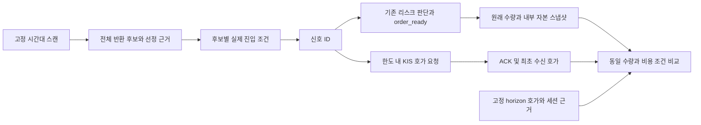

# 56차 — 실제 신호 시간대의 경제성 관측

## Plan

목적은 현재 엔진의 종목 선택과 진입가격을 비용 후 개선하는 것이다. 10월7일 첫 스캔의 신호0과 장중 신호2는 서로 다른 모집단이다. 첫 스캔 시각만 옮기는 대신 사전 고정한 시간대의 반환 스캔 전체를 수집한다. 이번 변경은 개발·검증이며 새 날짜 활성화·배포·매수 재개를 포함하지 않는다.

### 선택한 설계

- 새 명시 계약 `runner-signal-window-v1`: 시작/스캔 접수 종료/관측 종료, `max_scans` 1~100, `quote_admission=signal_created`를 고정한다. 기존 first-scan v1~v4는 그대로다.
- 각 스캔의 반환 후보 전부를 분모로 남기고 선정 근거와 실제 진입 조건을 기록한다. 같은 종목의 재등장도 별도 후보 ID다. 빈 스캔·복사 실패를 다른 성공 스캔으로 대체하지 않는다. 스캔 상한 초과는 관측 불완전이다.
- KIS 추가 호가는 기록된 신호에만 요청한다. 첫 스캔의 무신호 후보들이 슬롯을 소진하지 않게 한다. 기존 운영 채널 우선순위·등록/후보 lease 상한·종료까지 유지·미확인 해제 슬롯 재사용 금지를 그대로 적용한다. 신호 발생은 구독 ACK나 호가 수신을 보장하지 않는다.
- `channels.max_candidates`는 종목 수가 아닌 보존 중인 후보 ID별 lease 상한이다. 같은 종목의 반복 신호도 한도를 사용한다. 상한 초과는 `unallocated`로 남으며, 같은 종목에 기존 ACK된 채널이 있으면 그 호가를 사용할 수 있다. 추가 채널이나 전체 신호의 가격 확보를 보장하지 않는다.
- 신호 관측 실패/구독 실패는 거래 실행을 바꾸지 않고 자료의 완전성만 낮춘다. 주문·사이징·진입 조건·신호 횟수·매수 중지를 변경하지 않는다.
- `capital_policy`와 `fixed_horizon_bid_markout`를 필수로 선언한다. 정책의 소스/설정 참조는 capture와 일치해야 한다. 원래 수량·내부 자본 스냅샷과 기존 FeeCalculator/Decimal 계산기를 재사용한다.
- 호가는 order_ready 이후 첫 기록을 사용한다. 신호 후 구독에 따른 지연도 실제 지연이며 느리거나 품질이 나쁜 첫 호가를 건너뛰지 않는다. 900초는 향후 프로필 후보이며 계약 자체는 기존 명시 horizon을 따른다. 늦은 신호의 horizon 부족도 결측이다.
- 토스 기존 계약은 첫 스캔 전용으로 유지한다. 새 모드를 토스 입력에 자동 확대하거나 옛 grant를 재사용하지 않는다. 이번 경로의 가격 비교는 KIS 관측으로 한다.

### 해석과 배치 전 조건

후보 분모→신호→order_ready→구독/첫 호가→horizon 호가→세션 근거 검토→원래 진입과 가격 조건의 수수료·슬리피지 비교 순서다. 수량0·리스크 차단·미수신은 성공 거래나 수익0으로 바꾸지 않는다. 내부 자본 스냅샷은 증권사 매수 가능액 인증이 아니다. 미체결 의도를 모두 체결시킨 포트폴리오 재현도 아니므로 `production_eligible=false`, 계좌 수익률 null을 유지한다.

관측기 자체는 주문 없는 실행 모드가 아니다. 새 날짜 설치 전에는 매수 중지 유지, 코드 SHA/설정·비용/자본 참조, 거래일, 신호 시간대, 스캔·신호/채널 상한, 호가 유량과 메모리/원장 용량, 사전 고정 지연 한도 및 horizon 여유를 검토해야 한다. 10월6~7일에 맞춰 고른 시간대는 탐색 선택이며 이후 미관측 기간에서 평가한다. KRX 연속매매 세션 근거가 없으면 경제성 비교는 계속 불명이다. 이번 구현만으로 관측 준비 완료나 수익 우위를 주장하지 않는다.

## Do

`EntryObservationBuffer`에 유한 scan 예약·후보/신호 누적 연결을 추가했다. `_WindowBuffer`의 날짜/시간 제한과 `ObservationRuntime.install`의 명시 신호 구독 연결을 사용한다. `begin_gate_trace`는 스캔별로 한 번만 열고, gate 보고서는 모든 후보 발생건을 합산한다. 원장과 가격 비교기는 기존 형식을 재사용하며 새 모집단/시각/정책 참조를 오프라인에서도 대조한다. 토스 projection은 새 모드를 첫 스캔 이전부터 거부한다.

메타데이터 예산은 모든 선언 스캔 수를 곱해 검사한다. 큐는 스캔 한 번의 최대 동시 발생량을 확보하며 전체 호가 유량·실제 메모리 사용량 검증은 별도다. 늦은 신호/구독으로 horizon 자료가 없으면 기존 비교기가 불명으로 남긴다. 접수 종료가 모든 신호의 평가 가능성을 보장하지 않는다.

## See

- 테스트 우선 개발: 처음6개 실패로 미지원 계약을 확인했고, 전체 스캔 저장 예산2개·오프라인 선언 바인딩2개도 실패를 재현한 뒤 수정했다.
- 관련 검사405개 통과. 합성 2개 스캔/동일 종목 ID 분리, 한도/구독 실패/종료 경쟁, 원래 emit 반환/예외 유지, 새 모드 토스 거부, 원장 봉인 후 CLI의 스캔별 후보 상한을 확인했다.
- 합성 경제성 연결은 첫 무신호 후보를 추가해 분모5개를 보존하고 기존 비교쌍3개를 유지했다. horizon 호가를 제공하지 않은 경우 비교쌍0·수익 불명을 유지했다. 합성 수치는 엔진 수익 근거가 아니다.
- 전체 `scripts/dev/verify.sh` rc0: **4479 passed / 2 xfailed**, 131.47초. 문법·비밀정보 검사 통과, 운영 상태·외부 네트워크 접근0. 경고1개는 기존 pykrx의 resources.path 폐기 예정 알림이다. 독립 Astra/xhigh 리뷰에서 P0/P1 없이 P2 두 건(토스 입력 소비자 경계, gate CLI의 필수 frame 계약 누락)을 지적받았다. 세 회귀검사의 실패를 재현한 뒤 수정했고 관련251개가 통과했다. 리뷰어가 세 검사를 별도로 실행해3 passed·추가 지적 없음으로 수정 범위를 승인했다. 최종 전체 재검사 **4482 passed / 2 xfailed**, 132.14초, 문법·비밀정보 통과·격리 위반0. [PR #156](https://github.com/qwq-partners/qwq-ai-trader/pull/156)의 최종 HEAD 필수 verify와 통합 상태를 정본으로 따른다. 운영 상태의 최신 실제 확인은 [55차 결과](current-engine-capture-result-2026-10-07.md)를 따른다.

## 남은 순서

1. 고정 관측 시간대와 입력 프로필을 만든다. 예상 최대 스캔 수·신호 발생건·호가 유량으로 전체 저장 수명과 메모리 사용량을 검증하고, 첫 호가 지연/horizon 여유를 고정한다. 새 모드는 기존 날짜별 첫 스캔 설치 프로필에 자동 대입하지 않는다.
2. 적용할 정확한 코드/설정·날짜·자본/계좌 비용 근거를 확정한 뒤 운영 적용 범위를 검토한다. 현재 신규 배포·관측 예약은 없다.
3. 미래 관측에서 동일 수량의 현재 진입 대 가격 조건 하나를 비교한다. 회피 손실과 포기 이익, 비용 민감도, 미관측 비율을 함께 본다. 변경 채택은 비용 후 개선 근거로 결정한다.
4. 그 다음 현재 청산 경로 대조와 계좌 전체 자본 재사용/현금·업종 기여 분해를 진행한다. KODEX200 전체 기준을 유지하고 반도체 제외는 포트폴리오·벤치마크 양쪽에 동일하게 적용한 보조 진단으로 둔다.

리뷰 라우팅: 다중 파일 소스 감사 Sol/high, 독립 최종 리뷰 Astra/xhigh. 실제 모델/유효 effort 메타데이터는 노출되지 않아 미검증이며 fallback은 없었다. 작성자는 최종 리뷰어가 아니다.
