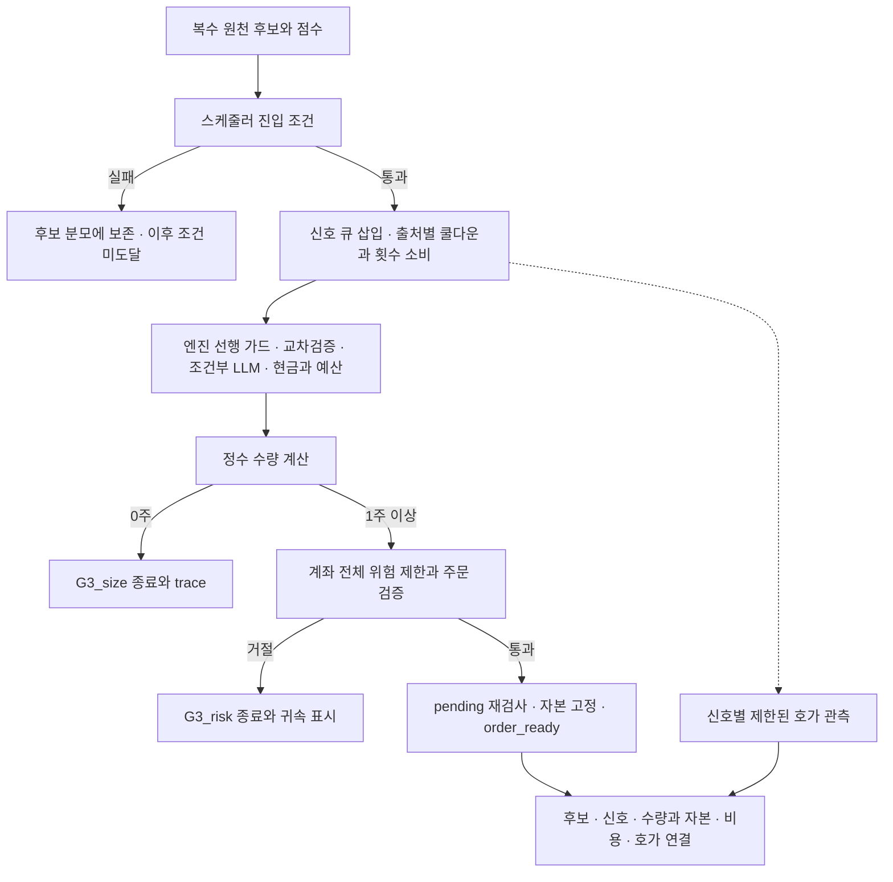

# 62차 — 인계 재검토와 다음 관측·순수익 검증 설계

2026-10-11 KST. 기준 소스 `febfe1fd1b9574480101bb077130e565ebb6b3da`, 운영 체크아웃 `83be6ac`. 두 버전의 `src/ scripts/ tests/` 차이는 없다. 이 문서는 설계와 기존 분석의 정정이며 **새 관측의 설치·예약이나 전략 검증 착수 기록이 아니다**.

## PLAN — 무엇을 개선하려는가

목적은 **현재 엔진이 어떤 종목을 어느 가격·시점에 매수해야 비용 후 순수익을 개선하는지** 찾는 것이다. 실시간 시세와 복수 원천 후보 선정은 검증할 강점이다. 일봉 검증만으로 그 효과를 기각하지도, 정밀한 입력만으로 수익 우위를 인정하지도 않는다. 구버전의 오류·계좌의 기존 수동 보유·현재 전략의 선택/진입/청산 효과를 분리한다.

이번 범위는 59~61차 인계의 소스·근거 검토, 다음 시간창의 계약, 판독 표5개, 가설 후보와 판정 기준이다. 운영 HEAD·설정·매수 중지·수동 보유 귀속 정책·쿨다운/횟수·once/영수증·토스 권한은 변경하지 않는다. 01:01의 서비스/PID/건강 상태는 인계의 당시 기록이며 이번에 새로 운영 점검한 값으로 쓰지 않는다.

## DO — 인계에서 확인하거나 정정한 것

| 항목 | 결과 | 후속 조치 |
|---|---|---|
| 59차 기준선/귀속 표시 | 종목별 시작 기준선과 manual 집합을 저장·복원한다. 실제 위험 게이트는 전체 포트폴리오 기준 | 아래 동일 종목 소유 전환 오류를 별도 추적. 이 진단값을 계좌 TWR이나 완전한 전략 순손익으로 사용하지 않음 |
| 60차 수량 trace/신호 연결 | `signal_id`, 수량 단계, 수량0의 `G3_size` 기록 경로 확인 | 실제 다음 BUY 행에서 연결과 누락을 확인. 사이징 전 종료면 trace가 없을 수 있음 |
| 61차 스캔 수 | 첫 신호는5번째 스캔. 이전4스캔 cooldown9건, 이후4스캔11건 | “첫6스캔 차단” 정정 |
| 61차 가상 결과 | cooldown20건의 후속 게이트는 미도달 | 신호+20·LLM+7·효과0 단정 철회. 정책 유지 이유를 효과 미확정으로 정정 |
| 비신호 자본 분모 | `available`은 비코어에서만 코어 예약금을 추가 차감 | 다른 전략/시각에 그대로 복사하지 않음. 동일 스캔도 동일 자본 상태를 보장하지 않음 |
| 새 `or {}` 표현 | 명시적 None 구분이라는 프로젝트 규칙에 어긋남 | 정상 dict에서 금융값0 손실은 미발견. 금액 오류와 구분하여 후속 소스 정리 대상으로 기록 |

### 동일 종목 소유 전환의 P2 표시 오류

`src/core/types.py`의 `manual_daily_unrealized_delta`는 현재 manual 보유에 종목별 시작 기준선을 적용하면서 시작 시점의 소유자를 확인하지 않는다. 시작 manual 종목을 빼는 두 번째 경로도 **종목 자체가 사라진 경우만** 처리한다.

아래는 실제 계좌가 아닌 합성 반례다. 시작 미실현손익−1,000,000원, 같은 종목의 종료 미실현0원, `daily_pnl=0`으로 고정했다.

| 소유 전환 | 현재 전략 귀속 표시 | 문서의 시작/현재 소유 기준으로 계산한 값 |
|---|---:|---:|
| manual → 전략 | +1,000,000 | 0 |
| 전략 → manual | 0 | +1,000,000 |

문서 정의에 맞추는 최소 수정안은 `현재 manual 미실현 합 − 시작 manual 집합의 기준선 합`을 manual 변동으로 계산하는 것이다. 두 방향의 같은 종목 전환 회귀 시험이 필요하다. **이번 문서 변경에서는 소스에 적용하지 않았다.** 귀속 정책 변경은 사용자 결정 사항이라는 인계 제약에 따라 계산 수정안과 해석상의 한계를 먼저 제시한다. 후속 소스 수정은 독립 교차 공급자 리뷰를 거친다.

이 최소 수정도 경제적 귀속 전체를 해결하지 않는다. manual 실현손익은 현재 정책상 분리하지 않으므로 `daily_pnl`에−1,000,000원이 포함되면 위 수정 후 값은 각각−1,000,000원/0원이다. 종목 키 하나만으로 혼합 보유·전환 시각·lot별 성과를 복원할 수 없다. **전환이 확인되거나 소유 이력이 불명인 날은 보고서의 귀속 신뢰도를 제한/미판정으로 표시**한다. 이 표시 오류로 전체 손실 제한이 완화되는 것은 아니다.

### 재집계의 근거와 범위

10월8일 원본을 읽기 전용으로 다시 집계했다. 원본 변경은 없다.

- study SHA256: `d2fcbbf28aa9957c0402497b982fc8d83c935f7a9853ffbd410e6969af801bb1`
- engine journal SHA256: `0d2229602be0be6432f9993daa224b9bb0e3622da764d23221e911a870c7cea8`
- 원본 위치는 기존 [58차 판독](current-engine-signal-result-2026-10-10.md)을 따른다. 계좌 원본·상세 캐시는 Git에 추가하지 않는다.
- 스캔별 정정은 [61차 정본](rejection-retry-policy-2026-10-11.md). 선행09:53 신호의 ID 연결은 이번 봉인 원장으로 증명되지 않는다.
- 10월11일 로컬 일일 상태 파일은 당일 날짜·귀속 스키마·총합 기준선 합계·manual 집합이 유효함을 확인했다. 이는 **실제 신규 거절 문구나 저녁 스냅샷 검증을 대신하지 않는다**.

## 다음 관측 창 — 날짜 미정, 설치 전 제안

### 우선안: 기존 v1로 첫 신호 이전부터 기록

| 항목 | 제안 | 이유/제약 |
|---|---|---|
| 날짜 D | 별도로 확정한 거래일 | 지금 날짜/예약을 생성하지 않음 |
| 활성화 | D 08:55 KST | 장중 재시작 없이 준비. 실제 활성화는 별도 운영 승인 후 |
| 접수 | D 09:00 이상 10:05 미만 | 기본 live_screening09:15보다 먼저 시작, 기본10:00의 다른 공유 쿨다운 경로도 판독 시 고려 |
| 종료 | D 10:21 KST | 마지막 접수 뒤900초+지연 여유. 늦은 신호는 결측 유지 |
| 스캔 | 최대14, 스캔당 후보100 | 5분 post-round sleep의 현행 설정 기준. 실제 설정/상한 초과 확인 |
| 계약 | `runner-signal-window-v1` | 기존 행 종류·검증기 유지, 새 날짜 study/지문/once는 별도 생성 |
| 후보별 호가 lease | 기존5를 용량 검토의 시작값으로 사용, lease5100초 | **전체 신호 관측 보장 아님**. 반복 종목도 신호 identity마다 소진 |
| 저장 한도 검토값 | buffer300,000·queue8,192·batch256·384MiB·행64KiB | 새 시간창의 전체 유량/메모리/불완전 봉인 시험 후 확정 |

09:15 정각부터만 기록하면 직전에 시작한 스캔이09:15 뒤 진입 조건에 도달하는 경계가 빠질 수 있다. 또 엔진은 KR 비코어 매수를09:29까지 막지만 스케줄러의 신호/30분 쿨다운 소진은 먼저 일어날 수 있다. 이 조합은09:30 이후 후보의 재평가에도 영향을 준다. **진입 시간 제한이나 소비 정책을 이번 관측 때문에 바꾸지 않는다.**

09:00 시작만으로 초기 상태가 빈 것을 증명하지 않는다. 모든 소비 경로의 실제 시작 설정과 당일 복원 횟수·사전 소비를 확인해야 한다. 기존 v1의 live_screening 후보 원장이 다른 출처의 모든 신호까지 포함한다고 가정하지 않는다. 선행 소비 ID/상태가 연결되지 않으면 `unknown_prior_state`로 남긴다.

### 설치 전 해결할 관측 용량과 대표성

1. 메타데이터는 최대14×201=2,814행으로 늘어난다. 기존23.2만 호가/4,200초 합성 사례를4,860초로 단순 비례하면 약26.8만 행이지만 **새 장초반 유량 시험 결과가 아니다**. 최대 메타데이터와 기존 운영 채널을 합친 저장/큐/메모리를 새 프로필로 검증한다.
2. 기존 lease5개가09:15 전후 거절 신호로 모두 소비되면 뒤의 유효 진입 가격은 빠질 수 있다. 따라서 이5개만으로 **수익 비교 가능 자료가 준비됐다고 판정하지 않는다**. 미할당 신호도 분모에 남긴다.
3. “14스캔×스캔당 신호5개”라서 lease를70으로 올리면 충분하다는 계산도 하지 않는다. 실시간 등록 한도41·운영 여유10·운영 채널/다른 경로·반복 종목의 공유 관계·유량을 함께 검증해야 한다. 확대가 필요하면 별도 프로필과 용량 시험을 먼저 제시한다.
4. 목적이 쿨다운 선행 상태 진단이면 제한된 호가 표본임을 명시한 v1을 쓸 수 있다. **목적이 진입가격 검증이면** 사전에 정한 적격 신호의 호가/900초 자료/수량·자본 연결을 보장할 수 있는 배정안을 확정한 뒤 설치한다. 앞선 진단 관측 성공을 수익 관측 준비 완료로 승격하지 않는다.
5. `scripts/ops/entry_capture_prepare_20261008.py`는 날짜·창·고정 입력이 묶인 이전 설치기다. 날짜만 치환해 재사용하지 않는다. 새 설치기는 source/config/kill/미체결/현재 readiness·기존 once 대사·DRY·실패 보존을 다시 검증해야 한다. 지금은 작성/실행하지 않았다.

### 대안: 늦은 창 + 선행 상태 sidecar

늦은 창이 필요하고 v1의 선행 소비 공백이 판독을 막을 때만 새 계약을 설계한다. 현재 study의 정확한 필드 집합과 원장 행 allowlist 때문에 v1에 임의 필드를 추가할 수 없다. `runner-signal-window-v2`처럼 명시적으로 버전을 구분하고 study 지문·검증기·테스트를 함께 바꿔야 한다.

필수 sidecar는 study SHA/epoch/capture ID/source/config/거래일, snapshot 시작·완료 시각, 연결된 첫 scan ID, 완전성/누락 사유, 종목별 쿨다운 만료·일일 횟수·소비 신호 ID/출처/시각/최종 결정이다. 현재 dict에는 소비 신호 ID가 없으므로 사후 최근 시각 DB 조인만으로 완전성을 주장할 수 없다. 소비 시점의 제한된 레지스트리와 같은 ID의 종료 결과가 필요하다.

스냅샷은 스케줄러의 동일 이벤트 루프에서 `await` 없이 첫 포함 스캔의 진입 조건 직전에 채취한다. 실제 scan 기록 훅의 순서를 먼저 확인하고 채취 구간·scan 연결 시각을 검증한다. 기록 편의를 위해 시각을 같게 만들지 않는다. 누락·상한 초과·다중 연결·지문 불일치는 빈 상태가 아니라 `unknown`이다. 이 대안은 **미구현**이며 우선안과 동시에 개발하지 않는다.

## 판독할 처리 흐름

현행 주요 경로의 요약이다. E 단계도 자체 거절로 종료할 수 있으며 F에 도달하지 않으면 수량 trace가 없는 것이 정상이다. 신호 로그의 `passed`는 pending 재검사보다 앞서 기록되므로 `order_ready`나 체결의 증거를 대신하지 않는다. 이 흐름을 문서화하는 것은 주문 실행 승인이 아니다.

## 다음 판독에 붙일 표5개

아래는 보고 계약이다. 실제 다음 관측의 값은 아직 없다. 공통으로 `observed / conditional / unknown` 근거 수준과 이유를 적고, 실패/결측/미도달 후보도 전체 분모에 남긴다.

| 표 | 필수 열 | 판독 규칙과 현재 한계 |
|---|---|---|
| A. 손실 거절의 귀속 | candidate/signal ID, 결정 시각, block_reason, 계좌/전략 귀속 표기, 기준선 날짜/범위, 소유 전환 여부 | 문자열 표기1건을 확인. 계좌 게이트 비율은 현재 equity 분모이며 계좌 수익률/TWR과 다름. 구조화된 신호 시점 숫자 없으면 정확한 금액 역산 금지. 유효 기준선인데 미측정이면 결함 조사; 기준선 미확보/파손이면 미측정이 정상 |
| B. 후보→수량→종료 | candidate ID, signal ID, 출처/전략, 신호·DB 시각, 행 순서/유형, 최종 gate/reason, requested_quantity, size_trace, 소비 플래그, join 상태 | 다중 penalized/passed/blocked 행을 한 신호의 순서로 연결. `passed`를 체결 성공으로 해석하지 않음. 사이징 미도달은 trace 부재가 가능. DB가 비동기이므로 행 없음은 종료 없음과 구분 |
| C. 비신호 후보의 자본 상한 | scan/candidate ID, 후보 가격 시각, 후보 전략/core 여부, 참조 자본 시각, available/max_value/strategy_remaining, 예약금 적용 조건, 상태 일치 증거, 판정 | 동시 상태·같은 예약금 정책이 증명될 때만 `price > min(available/1.3,max_value)`를 해당 상태의1주 불가로 판정. `strategy_remaining`은 같은 전략·시각만. 아니면 참조 스냅샷 조건부/미판정. 상한 이하는 매수 가능의 증명이 아님 |
| D. 재시도 억제와 사유 해소 | 차단 candidate ID, prior consuming signal ID/출처/시각, 이전 terminal reason/stop, 소비 상태, 이후 해소 조건/실측값/시각, 만료/마지막 출현, 후속 단계 도달 여부 | 이름만 일시적인 사유를 해소로 분류하지 않음. 정확한 이전 ID나 현재 해소 근거 없으면 unknown. 차단20건을 추가 신호/이익으로 세지 않음 |
| E. 저녁 귀속 스냅샷 | 실제 저장 timestamp, 거래일, account/strategy effective P&L, 기준선 확보 여부, 수동/전략 소유 연결 근거, 전환 여부 |16:00~16:15 보고 작업 뒤 저장하므로16:00 정각 값이 아님. 현재 positions 스냅샷에는 strategy가 없어 별도 소유 근거 필요. manual만 있어도 실현손익/전환 등이 있으면0이라고 단정하지 않음 |

C의 집계는 `전체 비신호 후보 = 동시 상태로 불가 확인 + 참조 상태에서만 조건부 불가 + 상한상 미배제 + 미판정`으로 중복 없이 나눈다. `상한상 미배제`는 매수 가능 후보 수가 아니다. 현재 trace는 모든 후보의 같은 시점 자본을 기록하지 않으므로 첫 관측부터 정확한 전체 분모가 나올 것으로 약속하지 않는다.

## 순수익 검증 — 사용자에게 제시한 가설 후보

인계 §5(3)에 따라 **하나만 선택받은 뒤** 미관측 기간으로 사전등록한다. 지금은 검증 미착수다.

- **H1 추천: 진입가격 조건.** 종목·수량·초기 손절/목표를 고정하고, 비용을 포함한 계획 손익비1.5 이상인 가격 조건을 만족할 때만 진입하는 안을 기존 즉시 진입과 비교한다. 기존 `entry_price_shadow.py`의 규칙을 활용한다. 계획 손익비는 실현 기대수익의 보증이 아니다. 동일 종료 규칙, 최대 대기, 신선한 호가·잔량·시점, 미체결 처리도 사전에 고정한다.
- **H2 대안: 선정의 중복 원천 보너스 제거.** 같은 정보가 여러 공급원에 반복된 경우의 점수 보너스만 제거하고, 나머지 점수·진입/청산/수량을 고정한다. 원천 provenance가 없으면 중복 여부 미판정이며 결과를 본 뒤 중복 기준을 조정하지 않는다. 재선정 후보의 가격 자료가 없으면 H2의 비교 표본을 만들 수 없다.

H1은 선정과 청산을 고정하므로 “어느 가격·시점에 들어가는가”의 효과를 먼저 분리하기 쉽다. H2와 동시에 변경하면 두 효과를 구분하기 어렵다. 기존 보유의 계좌 손실 제한을 통과하지 못한 신호에 임의 수량을 주어 매수 가능 사례로 만들지 않는다. 가상 전략 자본을 별도 정의하는 연구가 필요하면 사용자에게 정책안을 따로 제시한다.

### 사전등록에 넣을 판정 기준 제안

| 구분 | 제안 기준 |
|---|---|
| 표본/기간 | 선택·등록 이후 처음20개 적격 거래일을 고정. 비교 가능 사례30개 미만이면 증거 부족. 결과에 따라 기간/임계값을 연장·최적화하지 않음. 숫자는 최소 운영 기준 제안이며 통계적 검정력 보장이 아님 |
| 분모/실행성 | 전체 원래 후보·탈락·가상 미체결·미할당·결측을 보존. 같은 자본/동시 포지션·현금 경로로 재생. 호가가 가격에 닿았다는 이유만으로 체결을 확정하지 않음 |
| 비용 후 개선 | 가설의 비용 후 순손익>0 **및** 동일 기회 집합의 기존 방식 대비 순손익차>0. 수수료/세금은 검증된 적용값과 유효일로 고정하고 슬리피지0/10/30bps 민감도를 별도 보고. 누락을0원으로 대체하지 않음 |
| 벤치마크 | 전체 KODEX200 기준을 유지하며 **대칭 반도체 제외**를 보조 기준으로 병기. 사전 분류/당시 구성비로 양쪽에서 같은 업종을 제외·재가중하고 현금/노출/시간을 맞춤. 제외 종목·기간을 결과로 선택하지 않음. 구성/배당/시간 일치 자료 없으면 해당 비교는 미판정 |
| 버전/국면 | 소스·설정 epoch를 고정. 변경 시 별도 집단, 합산 승격 금지. 상승/횡보/하락 구분 규칙은 결과 열람 전에 고정하며 실제로 관측되지 않은 국면의 성과는 주장하지 않음 |
| 해석/승격 | 평균 외에 총순손익·낙폭·비용·기회 손실·자본 점유·일별 편차/불확실성을 함께 검토. 위 최소 조건 통과는 다음 독립 검증의 후보일 뿐 자동 실거래 승격이 아님. 계좌 전체 수익/TWR은 외부 현금 흐름을 대사한 별도 원장으로 판정 |

현재 다일 평가기 `evaluate_entry_window.py`는 하루1스캔 계약이다. 위 여러 스캔/여러 날짜의 경제성 평가를 이미 지원한다고 쓰지 않는다. 선택된 가설의 단일 종료/미체결/동시 자본 계약과 평가기 확장을 별도 계획·검증해야 한다. 당일 엔진/계좌 제한 때문에 `order_ready=0`이 반복되면 새 호가만 수집하지 말고 정책 분리 여부를 먼저 결정한다.

## SEE — 검증과 남은 순서

1. **현재 완료:** 소스 교차 검토, 원본 스캔 재집계/지문 보존, 기준선 스키마 점검, 합성 소유 전환 반례, 문서 정정과 관측/5개 표/가설 기준 제안.
2. **다음 우선순위1:** 귀속 계산의 최소 수정안 또는 전환일 미측정 처리 방식을 사용자에게 확정받고 소스 회귀·교차 공급자 리뷰. 위험 한도나 manual 실현손익 정책 변경과 분리한다.
3. **다음 우선순위2:** 가설 하나 선택 → 가설의 실행/자본/표본 계약 고정 → 호가 배정·새 창 용량·경계 시각/초기 상태 검증. 구 프로필을 그대로 자동 재예약하지 않는다.
4. **그다음:** 새 날짜 설치안/DRY와 운영 승인 → 관측 → 위5개 표 → 비용 후 평가. 관측 완료와 수익성 입증을 구분한다.

검증 기록은 아래에 완료한 결과만 추가한다. 새 예약·운영 배포·재시작은 이 문서의 완료 조건이 아니다.

### 이번 검증 결과

- 독립 소스 검토: 프로젝트 지정 `scripts/dev/codex_review.sh --branch`, 기준 `e07e18a7..febfe1f`, 읽기 전용으로 완료(rc0). P2 5건 중 분석/자본 설명을 정정했고 귀속 표시 오류와 None 표현 규칙은 소스 미수정으로 남겼다. 실행 완료는 소스 승인 판정과 다르다.
- 원장/관측 계약 감사와 별도 합성 반례 재현을 수행했다. 코디네이터도 두 방향 전환을 순수 `Portfolio` 합성 입력으로 재현했다. 운영 계좌의 실제 전환 발생을 주장하지 않는다.
- 기존 관련 시험: UTC·Asia/Seoul 각각 **25 passed**, 격리 위반0. 별도 반례 검토자의 기존 귀속 시험14개도 통과했다. 반례는 기존 시험이 놓친 결함이므로 기존 시험 통과를 오류 수정의 증거로 삼지 않는다.
- 전체 `verify.sh`: UTC **4705 passed / 2 skipped / 2 known xfailed**,148.30초, 문법·비밀정보 검사 통과, 운영 상태/외부 네트워크 접근 시도0. 기존 pykrx 경고1개. 명령은 `TZ=UTC QWQ_VERIFY_PYTHON=/home/ubuntu/projects/qwq-ai-trader/venv/bin/python bash scripts/dev/verify.sh`.
- 문서 독립 리뷰: 새 P0/P1/P2 없음, **문서만 통합 승인**. 관측 프로필 설치나 기존 소스 P2 해소 승인은 아니다. 상대 파일 링크252개·`git diff --check` 통과.
- 모델 라우팅: 기존 소스 교차 검토 요청 Astra/xhigh, 계약/반례/문서 독립 검토 요청 Sol/high. 실제 모델·유효 effort metadata는 노출되지 않아 미확인으로 기록한다. 문서 최종 리뷰는 같은 공급자이며 교차 공급자 돈 경로 승인으로 사용하지 않는다. 계약 감사의 연결 중단은 허용된1회 재요청으로 완료했다. 외부 소스 리뷰의 첫 래퍼는 probe에 작업 문맥이 섞여 중지했고, probe 분리 후 동일 모델/읽기 전용 권한으로 완료했으며 모델 fallback은 없었다.

문서 커밋·PR의 통합 상태는 해당 PR checks/Git 이력을 따른다. 운영 배포와 새 관측은 실행하지 않았다.
