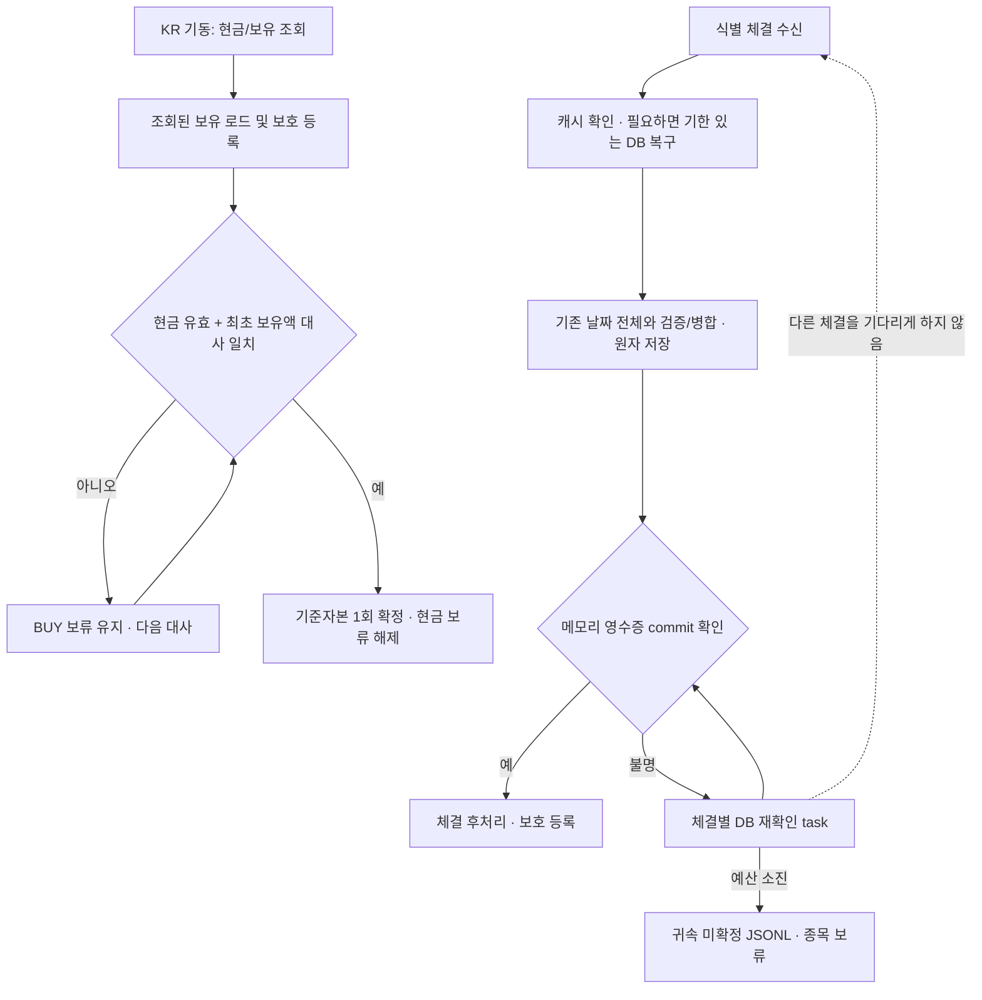

# Claude 후속 변경 독립 리뷰 — 2026-10-03

> 후속 수정·최종 검증은 아래 「49차 수정 및 재검증」을 따른다. 최초 리뷰의 미수정·예약 미변경 표시는 당시 이력이다.

## 최초 리뷰 결론

PR #141·#143의 장애 복구 방향과 승인된 계약 변경을 유지하되, 아래 P1 네 건을 우선 수정해야 한다. #141의 두 문제는 현재 배포본에도 해당하고, #143은 신규 체결 보호 지연을 추가한다. 테스트 통과만으로 예약 배포 대상을 승인할 수 없다.

이 리뷰는 소스·합성 입력·운영 파일의 읽기 전용 대조다. 실제 계좌에서 기록 유실이나 잘못된 주문이 발생했다고 판정하지 않는다. 운영 변경·재시작·주문·배포·예약 변경은 수행하지 않았다.

## Plan — 범위와 기준

- 목적: 순수익을 평가·개선할 수 있도록 체결 기록, 위험예산, 보호 주문 관리의 정확성을 확인한다. 전략의 수익성을 이번 리뷰로 판정하지 않는다.
- 기준: `origin/main=07db1dfc12ab07b5ef9109d563d22b68dabeaa95`.
- 운영 체크아웃: `2645820760d0b02d41f2962ed6bc9776061b4a95` detached; PR #141 반영.
- 예약 배포 대상: `2f5cbaeacec4ea1695656abc02252fe5e723d991`; PR #143 반영. 사용자 crontab에 2026-10-06 16:00 예약 존재.
- 원장 acknowledge, open 실패 시 보호 전량 SELL, 귀속 실패의 JSONL 기록·종목 보류는 승인된 정책으로 검토했다. 이전 테스트의 계약으로 되돌리지 않았다.
- 원장/브로커, 거래 저장/복구, 스케줄러/기동을 분리 검토하고 조정자가 재현과 운영 파일 정합을 확인했다.

## Do / See — 조치할 사항

### P1-1. 늦게 끝난 거래 복구가 최신 체결 상태를 덮어씀

- 위치: `src/core/evolution/trade_journal.py:804-812`, 호출부 `src/schedulers/kr_scheduler.py:3259`.
- PR #141 신규 경로. 현재 배포본과 예약 배포 대상 모두 해당.
- `recover_trade()`는 DB 조회 전에만 캐시 존재를 검사한다. `wait_for(to_thread(...), 5)`가 timeout 되어도 해당 스레드는 계속 실행된다. 다른 복구와 SELL 기록이 먼저 완료된 뒤 첫 조회가 반환하면 811행의 무조건 대입이 최신 캐시를 과거 객체로 바꾼다.
- 이벤트로 실행 순서를 고정한 합성 재현: `(exit_quantity, execution_records 개수)`가 `(1, 1)`에서 `(0, 0)`으로 감소했다. 실제 5초 대기를 생략하고 같은 경합 순서를 만들었다.
- 영향: 후속 체결의 이전 실행 연결이 사라지고, 잘못된 JSON 저장 또는 DB predecessor 충돌로 이어질 수 있다.
- 수정: DB 읽기와 캐시 반영을 분리한다. 이벤트 루프에서 현재 캐시와 복구 세대를 재검증한 뒤 반영하고, timeout 뒤 도착한 결과가 최신 객체를 교체하지 못하게 한다.
- 완료 기준: 지연된 복구 두 건 사이에 식별 SELL을 기록해도 체결 수량·실행 연결·저장 파일이 보존된다.

### P1-2. 오래된 거래 하나 복구 후 같은 날짜의 다른 JSON 거래가 삭제됨

- 위치: `src/core/evolution/trade_journal.py:716-725`, 신규 진입점 `:804-812`, 초기 로드 `:175`.
- 날짜 파일 전체를 캐시로 교체하는 잠재 결함은 기존에도 있었다. PR #141의 식별 SELL 복구가 이 문제를 새 경로에 노출했다. 현재 배포본과 예약 배포 대상 모두 해당.
- 시작 시 최근 30일만 로드하지만, DB 복구는 오래된 거래 하나만 캐시에 추가한다. 이후 `_persist_identified_trade()`가 이 부분 캐시로 해당 날짜 파일 전체를 교체한다.
- 합성 재현: 45일 전 날짜 파일의 거래 ID가 `['old1', 'old2']`에서 `['old1']`로 감소했다.
- 영향: 다른 거래의 JSON 기록·실행 연결·메타데이터가 소실된다. 이 재현이 PostgreSQL의 다른 거래 행 삭제를 뜻하지는 않는다.
- 수정: 해당 날짜의 기존 파일 전체를 읽고 검증·병합한 뒤 원자 저장한다. 중복 ID와 상충하는 실행 기록은 명시적으로 처리한다.
- 완료 기준: 30일 밖의 동일 날짜에 여러 거래를 둔 상태에서 하나를 복구·청산해도 나머지 거래와 메타데이터가 보존된다.

### P1-3. DB 영수증 재확인이 다른 종목의 신규 체결 보호를 지연

- 위치: `src/schedulers/kr_scheduler.py:3083`, `:3146`, `:3709`; DB 조회 `src/data/storage/trade_storage.py:609`.
- PR #143 신규 회귀. 현재 운영 #141에는 없고 예약 배포 대상에 포함된다.
- `_drain_fill_handoffs()`가 한 체결의 DB resolver를 직접 기다린다. 이 순차 루프 뒤에 다른 체결의 후처리와 새로운 체결 조회가 있으므로, DB가 느리면 다른 종목의 신규 보유분 손절 등록까지 지연된다. 두 번이라는 재시도 횟수 제한은 대기시간 제한이 아니다.
- 실제 스케줄러 후처리와 합성 DB 대기 이벤트로 재현: 첫 종목의 resolver 대기 중 두 번째 종목 ExitManager 상태는 없었고, DB 대기를 풀어 준 뒤에야 수량 3으로 등록됐다.
- 영향 범위: 다른 신규 체결의 조회·반영·보호 등록. 이벤트 루프 전체나 이미 등록된 모든 종목의 손절 작업이 멈춘다고 주장하지 않는다.
- 수정: 체결별 resolver 작업을 별도로 관리하고 처리 루프는 완료 여부만 확인한다. 작업별 기한과 취소·늦은 결과 처리 규칙을 둔다.
- 완료 기준: 앞선 종목 DB 조회가 지연돼도 뒤 종목 체결의 포트폴리오 반영과 손절 등록이 진행된다.

### P1-4. 기동 시 미검증 현금을 확정 현금·초기자본으로 사용

- 위치: `scripts/run_trader.py:304-313`, fallback 확대 `src/execution/broker/kis_kr.py:2149`.
- 기동 코드의 검증 플래그 무시는 선재 결함이며 Claude 인계에도 남은 일로 명시됐다. PR #143은 누락·비정상 매수가능 응답까지 fallback 경로를 확대한다.
- 브로커가 예수금과 `available_cash_verified=False`를 반환해도 기동 코드는 현금·초기자본에 적용한다. 이후 미검증 동기화는 그 현금을 보존한다.
- 영향: 예수금이 주문가능 현금보다 크면 매수 허용 상태에서 위험예산을 과대 계산할 수 있다. 현재 KILL_SWITCH_KR 유지로 신규 BUY는 중지되어 있으나 결함 자체가 해결된 것은 아니다.
- 검증 수준: 기동→브로커 반환→주기 동기화의 소스 추적. 실제 KIS 조회 또는 실주문 재현은 하지 않았다.
- 수정: 기동에서도 검증 여부를 확인하고, 보유 종목 로드는 계속하되 현금 검증 성공 전 신규 BUY를 보류한다. 미검증 현금을 기준자본으로 확정하지 않는다.
- 완료 기준: 실제 기동 경로에 미검증 잔고를 주입한 테스트에서 포지션은 로드되고 신규 BUY는 보류되며, 유효한 0원과 조회 실패가 구별된다.

## 문서 정정

`docs/reviews/codex-recent-work-review-2026-10-02.md:89`의 원장 open 실패가 반드시 다음 기동 보류로 이어진다는 설명은 과도하다. 시작 이벤트 저장 전에 실패하면 실패 세션의 영구 기록이 없어서 다음 정상 open의 `prior_unclean`이 False일 수 있다. 보호 전량 SELL 허용 정책을 되돌릴 사유가 아니라, 보장 범위를 정확히 적을 사항이다.

## 검증 근거

| 검증 | 결과 |
|---|---|
| `TZ=UTC QWQ_VERIFY_PYTHON=<공유 venv>/bin/python bash scripts/dev/verify.sh` | exit 0; 4093 passed, 2 xfailed; 문법·비밀정보 검사 통과; 운영 상태·외부망 접근 시도 0 |
| `TZ=Asia/Seoul <공유 venv>/bin/python -m pytest tests/test_execution_journal.py tests/test_p2_cleanup_20261003.py -q` | exit 0; 55 passed; 격리 위반 0 |
| `receipt_review_repro.py` | 조정자 재실행 exit 0; 오래된 날짜 파일 삭제와 늦은 복구 덮어쓰기 모두 재현; 격리 위반 0 |
| `resolver_stall_repro.py` | exit 0; 두 번째 종목 보호 등록 지연 재현; 격리 위반 0 |
| `bash scripts/dev/codex_review.sh --branch` | read-only 교차 리뷰 exit 0; 기준 `3e1ab68f46505c7d1b08201b6f3cdc9863ff33bf`; 스케줄러/기동 P1 보고 |

증거 파일은 `/tmp/qwq-claude-cross-review-20261003/`에 있다. DB 복구 재현은 stub을 사용했고 실제 계좌에는 접근하지 않았다. 읽기 전용 CLI 리뷰어의 개별 테스트는 해당 인터프리터에 pytest가 없어 실행하지 못했으며, 위 전체·관련 테스트는 조정자가 저장소의 공유 venv로 별도 수행했다.

독립 리뷰 요청 모델은 native 2명과 CLI 1명 모두 `gpt-6-astra/xhigh`. 실제 모델과 유효 effort를 증명하는 결과 메타데이터는 노출되지 않아 미검증으로 기록한다. 조정자가 소스와 재현 출력을 확인했으며 모델 합의를 검증 근거로 대체하지 않았다.

## 운영 인계 대조

읽기 전용으로 확인한 항목:

- 운영 HEAD `2645820`, detached, 미커밋 변경은 `config/evolved_overrides.yml` 하나. PID 249914 존재 및 10월 3일 01:15대 기동 시각 일치.
- KILL_SWITCH_KR 파일 존재.
- 10월 6일 16:00 예약 crontab과 대상 `2f5cbae` 일치.
- 재등록 archive의 신규 바이트와 현재 study·manifest·plan·deployment·registry·activation·snapshot 해시 파일 일치.
- activation의 입력 해시 7개, 소스 해시 285개, 보호 설정 해시 모두 현재 파일과 일치. old/new HEAD 모두 `2645820`.
- once 요청 바이트 및 보호 설정 핀은 이전 archive와 동일. 설치된 독립 활성화 실행기 SHA `6d87de20…` 일치.
- retention의 plan·deployment·registry snapshot과 현재 파일 동일. staged drop-in 해시 일치; activation receipt와 활성 drop-in은 아직 없음.

이는 현재 파일 정합 검사이며 미래 타이머 실행·실제 시세 수집 성공을 보장하지 않는다. 이번 리뷰에서는 타이머 상태·NRestarts를 새로 조회하지 않았고, 인계의 해당 값은 이전 관측값으로 취급한다. 재등록 스크립트 및 예약 배포 스크립트를 실행하지 않았다.

## 다음 작업 순서

1. 격리된 개발 브랜치에서 P1-1·P1-2를 수정하고 경합·오래된 날짜 보존 테스트를 추가한다.
2. P1-3을 수정하고 지연된 DB 조회와 다른 종목 신규 체결이 함께 있는 테스트를 추가한다.
3. P1-4를 기동 경로에서 수정하고 검증 현금 전환까지 BUY 보류를 검증한다.
4. 독립 리뷰·전체 검증 뒤 배포 대상과 10월 6일 관측 소스 고정의 정합을 다시 판단한다. 운영 HEAD를 임의 변경하면 현재 관측과 예약 배포의 핀이 어긋난다.
5. 관측 데이터로 종목 선택·진입 시점·청산·비용의 기여를 평가한다. 이번 장애 복구 변경 자체를 초과수익의 근거로 보지 않는다.

예약 취소·대상 변경 또는 선행 운영 배포는 이번 확인 요청에서 수행하지 않았다. 현재 예약 대상 `2f5cbae`에는 위 문제가 남아 있으므로 추가 수정·검증 없이 배포 승인으로 해석하지 않는다.

## 49차 수정 및 재검증

### Plan / Do

사용자가 원인 수정·검증 후 기존 예약 대상만 갱신하는 순서를 승인했다. 운영 HEAD와 10월6일 관측 입력은 그대로 유지한다.

- 늦은 복구: DB 조회만 분리하고 살아 있는 코루틴에서 현재 캐시를 재검사하여 게시한다. 취소된 호출의 작업 스레드는 캐시를 쓰지 않는다.
- 날짜 보존: 기존 날짜 파일 전체의 identity·실행 연결을 검증·병합한 뒤 원자 저장한다. JSON 원본·동료 거래·메타데이터를 보존한다. 실제 legacy writer와 asyncpg NUMERIC 저장 정밀도만 허용하고 정상 반올림을 충돌로 오판하지 않는다.
- 보호 진행: 체결별 resolver task에 조회당 5초·최대2회 예산을 적용한다. 다른 종목의 신규 체결 조회·보호 등록이 기다리지 않는다. 반환값만으로 commit을 인정하지 않으며 기존 메모리 영수증을 확인한다.
- 기동 회계: 미검증 현금·보유는 기준자본 확정과 BUY를 보류한다. 브로커 제출·POST 직전까지 같은 보류를 검사하므로 수동 예약도 우회하지 못한다. 첫 대사에서 기준을 한 번만 확정하며 복원된 당일 손익·고점은 유지한다. 기준 미확정 시 과거 자산 백필은 다음 정상 기동으로 연기한다.
- 부분 보유: 최초 확정은 주식평가액 요약과 응답 보유·최종 포트폴리오 합이 1원 이내로 맞아야 한다. 누락·음수·NaN·부분 응답·가격 시점 차이는 보류한다. 불일치여도 조회된 보유분의 보호 등록은 계속한다. 현금 파싱 실패는 민감한 값 대신 예외 유형만 기록한다.

### 독립 리뷰 지적 판정

외부 리뷰는 sanitized 소스만 제공하고 tools/MCP를 비활성화했다. 첫 리뷰의 실제 modelUsage는 `claude-opus-5`(firstParty), 요청 xhigh이며 유효 effort는 별도 확인되지 않았다. 코드 실행·운영 접근은 없는 소스 리뷰였다.

| 외부 리뷰 항목 | 판정·처리 |
|---|---|
| P1-1 DB 스케일 불일치 | 정상 float→NUMERIC 및 PnL 정수 반올림을 실제 격리 PostgreSQL 왕복으로 확인하여 수정. JSON 원본 보존 |
| P1-2 부분 포지션으로 최초 자본 과소 확정 | 합성 기동/첫 대사에서 재현 후 요약·응답·최종 보유 합 대조로 수정 |
| P1-3 DB 보강의 청산수량 역행 | 동일·감소 누계를 기존 원본에 덮지 않는다. 전진 보강은 파일 저장 후 캐시 게시하여 직후 식별 SELL과 연결한다. 캐시 밖 정상 legacy도 검증된 파일에서 복원한다 |
| P2-1 DB 작업 스레드 수명 | 취소된 조회의 결과 미게시를 유지하고 connect/query/close에도 유한 대기 적용. native pool 재설계는 하지 않음 |
| P2-2 전체 날짜 파일 검증 비용 | 정확한 peer 보존에 필요한 현재 원자 저장 방식을 유지. 실제 장중 지연 측정 없이 성능 개선 완료로 주장하지 않음. 대규모 날짜 파일의 비용 측정·증분 저장 설계는 후속 과제 |
| P2-3 미확정 0의 과거 백필 | 백필 보류로 수정. EquityTracker는 런타임 baseline을 저장하지 않고 매번 portfolio를 읽으므로 별도 setter는 불필요 |
| P2-4/5 sparse legacy·비유한 JSON | 명시적 손상/충돌 오류로 분류하며 원본을 덮지 않음. 회계값 임의 정규화 금지 |
| P2-6 실패 handoff와 최초 현금 보류 | 미완결 체결 적용 중 대사를 허용하지 않는 기존 계약 유지. 기존 실패 즉시/정체15분 heartbeat·경보가 존재한다. 현금만 우회 확정하면 기준자본이 잘못될 수 있어 채택하지 않음 |
| P2-7 현금 파싱 원인 누락 | 예외 유형 로그 추가; 응답 값은 로그에 싣지 않음 |
| P2-8 기동 이후 재무장 비대칭 | 이번 변경은 최초 미검증 기동 보류. 이후 일반 대사 장애의 기존 3회/10분 규칙은 별도 설계 결정 대상으로 유지하며, 모든 런타임 현금 신선도를 보장한다고 표현하지 않음 |

확인 요청의 `with_request_source`는 반환값을 전파하고, US는 별도 엔진의 risk manager를 생성한다. 관련 소스를 직접 확인하여 두 우려를 기각했다. 승인된 원장 acknowledge·원장 open 실패 시 보호 전량 SELL·귀속 미확정 JSONL/종목 보류 계약은 유지한다.

### See

최종 통합 검증과 모델 메타데이터·PR·예약 갱신 결과는 아래에 확정 기록한다. 실제 계좌 주문이나 수익성 검증을 수행한 것으로 해석하지 않는다.

### 통합 처리 흐름

현금 보류 해제는 KILL_SWITCH·종목 보류·기타 위험 게이트를 해제하지 않는다. 원장·JSON 저장 실패를 성공으로 표시하거나 과거 체결을 자동 재생하지 않는다.

### 추가 저장 경계 판정

- 전진 DB 보강은 파일에 먼저 반영한 뒤 캐시에 게시한다. 복사본을 사용하여 기존 객체를 보존하며, 캐시 밖 legacy의 메타데이터·registry도 확인한다. 동일·뒤진 DB 행은 파일 원본을 바꾸지 않고 필요한 캐시 복원만 한다.
- 날짜 파일 손상·저장 실패는 해당 행에서 분리한다. 원본을 보존하며 무관한 다른 날짜의 보강은 계속한다. 실제 전진에 `updated_at`을 갱신하고 집계는 복원/보강으로 표시한다.
- **replace 이전 실패에서는 기존 파일·캐시를 보존한다. replace 이후 디렉터리 fsync 실패에서는 교체된 파일이 보일 수 있으나 내구성이 미확정이다.** 이때 캐시 게시나 성공 반환을 하지 않는다. 다음 식별 체결의 저널 실패는 기존 귀속 미확정 처리로 연결하며, 정상 재대사는 파일·캐시를 다시 일치시킨다. 이를 보호 전량 SELL 주문 차단으로 해석하지 않는다.
- 외부 델타 리뷰의 fsync 실패 후 성공 처리 제안은 내구성 계약과 맞지 않아 채택하지 않았다. 독립 Astra 리뷰어가 임시 파일·DB stub으로 실패 `(캐시5, 파일7)`과 정상 재대사 `(7,7)`를 재현했고, 최종 회귀도 이를 검증한다. 보장이 약한 상태를 성공으로 승격하지 않는다.
- 외부 리뷰의 시각 표현 우려는 실제 `TIMESTAMP` naive 스키마와 맞지 않는다. 창 밖 legacy 복원은 명시한 `days` 범위를 따르는 기존 계약이며, 조건부 우려만으로 축소하지 않는다. 대규모 날짜 파일의 반복 검증·fsync 비용은 관측 후 성능 측정 과제로 남긴다.

### 리뷰 수행 기록

- 초기 교차 공급자 리뷰: 실제 `claude-opus-5`/요청 xhigh, 실행 완료. 지적을 소스·재현으로 분류하여 반영했다.
- 넓은 범위 재리뷰는 600초 절대 기한에 종료(exit 1, 1,140개 스트림 이벤트). 완료·승인 근거로 사용하지 않았다. 모델 장애로 단정하거나 우회하지 않았으며, 이후 검토를 실제 변경 함수로 나누고 bounded 검토에 high를 명시했다.
- 전진 저장 델타 및 미캐시 복원 한정 리뷰: 실제 `claude-opus-5`/요청 high, 각각 실행 완료. 미캐시 복원 PASS, 나머지 지적은 위 판정과 후속 행 단위 오류 격리로 처리했다. 유효 effort는 결과 메타데이터에 없으므로 별도 미검증이다.
- 독립 native Astra/xhigh 리뷰는 현금 경계 58개, 최종 원장 행 격리·내구성 경계 26개를 직접 통과시켰다. 작성자와 리뷰어는 분리했으며 실제 native 모델 메타데이터는 미노출이다.

- 행 오류 격리의 최종 외부 리뷰는 무결성 회귀 없음으로 판단했다. 예외 집합·실패 집계·진단 로그 지적은 `Exception`을 행 단위에서 처리(취소는 전파), 실패 개수 별도 경고, 정형 저널 오류 원인만 표기하는 보완으로 반영했다. 실제 모델은 `claude-opus-5`, 요청 high, 소스 한정 검토다. 누락 ID 행 뒤에도 정상 행이 처리되는 회귀를 추가했다.

### 최종 검증 결과

| 검사 | 근거 |
|---|---|
| KST 최종 관련 검사 | 161 passed, exit 0, 운영 상태·외부 네트워크 접근 시도 0건 |
| UTC 최종 전체·문법·비밀정보 | 4199 passed, 2 known xfailed, pykrx 기존 경고1; exit0, 격리 위반0, 문법·비밀정보 통과(124.20초) |
| 예약 가드 격리 사본 | 정상 및 차단 조건 10개 통과. 설치본·실제 API·서비스 조작·알림·cron 쓰기 없음 |
| 운영/관측 보존 사전 검사 | HEAD2645820, 소스285·입력7·보호 설정2 지문 일치, PID249914 유지, 매수 중지 존재 |

최종 배포 대상 변경 결과는 [49차 실행 기록](../operations/capture-execution-2026-10-06.md#49차--p1-수정과-관측-후-배포-예약-갱신)에 남긴다. 실제 수집·배포 성공은 10월6일에 별도로 판정한다.

마지막 행 오류 집계·정형 진단 보완도 독립 Astra/xhigh가 2개 회귀를 직접 재실행해 통과시켰다. 조정자는 최종 소스 전체 검증 후 PR/CI 단계로 진행한다.

제품 PR #145는 head `a12779600a72e51c8fd1a7a1eebafe8b02df137e`의 필수CI4199 passed/2 xfailed·격리0을 확인한 뒤 `7049bbaef752bdf8cb3c623de6cebc034dfe7ba8`로 병합됐다. 두 tree는 동일하다. 예약 TARGET만 이 머지 SHA로 교체하고 운영/관측 지문·PID·cron 보존과 격리10가드를 다시 확인했다. 이 뒤 문서 커밋은 예약 대상에 자동 포함되지 않는다.
